```mermaid
graph LR
    Inference_Orchestrator["Inference Orchestrator"]
    RealESRGAN_Enhancer["RealESRGAN Enhancer"]
    RealESRGAN_Model["RealESRGAN Model"]
    Network_Architecture["Network Architecture"]
    RealESRGAN_Dataset["RealESRGAN Dataset"]
    Inference_Orchestrator -- "orchestrates" --> RealESRGAN_Enhancer
    RealESRGAN_Enhancer -- "uses" --> RealESRGAN_Model
    RealESRGAN_Model -- "implements" --> Network_Architecture
    RealESRGAN_Dataset -- "used for training" --> RealESRGAN_Model
    Network_Architecture -- "used during training" --> RealESRGAN_Model
    click Inference_Orchestrator href "https://github.com/CodeBoarding/GeneratedOnBoardings/blob/main/Real-ESRGAN/Inference Orchestrator.md" "Details"
    click RealESRGAN_Enhancer href "https://github.com/CodeBoarding/GeneratedOnBoardings/blob/main/Real-ESRGAN/RealESRGAN Enhancer.md" "Details"
    click RealESRGAN_Model href "https://github.com/CodeBoarding/GeneratedOnBoardings/blob/main/Real-ESRGAN/RealESRGAN Model.md" "Details"
    click Network_Architecture href "https://github.com/CodeBoarding/GeneratedOnBoardings/blob/main/Real-ESRGAN/Network Architecture.md" "Details"
    click RealESRGAN_Dataset href "https://github.com/CodeBoarding/GeneratedOnBoardings/blob/main/Real-ESRGAN/RealESRGAN Dataset.md" "Details"
```

## Component Details

The Real-ESRGAN project focuses on enhancing images and videos using deep learning techniques. The core functionality revolves around taking low-resolution inputs and generating high-resolution, visually appealing outputs. The process involves orchestrating the enhancement pipeline, utilizing pre-trained models, and employing specific network architectures for optimal performance. The training process leverages datasets of low-resolution and high-resolution image pairs and can incorporate discriminator networks to improve the realism of the generated images.

### Inference Orchestrator
The Inference Orchestrator manages the overall process of enhancing images and videos. It handles input (either a single image or a video), loads the Real-ESRGAN Enhancer, and manages the pre and post processing. For videos, it extracts frames, enhances each frame, and reassembles the enhanced frames into a video. It acts as the entry point for using the Real-ESRGAN enhancement capabilities.
- **Related Classes/Methods**: `inference_realesrgan.py`, `inference_realesrgan_video.py`

### RealESRGAN Enhancer
The RealESRGAN Enhancer encapsulates the core image enhancement functionality. It preprocesses the input image to be compatible with the model, performs the enhancement using the RealESRGAN Model's forward pass, and post-processes the output image to prepare it for display or saving. It serves as an abstraction layer over the specific RealESRGAN model architecture.
- **Related Classes/Methods**: `realesrgan/utils.py`

### RealESRGAN Model
The RealESRGAN Model represents the deep learning model responsible for performing the actual image enhancement. It defines the model architecture (e.g., SRVGGNetCompact), handles the forward pass that transforms the low-resolution input into a high-resolution output, and manages the model's internal state (weights, biases, etc.). It is the core computational engine of the system.
- **Related Classes/Methods**: `realesrgan/models/realesrgan_model.py`, `realesrgan/models/realesrnet_model.py`

### Network Architecture
The Network Architecture defines the specific network architectures used within the RealESRGAN model, such as SRVGGNetCompact and UNetDiscriminatorSN. These architectures provide reusable building blocks for constructing the overall enhancement model and discriminator, respectively. They are specific types of networks optimized for image super-resolution and GAN-based training.
- **Related Classes/Methods**: `realesrgan/archs/srvgg_arch.py`, `realesrgan/archs/discriminator_arch.py`

### RealESRGAN Dataset
The RealESRGAN Dataset provides a dataset class specifically designed for training and evaluating the Real-ESRGAN model. It handles loading and pre-processing of image pairs (low-resolution and high-resolution) for training the model. It is responsible for providing the training data in a format suitable for the model.
- **Related Classes/Methods**: `realesrgan/data/realesrgan_dataset.py`