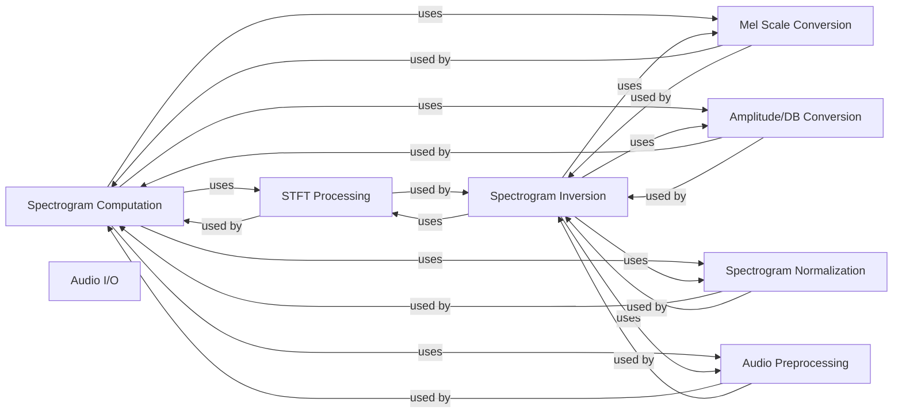

## Component Details

### Spectrogram Computation
This component focuses on computing spectrograms (both linear and mel) from audio signals. It involves pre-processing steps like preemphasis, STFT calculation, conversion to dB scale, and normalization. It utilizes helper functions for STFT, mel scale conversion, and amplitude-to-dB conversion.
- **Related Classes/Methods**: `synthesizer.audio.linearspectrogram`, `synthesizer.audio.melspectrogram`, `synthesizer.audio._stft`, `synthesizer.audio._linear_to_mel`, `synthesizer.audio._mel_to_linear`, `synthesizer.audio._amp_to_db`, `synthesizer.audio._normalize`, `synthesizer.audio.preemphasis`

### Spectrogram Inversion
This component focuses on inverting spectrograms (both linear and mel) back into audio signals. It involves denormalization, conversion from dB to amplitude, and the use of the Griffin-Lim algorithm or LWS for phase reconstruction. It also applies inverse preemphasis to the reconstructed audio.
- **Related Classes/Methods**: `synthesizer.audio.inv_linear_spectrogram`, `synthesizer.audio.inv_mel_spectrogram`, `synthesizer.audio._griffin_lim`, `synthesizer.audio._lws_processor`, `synthesizer.audio._db_to_amp`, `synthesizer.audio._denormalize`, `synthesizer.audio.inv_preemphasis`

### STFT Processing
This component provides the core functionality for performing Short-Time Fourier Transforms (STFT) and inverse STFT (ISTFT). It abstracts the underlying implementation (either librosa or LWS) and provides a consistent interface for other components.
- **Related Classes/Methods**: `synthesizer.audio._stft`, `synthesizer.audio._istft`, `synthesizer.audio._lws_processor`

### Mel Scale Conversion
This component handles the conversion between linear and mel scales for spectrograms. It includes functions for converting linear spectrograms to mel spectrograms and vice versa, as well as building the mel filterbank.
- **Related Classes/Methods**: `synthesizer.audio._linear_to_mel`, `synthesizer.audio._mel_to_linear`, `synthesizer.audio._build_mel_basis`

### Audio Preprocessing
This component provides basic audio preprocessing functions, including preemphasis and inverse preemphasis. Preemphasis enhances high-frequency components, while inverse preemphasis reverses this effect.
- **Related Classes/Methods**: `synthesizer.audio.preemphasis`, `synthesizer.audio.inv_preemphasis`

### Audio I/O
This component handles loading and saving audio files. It provides functions for loading WAV files using librosa and saving WAV files using scipy or soundfile, with appropriate normalization to prevent clipping.
- **Related Classes/Methods**: `synthesizer.audio.load_wav`, `synthesizer.audio.save_wav`, `synthesizer.audio.save_wavenet_wav`

### Amplitude/DB Conversion
This component provides functions for converting between amplitude and decibel scales. These conversions are essential for spectrogram processing and inversion.
- **Related Classes/Methods**: `synthesizer.audio._amp_to_db`, `synthesizer.audio._db_to_amp`

### Spectrogram Normalization
This component provides functions for normalizing and denormalizing spectrograms. Normalization ensures that the spectrogram values are within a specific range, which can improve the performance of subsequent processing steps.
- **Related Classes/Methods**: `synthesizer.audio._normalize`, `synthesizer.audio._denormalize`
