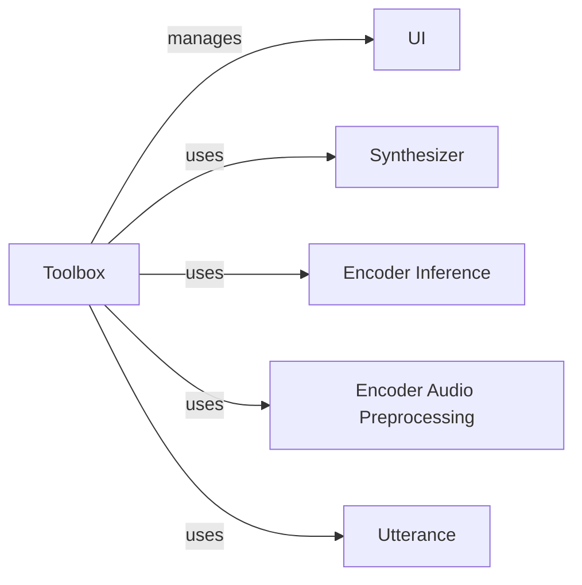

## Component Details

### Toolbox
The Toolbox class serves as the central orchestration point for the real-time voice cloning application. It initializes and manages the user interface, sets up event handlers for user interactions, and coordinates core functionalities such as data loading, audio recording, speaker encoding, speech synthesis, and vocoding. It acts as a bridge between the UI and the backend processing components, ensuring smooth data flow and control throughout the voice cloning process.
- **Related Classes/Methods**: `repos.Real-Time-Voice-Cloning.toolbox.Toolbox`

### UI
The UI component is responsible for managing the user interface of the toolbox application. It handles drawing UI elements, logging messages to the console, setting audio devices based on user selection, and managing the selection of browsers and models. The UI interacts closely with the Toolbox class, triggering actions and updating the interface based on user input and the application's state.
- **Related Classes/Methods**: `repos.Real-Time-Voice-Cloning.toolbox.ui.UI`

### Synthesizer
The Synthesizer component is responsible for speech synthesis. It provides methods for loading and preprocessing audio, creating spectrograms from audio data, and synthesizing speech from these spectrograms. The Toolbox utilizes the Synthesizer to generate speech from text or other inputs, enabling the voice cloning functionality.
- **Related Classes/Methods**: `synthesizer.inference.Synthesizer`

### Encoder Inference
The Encoder Inference component focuses on generating speaker embeddings from audio utterances. It provides the `embed_utterance` function, which takes an audio waveform as input and produces a fixed-length vector representing the speaker's voice characteristics. This embedding is crucial for voice cloning, as it captures the unique identity of the speaker.
- **Related Classes/Methods**: `encoder.inference`

### Encoder Audio Preprocessing
The Encoder Audio Preprocessing component provides the `preprocess_wav` function, which prepares audio waveforms for the encoder. This preprocessing includes normalization of the audio signal and noise reduction techniques to improve the quality of the speaker embeddings generated by the encoder.
- **Related Classes/Methods**: `encoder.audio`

### Utterance
The Utterance component represents a single segment of audio, storing the audio data itself, the corresponding spectrogram representation, and the speaker embedding generated by the encoder. It serves as a container for managing and processing individual audio samples within the voice cloning pipeline.
- **Related Classes/Methods**: `toolbox.utterance.Utterance`
