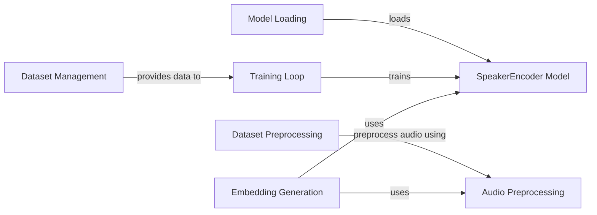

## Component Details

The Speaker Encoder component is responsible for extracting unique voice embeddings from audio data. It encompasses the entire process, from preprocessing raw audio to training the speaker encoder model and generating embeddings for inference. The main flow involves loading audio data, preprocessing it to remove silences and convert it into a suitable format, extracting features using the SpeakerEncoder model, and generating speaker embeddings. These embeddings can then be used for speaker verification or voice cloning tasks. The purpose of this component is to provide a robust and accurate representation of a speaker's voice characteristics.

### SpeakerEncoder Model
The core deep learning model responsible for generating speaker embeddings from audio features. It learns to map audio segments to fixed-dimensional vectors that represent the speaker's voice characteristics. The model is trained using a loss function that encourages similar embeddings for utterances from the same speaker and dissimilar embeddings for utterances from different speakers.
- **Related Classes/Methods**: `Real-Time-Voice-Cloning.encoder.model.SpeakerEncoder:loss`

### Audio Preprocessing
This component handles the initial processing of raw audio waveforms. It includes functions for resampling the audio, normalizing the amplitude, and removing leading and trailing silences. The goal is to prepare the audio data for feature extraction and improve the quality of the resulting speaker embeddings.
- **Related Classes/Methods**: `Real-Time-Voice-Cloning.encoder.audio:preprocess_wav`, `Real-Time-Voice-Cloning.encoder.audio:trim_long_silences`

### Embedding Generation
This component focuses on generating speaker embeddings from preprocessed audio frames. It uses the SpeakerEncoder model to embed batches of frames and also provides a higher-level function to embed entire utterances by segmenting them into frames, embedding each frame, and aggregating the frame-level embeddings.
- **Related Classes/Methods**: `Real-Time-Voice-Cloning.encoder.inference:embed_frames_batch`, `Real-Time-Voice-Cloning.encoder.inference:embed_utterance`

### Dataset Management
This component manages the dataset used for training the speaker encoder. It includes classes for representing speakers and utterances, loading audio data, organizing it by speaker, and providing batches of data to the training loop. It also includes data augmentation techniques to improve the robustness of the model.
- **Related Classes/Methods**: `Real-Time-Voice-Cloning.encoder.data_objects.speaker_verification_dataset.SpeakerVerificationDataset:__init__`, `Real-Time-Voice-Cloning.encoder.data_objects.speaker_verification_dataset.SpeakerVerificationDataLoader:collate`, `Real-Time-Voice-Cloning.encoder.data_objects.speaker.Speaker:_load_utterances`, `Real-Time-Voice-Cloning.encoder.data_objects.speaker.Speaker:random_partial`, `Real-Time-Voice-Cloning.encoder.data_objects.utterance.Utterance:random_partial`

### Training Loop
This component implements the training loop for the speaker encoder model. It iterates over the training data, feeds it to the model, calculates the loss, and updates the model's parameters. It also includes functionality for logging training progress and saving checkpoints of the model.
- **Related Classes/Methods**: `Real-Time-Voice-Cloning.encoder.train:train`

### Model Loading
This component provides functionality for loading a pre-trained speaker encoder model from a file. This allows the model to be used for inference without training from scratch.
- **Related Classes/Methods**: `Real-Time-Voice-Cloning.encoder.inference:load_model`

### Dataset Preprocessing
This component handles the initial preprocessing of the dataset, including initializing directories, logging dataset parameters, and preprocessing audio data for each speaker. It also includes specific implementations for preprocessing popular datasets like LibriSpeech and VoxCeleb.
- **Related Classes/Methods**: `Real-Time-Voice-Cloning.encoder.preprocess.DatasetLog:__init__`, `Real-Time-Voice-Cloning.encoder.preprocess.DatasetLog:_log_params`, `Real-Time-Voice-Cloning.encoder.preprocess.DatasetLog:finalize`, `Real-Time-Voice-Cloning.encoder.preprocess:_init_preprocess_dataset`, `Real-Time-Voice-Cloning.encoder.preprocess:_preprocess_speaker`, `Real-Time-Voice-Cloning.encoder.preprocess:preprocess_librispeech`, `Real-Time-Voice-Cloning.encoder.preprocess:preprocess_voxceleb1`, `Real-Time-Voice-Cloning.encoder.preprocess:preprocess_voxceleb2`
