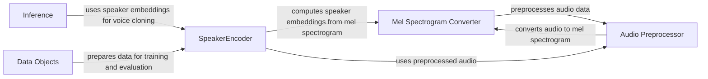

## Component Details

### SpeakerEncoder
The SpeakerEncoder class is a PyTorch module responsible for generating speaker embeddings from mel spectrograms. It uses an LSTM network to capture the temporal dynamics of the spectrogram and produces a fixed-size vector representing the speaker's voice characteristics. The embeddings are L2-normalized to ensure consistent similarity comparisons. It also includes methods for computing a similarity matrix between embeddings and calculating the loss and EER for a batch of embeddings.
- **Related Classes/Methods**: `repos.Real-Time-Voice-Cloning.encoder.model.SpeakerEncoder`

### Audio Preprocessor
The Audio Preprocessor module provides functionalities for preparing raw audio data for speaker embedding extraction. It includes operations such as loading audio files, resampling to a consistent sample rate, normalizing the audio volume, and trimming silence from the beginning and end of the audio. These steps ensure that the audio data is in a suitable format for subsequent processing by the Mel Spectrogram Converter and SpeakerEncoder.
- **Related Classes/Methods**: `repos.Real-Time-Voice-Cloning.encoder.audio`

### Mel Spectrogram Converter
The Mel Spectrogram Converter transforms preprocessed audio waveforms into mel spectrograms. This involves applying a Short-Time Fourier Transform (STFT) to the audio signal, followed by mapping the frequency bins to the mel scale. The resulting mel spectrogram represents the audio's frequency content over time and serves as the input to the SpeakerEncoder. This conversion highlights the important frequency components of speech, making it easier for the SpeakerEncoder to learn speaker-specific features.
- **Related Classes/Methods**: `repos.Real-Time-Voice-Cloning.encoder.audio`

### Inference
The Inference module provides functions for performing inference with the trained SpeakerEncoder model. It includes functions for loading the model from a checkpoint, encoding a single utterance, and averaging multiple embeddings to create a speaker representation. This module is used to generate speaker embeddings for new audio samples during the voice cloning process.
- **Related Classes/Methods**: `repos.Real-Time-Voice-Cloning.encoder.inference`

### Data Objects
The Data Objects module defines classes for representing speakers, utterances, and datasets used for training and evaluation. These classes provide a structured way to manage audio data and speaker metadata. The module includes classes for speaker verification datasets, individual speakers, audio utterances, random cyclers for data iteration, and speaker batches for efficient training.
- **Related Classes/Methods**: `repos.Real-Time-Voice-Cloning.encoder.data_objects.speaker_verification_dataset`, `repos.Real-Time-Voice-Cloning.encoder.data_objects.speaker`, `repos.Real-Time-Voice-Cloning.encoder.data_objects.utterance`, `repos.Real-Time-Voice-Cloning.encoder.data_objects.random_cycler`, `repos.Real-Time-Voice-Cloning.encoder.data_objects.speaker_batch`
