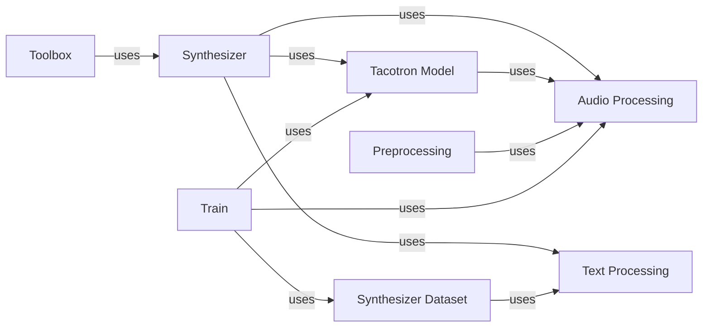

## Component Details

### Synthesizer
The Synthesizer component is the core of the speech synthesis process. It takes text and speaker embeddings as input and generates speech. It orchestrates the text-to-sequence conversion, spectrogram generation using the Tacotron model, and vocoding processes. It uses text processing utilities for converting text to sequences and audio processing utilities for spectrogram computations.
- **Related Classes/Methods**: `repos.Real-Time-Voice-Cloning.synthesizer.inference.Synthesizer`

### Tacotron Model
The Tacotron model is the core neural network architecture for text-to-speech synthesis. It consists of an encoder, a decoder, and a CBHG module. The encoder converts text sequences into a fixed-length representation, the decoder generates spectrogram frames from this representation, and the CBHG module is used for post-processing the spectrogram.
- **Related Classes/Methods**: `repos.Real-Time-Voice-Cloning.synthesizer.models.tacotron.Tacotron`, `/home/imilev/CodeBoarding/repos/Real-Time-Voice-Cloning/synthesizer/models/tacotron.py`

### Audio Processing
The Audio Processing component provides functions for audio processing tasks, including spectrogram and mel spectrogram computation, as well as inverse transformations. It is used by the Synthesizer for generating spectrograms from audio and converting them back to audio.
- **Related Classes/Methods**: `repos.Real-Time-Voice-Cloning.synthesizer.audio`

### Text Processing
The Text Processing component provides utilities for text processing, including text-to-sequence conversion and cleaning. It is used by the Synthesizer to convert input text into a sequence of integers that can be fed into the Tacotron model.
- **Related Classes/Methods**: `repos.Real-Time-Voice-Cloning.synthesizer.utils.text`

### Synthesizer Dataset
The Synthesizer Dataset component is a PyTorch Dataset class that loads and prepares data for training the synthesizer. It handles text-to-sequence conversion and padding. It relies on the Text Processing component for converting text to sequences.
- **Related Classes/Methods**: `repos.Real-Time-Voice-Cloning.synthesizer.synthesizer_dataset.SynthesizerDataset`, `repos.Real-Time-Voice-Cloning.synthesizer.synthesizer_dataset`

### Preprocessing
The Preprocessing component handles the preprocessing of audio data for training the synthesizer. This includes splitting audio into utterances and extracting mel spectrograms. It uses Audio Preprocessing and Mel Spectrogram components.
- **Related Classes/Methods**: `repos.Real-Time-Voice-Cloning.synthesizer.preprocess`

### Toolbox
The Toolbox component provides a user interface for interacting with the synthesizer, encoder, and vocoder. It handles loading data, training, and generating speech. It uses the Synthesizer component to generate speech from text and speaker embeddings.
- **Related Classes/Methods**: `repos.Real-Time-Voice-Cloning.toolbox.Toolbox`

### Train
The Train component contains the main training loop for the synthesizer model. It uses the Tacotron Model and Synthesizer Dataset components for training. It also uses Audio Processing and Plotting Utilities components.
- **Related Classes/Methods**: `repos.Real-Time-Voice-Cloning.synthesizer.train`
