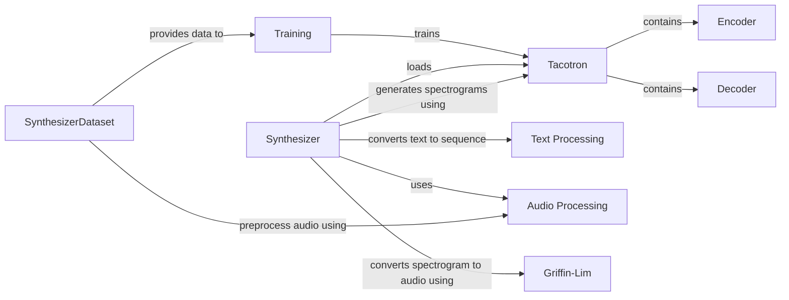

## Component Details

The Speech Synthesizer component converts text into a spectrogram representation of speech, conditioned on a voice embedding. It encompasses text processing, audio processing, the core Tacotron model, dataset management, preprocessing, inference, and training functionalities. The main flow involves converting text to a sequence of symbols, feeding it to the Tacotron model to generate a spectrogram, and then using Griffin-Lim to reconstruct the audio. The purpose is to synthesize speech that mimics a specific voice, enabling personalized and expressive speech generation.

### Tacotron
The Tacotron model is a neural network that converts text into a spectrogram. It consists of an Encoder, Decoder, and Attention mechanism. It learns to map text sequences to corresponding spectrogram representations of speech.
- **Related Classes/Methods**: `Real-Time-Voice-Cloning.synthesizer.models.tacotron`

### Encoder
The Encoder is a module within the Tacotron model responsible for processing the input text sequence and extracting relevant features. It transforms the text into a hidden representation that captures the phonetic and semantic information.
- **Related Classes/Methods**: `Real-Time-Voice-Cloning.synthesizer.models.tacotron`

### Decoder
The Decoder is a module within the Tacotron model that takes the encoded text representation and generates a spectrogram. It uses an attention mechanism to focus on different parts of the input text while generating the spectrogram frames.
- **Related Classes/Methods**: `Real-Time-Voice-Cloning.synthesizer.models.tacotron`

### SynthesizerDataset
The SynthesizerDataset is a class that handles loading and preprocessing the training data for the Tacotron model. It provides batches of text and corresponding spectrograms for training.
- **Related Classes/Methods**: `Real-Time-Voice-Cloning.synthesizer.synthesizer_dataset`

### Synthesizer
The Synthesizer class is responsible for loading the trained Tacotron model and generating spectrograms from text. It orchestrates the text-to-speech process.
- **Related Classes/Methods**: `Real-Time-Voice-Cloning.synthesizer.inference`

### Text Processing
This component converts a given text string into a sequence of numerical symbols, which can be used as input to the Tacotron model.
- **Related Classes/Methods**: `Real-Time-Voice-Cloning.synthesizer.utils.text`

### Audio Processing
A collection of functions for audio processing, including spectrogram and mel spectrogram transformations, and inverse transformations.
- **Related Classes/Methods**: `Real-Time-Voice-Cloning.synthesizer.audio`

### Griffin-Lim
The Griffin-Lim algorithm is used to reconstruct audio from a spectrogram. It's an iterative phase recovery algorithm.
- **Related Classes/Methods**: `Real-Time-Voice-Cloning.synthesizer.inference`, `Real-Time-Voice-Cloning.synthesizer.audio`

### Training
The training component is responsible for training the Tacotron model using the provided dataset and evaluating its performance.
- **Related Classes/Methods**: `Real-Time-Voice-Cloning.synthesizer.train`
