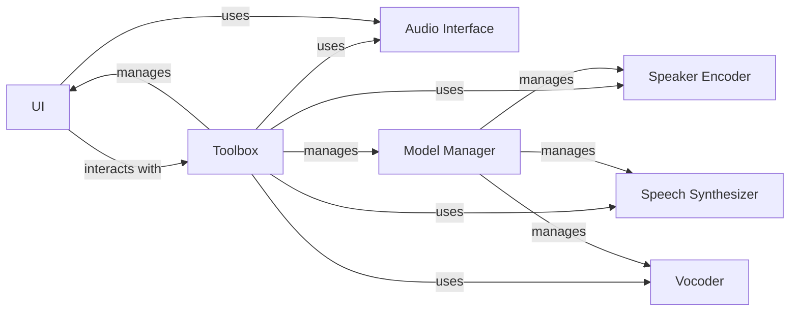

## Component Details

The Toolbox Interface provides the user interface and orchestrates the voice cloning process. It manages audio input/output, model loading/saving, and interacts with the Speaker Encoder, Speech Synthesizer, and Vocoder components to perform voice cloning. The UI component handles user interactions and displays feedback, while the Toolbox component manages the models and audio processing.

### UI
The UI class manages the graphical user interface of the toolbox. It handles user interactions, displays information, and triggers actions in the Toolbox. It uses PyQT for the interface, managing the different panels and widgets for controlling the voice cloning process.
- **Related Classes/Methods**: `Real-Time-Voice-Cloning.toolbox.ui.UI`

### Toolbox
The Toolbox class orchestrates the voice cloning process. It manages the encoder, synthesizer, and vocoder models, handles recording and playback of audio, and interacts with the UI to update the display. It also handles loading and saving of models, acting as the central control point for the application.
- **Related Classes/Methods**: `Real-Time-Voice-Cloning.toolbox.Toolbox`

### Audio Interface
The Audio Interface handles the audio input and output devices. It provides methods for recording audio from the microphone and playing audio through the speakers. It is used by both the UI and the Toolbox for audio-related tasks.
- **Related Classes/Methods**: `Real-Time-Voice-Cloning.toolbox.ui.UI:setup_audio_devices`, `Real-Time-Voice-Cloning.toolbox.Toolbox:record`, `Real-Time-Voice-Cloning.toolbox.Toolbox:replay_last_wav`

### Model Manager
The Model Manager is responsible for loading, saving, and managing the different models used in the voice cloning process (encoder, synthesizer, vocoder). It provides methods for initializing and updating the models, ensuring that the models are properly loaded and ready for use.
- **Related Classes/Methods**: `Real-Time-Voice-Cloning.toolbox.Toolbox:init_encoder`, `Real-Time-Voice-Cloning.toolbox.Toolbox:init_synthesizer`, `Real-Time-Voice-Cloning.toolbox.Toolbox:init_vocoder`

### Speaker Encoder
The Speaker Encoder is responsible for extracting speaker embeddings from the recorded audio. These embeddings are used to represent the speaker's voice characteristics and are used by the synthesizer to clone the voice.
- **Related Classes/Methods**: _None_

### Speech Synthesizer
The Speech Synthesizer is responsible for generating speech from text, using the speaker embeddings provided by the Speaker Encoder. It takes text as input and produces audio that sounds like the target speaker.
- **Related Classes/Methods**: _None_

### Vocoder
The Vocoder is responsible for converting the output of the Speech Synthesizer into audible speech. It takes the synthesized audio and generates the final waveform that is played to the user.
- **Related Classes/Methods**: _None_
