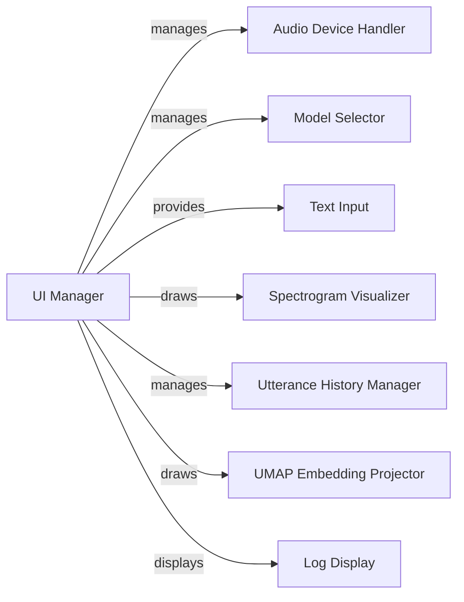

## Component Details

### UI Manager
The UI Manager is the central component responsible for orchestrating the entire user interface of the real-time voice cloning toolbox. It initializes and manages all other UI components, handles user interactions, and updates the display accordingly. It acts as the main entry point for the user to interact with the voice cloning process.
- **Related Classes/Methods**: `repos.Real-Time-Voice-Cloning.toolbox.ui.UI`

### Audio Device Handler
The Audio Device Handler manages the audio input and output devices used by the application. It detects available devices, allows the user to select the desired devices for recording and playback, and configures the audio streams. This component ensures proper audio capture and delivery during the voice cloning process.
- **Related Classes/Methods**: `repos.Real-Time-Voice-Cloning.toolbox.ui.UI`

### Model Selector
The Model Selector provides a user interface for selecting the different models used in the voice cloning pipeline, including the encoder, synthesizer, and vocoder. It allows the user to choose the desired models based on their specific needs and preferences, influencing the quality and characteristics of the cloned voice.
- **Related Classes/Methods**: `repos.Real-Time-Voice-Cloning.toolbox.ui.UI`

### Text Input
The Text Input component provides a text area where the user can enter the text to be synthesized. It allows the user to control the content of the generated speech, enabling them to specify the desired message or script for voice cloning.
- **Related Classes/Methods**: `repos.Real-Time-Voice-Cloning.toolbox.ui.UI`

### Spectrogram Visualizer
The Spectrogram Visualizer displays the spectrograms of the current and generated utterances. It allows the user to visually inspect the audio content and compare the characteristics of different voices, providing insights into the spectral properties of the audio signals.
- **Related Classes/Methods**: `repos.Real-Time-Voice-Cloning.toolbox.ui.UI`

### Utterance History Manager
The Utterance History Manager keeps track of recently used utterances, allowing the user to select a previously loaded or recorded utterance and use its embedding for voice cloning. This component facilitates the reuse of existing voice samples and streamlines the voice cloning process.
- **Related Classes/Methods**: `repos.Real-Time-Voice-Cloning.toolbox.ui.UI`

### UMAP Embedding Projector
The UMAP Embedding Projector handles the visualization of utterance embeddings using UMAP (Uniform Manifold Approximation and Projection). It reduces the dimensionality of the embeddings and plots them in a 2D space, allowing users to visualize the relationships between different speakers and utterances. This component provides a visual representation of the voice space and helps users understand the similarities and differences between voices.
- **Related Classes/Methods**: `repos.Real-Time-Voice-Cloning.toolbox.ui.UI`

### Log Display
The Log Display component shows the logs of the application. It provides information about the application's internal state, including errors, warnings, and debugging messages. This component is useful for troubleshooting and monitoring the application's behavior.
- **Related Classes/Methods**: `repos.Real-Time-Voice-Cloning.toolbox.ui.UI`
