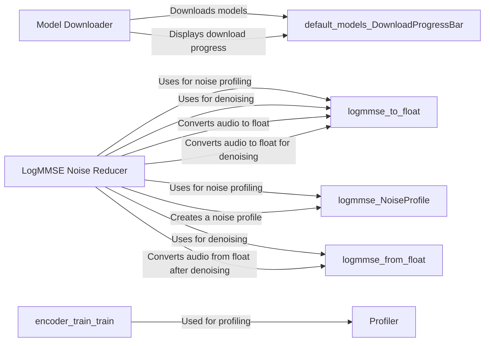

## Component Details

### Profiler
The Profiler component measures the execution time of code sections. It provides a `tick` method to mark the start and end of a section, recording the elapsed time. It then calculates and prints the mean and standard deviation of these times, offering insights into performance bottlenecks. It's used throughout the project to identify performance-critical sections.
- **Related Classes/Methods**: `repos.Real-Time-Voice-Cloning.utils.profiler`

### Model Downloader
The Model Downloader component handles the downloading of default models required by the project. It includes functions to download files from a given URL with a progress bar and to ensure that all default models are present in the specified directory. It uses threads for downloading to avoid blocking the main process.
- **Related Classes/Methods**: `repos.Real-Time-Voice-Cloning.utils.default_models`

### LogMMSE Noise Reducer
The LogMMSE Noise Reducer component implements the LogMMSE algorithm for noise reduction in audio signals. It includes functions to estimate the noise profile from an audio signal and to denoise the signal using the estimated profile. It also provides functions for converting audio data to and from float format.
- **Related Classes/Methods**: `repos.Real-Time-Voice-Cloning.utils.logmmse`
