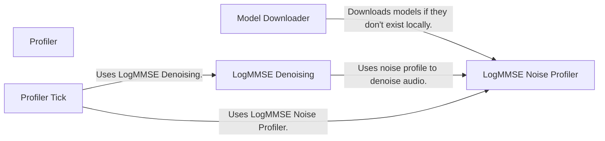

## Component Details

The Utilities component provides essential helper functions for the Real-Time Voice Cloning project. It encompasses functionalities such as downloading pre-trained models, audio processing techniques like LogMMSE noise reduction, and profiling tools for performance analysis. These utilities are designed to be reusable across various parts of the system, promoting modularity and maintainability.

### Model Downloader
The Model Downloader component is responsible for downloading pre-trained models required by the project. It checks if the model exists locally and downloads it from a remote source if it's missing, ensuring that the necessary models are available for other components to function correctly.
- **Related Classes/Methods**: `Real-Time-Voice-Cloning.utils.default_models:download`

### LogMMSE Noise Profiler
The LogMMSE Noise Profiler component analyzes audio signals to estimate the noise characteristics. This profile is then used by the LogMMSE Denoising component to effectively reduce noise from the audio, enhancing the clarity of the voice signal.
- **Related Classes/Methods**: `Real-Time-Voice-Cloning.utils.logmmse:profile_noise`

### LogMMSE Denoising
The LogMMSE Denoising component implements the LogMMSE algorithm to reduce noise in audio signals. It utilizes the noise profile generated by the LogMMSE Noise Profiler to suppress noise and improve the quality of the audio.
- **Related Classes/Methods**: `Real-Time-Voice-Cloning.utils.logmmse:denoise`

### Profiler
The Profiler component provides a mechanism for measuring the execution time of different code blocks. It allows developers to identify performance bottlenecks and optimize the code for efficiency. The Profiler class offers methods to start and stop timers, providing detailed timing information.
- **Related Classes/Methods**: `Real-Time-Voice-Cloning.utils.profiler.Profiler`

### Profiler Tick
The Profiler Tick component is a method within the Profiler class that records the time elapsed since the last tick. This allows for measuring the time taken by specific code segments within a larger block, providing more granular performance insights.
- **Related Classes/Methods**: `Real-Time-Voice-Cloning.utils.profiler.Profiler:tick`
