```mermaid
graph LR
    STFT["STFT"]
    ISTFT["ISTFT"]
    Griffin_Lim_Algorithm["Griffin-Lim Algorithm"]
    Linear_Spectrogram_Inversion["Linear Spectrogram Inversion"]
    Mel_Spectrogram_Inversion["Mel Spectrogram Inversion"]
    Vocoder_Griffin_Lim["Vocoder Griffin-Lim"]
    Griffin_Lim_Algorithm -- "Performs" --> STFT
    Griffin_Lim_Algorithm -- "Performs" --> ISTFT
    Linear_Spectrogram_Inversion -- "Converts to waveform" --> Griffin_Lim_Algorithm
    Mel_Spectrogram_Inversion -- "Converts mel to linear spectrogram" --> Linear_Spectrogram_Inversion
    Vocoder_Griffin_Lim -- "Converts to waveform" --> Mel_Spectrogram_Inversion
    ISTFT -- "Inverse transform" --> STFT
```

## Component Details

### STFT
The Short-Time Fourier Transform (STFT) component converts a time-domain audio signal into a frequency-domain representation, producing a spectrogram. This is a fundamental step in analyzing and manipulating audio signals, allowing for operations in the frequency domain. It uses librosa library.
- **Related Classes/Methods**: `synthesizer.audio._stft`

### ISTFT
The Inverse Short-Time Fourier Transform (ISTFT) component converts a frequency-domain representation (spectrogram) back into a time-domain audio signal. This is the inverse operation of STFT and is crucial for reconstructing audio after frequency-domain processing. It uses librosa library.
- **Related Classes/Methods**: `synthesizer.audio._istft`

### Griffin-Lim Algorithm
The Griffin-Lim algorithm is used for phase reconstruction from a magnitude spectrogram. Since the phase information is often lost or modified during audio processing, this algorithm iteratively estimates the phase, allowing for the reconstruction of a coherent audio signal from its magnitude spectrogram. It iteratively applies STFT and ISTFT.
- **Related Classes/Methods**: `synthesizer.audio._griffin_lim`

### Linear Spectrogram Inversion
This component converts a linear spectrogram into a waveform. It employs the Griffin-Lim algorithm (or LWS if enabled) for phase reconstruction and then applies ISTFT to generate the final waveform. This process is essential for converting processed spectrograms back into audible audio.
- **Related Classes/Methods**: `synthesizer.audio.inv_linear_spectrogram`

### Mel Spectrogram Inversion
This component converts a mel spectrogram into a waveform. It first transforms the mel spectrogram into a linear spectrogram and then uses either the Griffin-Lim algorithm (or LWS if enabled) for phase reconstruction, followed by ISTFT to produce the waveform. This is a key step in vocoding, as mel spectrograms are commonly used in speech processing.
- **Related Classes/Methods**: `synthesizer.audio.inv_mel_spectrogram`

### Vocoder Griffin-Lim
This component is part of the synthesizer inference process and specifically uses the Griffin-Lim algorithm to convert a mel spectrogram back into a waveform. It represents a specific application of the Griffin-Lim algorithm within the larger voice cloning system.
- **Related Classes/Methods**: `synthesizer.inference.Synthesizer.griffin_lim`
