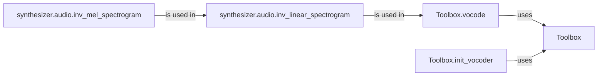

## Component Details

The Vocoder subsystem is responsible for converting the spectrogram, generated by the Synthesizer, into audible raw audio. The process begins with the Toolbox initializing the vocoder with necessary parameters and models. Subsequently, the Toolbox utilizes the vocoder to transform mel spectrograms into audio waveforms. This conversion involves transforming the mel spectrogram to a linear spectrogram and then converting the linear spectrogram to raw audio using inverse Short-Time Fourier Transform (iSTFT). The final output is the reconstructed audio waveform, making the synthesized speech audible.

### Toolbox
The Toolbox class provides utility functions and tools used throughout the voice cloning process, including vocoding and vocoder initialization. It serves as a central point for managing and utilizing vocoding functionalities.
- **Related Classes/Methods**: `Real-Time-Voice-Cloning.toolbox.Toolbox`

### Toolbox.vocode
This method within the Toolbox class orchestrates the vocoding process. It takes mel spectrograms as input and converts them into audio waveforms using the initialized vocoder. It calls the necessary functions for mel spectrogram inversion and linear spectrogram inversion.
- **Related Classes/Methods**: `Real-Time-Voice-Cloning.toolbox.Toolbox:vocode`

### Toolbox.init_vocoder
This method initializes the vocoder within the Toolbox, setting up the necessary parameters, loading pre-trained models, and configuring the vocoder for audio synthesis. This ensures that the vocoder is ready to convert spectrograms into audio.
- **Related Classes/Methods**: `Real-Time-Voice-Cloning.toolbox.Toolbox:init_vocoder`

### synthesizer.audio.inv_linear_spectrogram
This function converts a linear spectrogram back into an audio waveform using the inverse Short-Time Fourier Transform (iSTFT). It reconstructs the audio from the frequency-domain representation.
- **Related Classes/Methods**: `Real-Time-Voice-Cloning.synthesizer.audio:inv_linear_spectrogram`

### synthesizer.audio.inv_mel_spectrogram
This function converts a mel spectrogram back into a linear spectrogram. This is an intermediate step in converting a mel spectrogram to an audio waveform, as the iSTFT operates on linear spectrograms.
- **Related Classes/Methods**: `Real-Time-Voice-Cloning.synthesizer.audio:inv_mel_spectrogram`
