```mermaid
graph LR
    User_Interface["User Interface"]
    Core_Orchestration["Core Orchestration"]
    Speaker_Encoding["Speaker Encoding"]
    Speech_Synthesis["Speech Synthesis"]
    Vocoder["Vocoder"]
    Audio_Processing["Audio Processing"]
    Utilities["Utilities"]
    User_Interface -- "uses" --> Core_Orchestration
    Core_Orchestration -- "uses" --> User_Interface
    Core_Orchestration -- "uses" --> Speaker_Encoding
    Core_Orchestration -- "uses" --> Speech_Synthesis
    Core_Orchestration -- "uses" --> Vocoder
    Speaker_Encoding -- "extracts features with" --> Audio_Processing
    Speech_Synthesis -- "synthesizes audio with" --> Audio_Processing
    Audio_Processing -- "provides audio tools for" --> Speech_Synthesis
    Audio_Processing -- "provides audio tools for" --> Speaker_Encoding
    Utilities -- "provides utilities for" --> Core_Orchestration
    Utilities -- "provides utilities for" --> Speaker_Encoding
    Utilities -- "provides utilities for" --> Speech_Synthesis
    Vocoder -- "converts spectrograms to audio" --> Speech_Synthesis
    click User_Interface href "https://github.com/CodeBoarding/GeneratedOnBoardings/blob/main/Real-Time-Voice-Cloning/User Interface.md" "Details"
    click Core_Orchestration href "https://github.com/CodeBoarding/GeneratedOnBoardings/blob/main/Real-Time-Voice-Cloning/Core Orchestration.md" "Details"
    click Speaker_Encoding href "https://github.com/CodeBoarding/GeneratedOnBoardings/blob/main/Real-Time-Voice-Cloning/Speaker Encoding.md" "Details"
    click Speech_Synthesis href "https://github.com/CodeBoarding/GeneratedOnBoardings/blob/main/Real-Time-Voice-Cloning/Speech Synthesis.md" "Details"
    click Vocoder href "https://github.com/CodeBoarding/GeneratedOnBoardings/blob/main/Real-Time-Voice-Cloning/Vocoder.md" "Details"
    click Audio_Processing href "https://github.com/CodeBoarding/GeneratedOnBoardings/blob/main/Real-Time-Voice-Cloning/Audio Processing.md" "Details"
    click Utilities href "https://github.com/CodeBoarding/GeneratedOnBoardings/blob/main/Real-Time-Voice-Cloning/Utilities.md" "Details"
```

## Component Details

### User Interface
The User Interface component provides the graphical interface for the real-time voice cloning toolbox. It handles user interactions, displays audio information, and manages audio devices. It allows users to interact with the voice cloning process, controlling parameters and monitoring progress.
- **Related Classes/Methods**: `repos.Real-Time-Voice-Cloning.toolbox.ui.UI`

### Core Orchestration
The Core Orchestration component manages the overall voice cloning process. It sets up events, loads data, records audio, and triggers the speaker encoding, synthesis, and vocoding processes. It acts as the central control point, coordinating the other components and managing the data flow between them.
- **Related Classes/Methods**: `repos.Real-Time-Voice-Cloning.toolbox.Toolbox`

### Speaker Encoding
The Speaker Encoding component extracts speaker embeddings from audio data. It includes preprocessing, model definition, training logic, and inference functions. The encoder is responsible for capturing the unique characteristics of a speaker's voice and creating a representation that can be used by the Synthesizer.
- **Related Classes/Methods**: `repos.Real-Time-Voice-Cloning.encoder.model.SpeakerEncoder`, `repos.Real-Time-Voice-Cloning.encoder.audio`, `repos.Real-Time-Voice-Cloning.encoder.inference`, `repos.Real-Time-Voice-Cloning.encoder.preprocess`, `repos.Real-Time-Voice-Cloning.encoder.data_objects.speaker_verification_dataset`, `repos.Real-Time-Voice-Cloning.encoder.data_objects.speaker`, `repos.Real-Time-Voice-Cloning.encoder.data_objects.utterance`, `repos.Real-Time-Voice-Cloning.encoder.data_objects.random_cycler`, `repos.Real-Time-Voice-Cloning.encoder.data_objects.speaker_batch`, `repos.Real-Time-Voice-Cloning.encoder.visualizations`

### Speech Synthesis
The Speech Synthesis component synthesizes spectrograms from text and speaker embeddings. It includes the Tacotron model, training logic, and inference functions. The synthesizer is responsible for generating the acoustic features of the target voice based on the input text and the speaker embedding from the Speaker Encoder.
- **Related Classes/Methods**: `repos.Real-Time-Voice-Cloning.synthesizer.models.tacotron`, `repos.Real-Time-Voice-Cloning.synthesizer.inference.Synthesizer`, `repos.Real-Time-Voice-Cloning.synthesizer.audio`, `repos.Real-Time-Voice-Cloning.synthesizer.preprocess`, `repos.Real-Time-Voice-Cloning.synthesizer.synthesizer_dataset`, `repos.Real-Time-Voice-Cloning.synthesizer.utils.text`, `repos.Real-Time-Voice-Cloning.synthesizer.utils.cleaners`, `repos.Real-Time-Voice-Cloning.synthesizer.utils._cmudict`

### Vocoder
The Vocoder component converts spectrograms into audio waveforms. It is the final stage in the voice cloning process, responsible for generating the audible output. It takes the spectrogram generated by the Synthesizer and produces the corresponding audio.
- **Related Classes/Methods**: `repos.Real-Time-Voice-Cloning.vocoder`

### Audio Processing
The Audio Processing component provides tools for audio-related tasks, including calculating spectrograms, inverting spectrograms, and performing short-time Fourier transforms. It provides fundamental audio processing capabilities used by the Encoder and Synthesizer.
- **Related Classes/Methods**: `repos.Real-Time-Voice-Cloning.synthesizer.audio`

### Utilities
The Utilities component provides various utility functions, including argument parsing, default model downloading, noise reduction, and profiling. It offers supporting functionalities used across different components of the project.
- **Related Classes/Methods**: `repos.Real-Time-Voice-Cloning.utils`