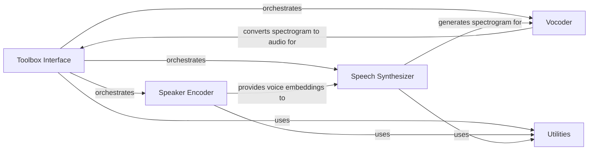

## Component Details

The Real-Time Voice Cloning project enables users to clone voices in real-time. The process begins with the Toolbox Interface, which captures user input and orchestrates the voice cloning pipeline. The Speaker Encoder extracts voice embeddings from audio data, which are then fed into the Speech Synthesizer. The Speech Synthesizer converts text into a spectrogram, conditioned on the voice embedding. Finally, the Vocoder transforms the spectrogram into audible speech, which is outputted to the user. The Utilities component provides supporting functionalities throughout the process.

### Toolbox Interface
The Toolbox Interface serves as the primary point of interaction for the user. It manages audio input/output devices, provides a graphical user interface, and orchestrates the entire voice cloning process by calling upon the Speaker Encoder, Speech Synthesizer, and Vocoder components. It also handles user interactions and displays feedback.
- **Related Classes/Methods**: `Real-Time-Voice-Cloning.toolbox.ui.UI`, `Real-Time-Voice-Cloning.toolbox.Toolbox`

### Speaker Encoder
The Speaker Encoder extracts unique voice embeddings from audio data. It preprocesses audio, uses a deep learning model to generate embeddings, and provides these embeddings to the Speech Synthesizer. It encapsulates functionalities for audio processing, inference, dataset management, core model definition, and training.
- **Related Classes/Methods**: `Real-Time-Voice-Cloning.encoder.preprocess`, `Real-Time-Voice-Cloning.encoder.audio`, `Real-Time-Voice-Cloning.encoder.inference`, `Real-Time-Voice-Cloning.encoder.data_objects`, `Real-Time-Voice-Cloning.encoder.model`, `Real-Time-Voice-Cloning.encoder.train`

### Speech Synthesizer
The Speech Synthesizer converts text into a spectrogram representation of speech, conditioned on the voice embedding provided by the Speaker Encoder. It includes text processing, audio processing, a core Tacotron model, dataset management, preprocessing, inference, and training functionalities.
- **Related Classes/Methods**: `Real-Time-Voice-Cloning.synthesizer.preprocess`, `Real-Time-Voice-Cloning.synthesizer.synthesizer_dataset`, `Real-Time-Voice-Cloning.synthesizer.synthesize`, `Real-Time-Voice-Cloning.synthesizer.audio`, `Real-Time-Voice-Cloning.synthesizer.inference`, `Real-Time-Voice-Cloning.synthesizer.utils.text`, `Real-Time-Voice-Cloning.synthesizer.utils.cleaners`, `Real-Time-Voice-Cloning.synthesizer.utils._cmudict`, `Real-Time-Voice-Cloning.synthesizer.train`, `Real-Time-Voice-Cloning.synthesizer.models.tacotron`

### Vocoder
The Vocoder transforms the spectrogram generated by the Synthesizer into raw audio. It reconstructs the audio waveform from the spectrogram, making the synthesized speech audible. It is called by the Toolbox to produce the final audio output.
- **Related Classes/Methods**: _None_

### Utilities
The Utilities component provides a collection of helper functions used throughout the project. These include functionalities for downloading models, audio processing tasks like noise reduction, and profiling tools. It supports various components by providing common functionalities.
- **Related Classes/Methods**: `Real-Time-Voice-Cloning.utils`