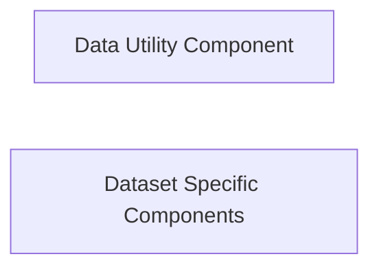

## Details

The `reclearn.data` subsystem is designed to manage and preprocess various datasets for recommendation tasks. It is primarily composed of two key architectural components: `Data Utility Component` and `Dataset Specific Components`. The `Data Utility Component` offers general-purpose data manipulation utilities, such as file splitting, which can be leveraged across different data processing pipelines. In contrast, the `Dataset Specific Components` are tailored to handle the unique characteristics of individual benchmark datasets, encompassing their loading, filtering, sorting, and negative sampling logic. While both components contribute to data preparation, the current analysis indicates that `Dataset Specific Components`, particularly the `create_ml_1m_dataset` method, perform their data processing independently and do not directly utilize the specific file utility methods provided by the `Data Utility Component`. This suggests a design where dataset-specific processing is self-contained, allowing for flexibility in handling diverse dataset requirements.

### Data Utility Component
This component provides foundational, general-purpose utilities for data manipulation and preprocessing. It handles common tasks that are not specific to any particular dataset, such as file splitting and basic data transformations. This aligns with the "Modular Design" and "Pipeline Architecture" principles by offering reusable building blocks for data preparation.

**Related Classes/Methods**:

- <a href="https://github.com/ZiyaoGeng/RecLearn/blob/reclearn/reclearn/data/utils.py#L38-L60" target="_blank" rel="noopener noreferrer">`reclearn.data.utils.splitByLineCount`:38-60</a>
- <a href="https://github.com/ZiyaoGeng/RecLearn/blob/reclearn/reclearn/data/utils.py#L12-L35" target="_blank" rel="noopener noreferrer">`reclearn.data.utils.mkSubFile`:12-35</a>

### Dataset Specific Components
These components specialize in managing and preprocessing specific benchmark datasets. They encapsulate dataset-specific loading logic, negative sampling, and sequence generation, ensuring data is formatted correctly for various recommendation tasks. This demonstrates the "Extensibility" aspect of the framework, allowing new datasets to be integrated by adding new components within this structure.

**Related Classes/Methods**:

- <a href="https://github.com/ZiyaoGeng/RecLearn/blob/reclearn/reclearn/data/datasets/movielens.py#L205-L221" target="_blank" rel="noopener noreferrer">`reclearn.data.datasets.movielens.generate_seq_data`:205-221</a>
- <a href="https://github.com/ZiyaoGeng/RecLearn/blob/reclearn/reclearn/data/datasets/movielens.py#L174-L179" target="_blank" rel="noopener noreferrer">`reclearn.data.datasets.movielens._gen_negative_samples`:174-179</a>
- <a href="https://github.com/ZiyaoGeng/RecLearn/blob/reclearn/reclearn/data/datasets/movielens.py#L224-L280" target="_blank" rel="noopener noreferrer">`reclearn.data.datasets.movielens.create_ml_1m_dataset`:224-280</a>
- <a href="https://github.com/ZiyaoGeng/RecLearn/blob/reclearn/reclearn/data/datasets/movielens.py#L308-L312" target="_blank" rel="noopener noreferrer">`reclearn.data.datasets.movielens.gen_neg`:308-312</a>
- <a href="https://github.com/ZiyaoGeng/RecLearn/blob/reclearn/reclearn/data/datasets/movielens.py#L283-L346" target="_blank" rel="noopener noreferrer">`reclearn.data.datasets.movielens.create_seq_ml_1m_dataset`:283-346</a>

### [FAQ](https://github.com/CodeBoarding/GeneratedOnBoardings/tree/main?tab=readme-ov-file#faq)