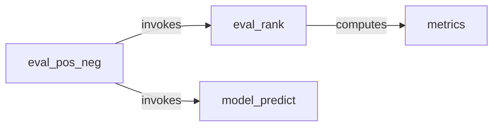

## Details

The `reclearn.evaluator` subsystem is designed to provide a structured approach to evaluating recommendation algorithms. It primarily consists of two core components: `eval_pos_neg` and `eval_rank`. The `eval_pos_neg` component acts as the initial orchestrator, preparing data and leveraging a `model` to generate predictions. These predictions are then passed to `eval_rank`, which is responsible for calculating various ranking-based metrics. This clear separation of concerns ensures that data preparation and model interaction are handled distinctly from the metric computation, leading to a modular and maintainable evaluation pipeline.

### eval_pos_neg
This component serves as the high-level entry point and orchestrator for evaluations involving both positive and negative samples. Its primary responsibility is to prepare the input data, manage the context for metric calculations, and initiate the evaluation flow by interacting with a prediction model. It acts as a facade for the overall evaluation process, abstracting away the complexities of data preparation for different evaluation scenarios.

**Related Classes/Methods**:

- <a href="https://github.com/ZiyaoGeng/RecLearn/blob/reclearn/reclearn/evaluator/evaluator.py#L9-L21" target="_blank" rel="noopener noreferrer">`eval_pos_neg`:9-21</a>

### eval_rank
This component specializes in computing a variety of ranking-based evaluation metrics, including Precision, Recall, Normalized Discounted Cumulative Gain (NDCG), and Mean Reciprocal Rank (MRR). It takes processed data or ranking scores as input and calculates the performance indicators relevant to ranking tasks.

**Related Classes/Methods**:

- <a href="https://github.com/ZiyaoGeng/RecLearn/blob/reclearn/reclearn/evaluator/evaluator.py#L24-L44" target="_blank" rel="noopener noreferrer">`eval_rank`:24-44</a>

### [FAQ](https://github.com/CodeBoarding/GeneratedOnBoardings/tree/main?tab=readme-ov-file#faq)