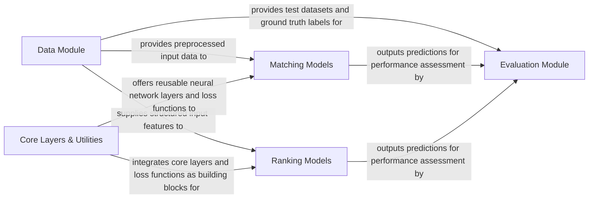

## Details

The RecLearn project is structured around a clear, modular architecture designed for developing and evaluating recommender systems. The Data Module serves as the entry point for all data, handling its preparation and distribution to downstream components. Core Layers & Utilities provides fundamental building blocks, including neural network layers and loss functions, which are leveraged by both Matching Models and Ranking Models. These two model components represent distinct stages in a typical recommender system pipeline: Matching Models efficiently retrieve candidate items, while Ranking Models refine this selection by ordering them by relevance. Finally, the Evaluation Module consumes the outputs from both Matching and Ranking Models, along with ground truth data from the Data Module, to assess overall system performance. This design promotes reusability, clear separation of concerns, and facilitates independent development and testing of each architectural component.

### Data Module [[Expand]](./Data_Module.md)
Responsible for all aspects of data handling, including loading, preprocessing, transformation, and splitting datasets for training, validation, and testing. It ensures data is in the correct format for downstream model consumption.

**Related Classes/Methods**:

- <a href="https://github.com/ZiyaoGeng/RecLearn/blob/reclearn/reclearn/data/utils.py" target="_blank" rel="noopener noreferrer">`reclearn/data/utils.py`</a>
- <a href="https://github.com/ZiyaoGeng/RecLearn/blob/reclearn/reclearn/data/datasets/movielens.py" target="_blank" rel="noopener noreferrer">`reclearn/data/datasets/movielens.py`</a>

### Core Layers & Utilities
Provides foundational, reusable neural network building blocks and common utility functions, including various loss functions essential for model training. These layers are designed to be model-agnostic.

**Related Classes/Methods**:

- <a href="https://github.com/ZiyaoGeng/RecLearn/blob/reclearn/reclearn/layers/core.py" target="_blank" rel="noopener noreferrer">`reclearn/layers/core.py`</a>
- <a href="https://github.com/ZiyaoGeng/RecLearn/blob/reclearn/reclearn/models/losses.py" target="_blank" rel="noopener noreferrer">`reclearn/models/losses.py`</a>

### Matching Models
Encapsulates various recommender system models specifically designed for the "matching" task. These models aim to efficiently retrieve a set of relevant candidate items from a large corpus.

**Related Classes/Methods**:

- <a href="https://github.com/ZiyaoGeng/RecLearn/blob/reclearn/reclearn/models/matching/attrec.py" target="_blank" rel="noopener noreferrer">`reclearn/models/matching/attrec.py`</a>
- <a href="https://github.com/ZiyaoGeng/RecLearn/blob/reclearn/reclearn/models/matching/bpr.py" target="_blank" rel="noopener noreferrer">`reclearn/models/matching/bpr.py`</a>
- <a href="https://github.com/ZiyaoGeng/RecLearn/blob/reclearn/reclearn/models/matching/dssm.py" target="_blank" rel="noopener noreferrer">`reclearn/models/matching/dssm.py`</a>
- <a href="https://github.com/ZiyaoGeng/RecLearn/blob/reclearn/reclearn/models/matching/caser.py" target="_blank" rel="noopener noreferrer">`reclearn/models/matching/caser.py`</a>
- <a href="https://github.com/ZiyaoGeng/RecLearn/blob/reclearn/reclearn/models/matching/gru4rec.py" target="_blank" rel="noopener noreferrer">`reclearn/models/matching/gru4rec.py`</a>
- <a href="https://github.com/ZiyaoGeng/RecLearn/blob/reclearn/reclearn/models/matching/fissa.py" target="_blank" rel="noopener noreferrer">`reclearn/models/matching/fissa.py`</a>
- <a href="https://github.com/ZiyaoGeng/RecLearn/blob/reclearn/reclearn/models/matching/mind.py" target="_blank" rel="noopener noreferrer">`reclearn/models/matching/mind.py`</a>
- <a href="https://github.com/ZiyaoGeng/RecLearn/blob/reclearn/reclearn/models/matching/ncf.py" target="_blank" rel="noopener noreferrer">`reclearn/models/matching/ncf.py`</a>
- <a href="https://github.com/ZiyaoGeng/RecLearn/blob/reclearn/reclearn/models/matching/poprec.py" target="_blank" rel="noopener noreferrer">`reclearn/models/matching/poprec.py`</a>
- <a href="https://github.com/ZiyaoGeng/RecLearn/blob/reclearn/reclearn/models/matching/sasrec.py" target="_blank" rel="noopener noreferrer">`reclearn/models/matching/sasrec.py`</a>
- <a href="https://github.com/ZiyaoGeng/RecLearn/blob/reclearn/reclearn/models/matching/youtubednn.py" target="_blank" rel="noopener noreferrer">`reclearn/models/matching/youtubednn.py`</a>

### Ranking Models
Contains implementations of recommender system models focused on the "ranking" task. These models take a smaller set of candidate items and order them by predicted relevance.

**Related Classes/Methods**:

- <a href="https://github.com/ZiyaoGeng/RecLearn/blob/reclearn/reclearn/models/ranking/afm.py" target="_blank" rel="noopener noreferrer">`reclearn/models/ranking/afm.py`</a>
- <a href="https://github.com/ZiyaoGeng/RecLearn/blob/reclearn/reclearn/models/ranking/dcn.py" target="_blank" rel="noopener noreferrer">`reclearn/models/ranking/dcn.py`</a>
- <a href="https://github.com/ZiyaoGeng/RecLearn/blob/reclearn/reclearn/models/ranking/deepfm.py" target="_blank" rel="noopener noreferrer">`reclearn/models/ranking/deepfm.py`</a>
- <a href="https://github.com/ZiyaoGeng/RecLearn/blob/reclearn/reclearn/models/ranking/deep_crossing.py" target="_blank" rel="noopener noreferrer">`reclearn/models/ranking/deep_crossing.py`</a>
- <a href="https://github.com/ZiyaoGeng/RecLearn/blob/reclearn/reclearn/models/ranking/ffm.py" target="_blank" rel="noopener noreferrer">`reclearn/models/ranking/ffm.py`</a>
- <a href="https://github.com/ZiyaoGeng/RecLearn/blob/reclearn/reclearn/models/ranking/fm.py" target="_blank" rel="noopener noreferrer">`reclearn/models/ranking/fm.py`</a>
- <a href="https://github.com/ZiyaoGeng/RecLearn/blob/reclearn/reclearn/models/ranking/nfm.py" target="_blank" rel="noopener noreferrer">`reclearn/models/ranking/nfm.py`</a>
- <a href="https://github.com/ZiyaoGeng/RecLearn/blob/reclearn/reclearn/models/ranking/pnn.py" target="_blank" rel="noopener noreferrer">`reclearn/models/ranking/pnn.py`</a>
- <a href="https://github.com/ZiyaoGeng/RecLearn/blob/reclearn/reclearn/models/ranking/wdl.py" target="_blank" rel="noopener noreferrer">`reclearn/models/ranking/wdl.py`</a>
- <a href="https://github.com/ZiyaoGeng/RecLearn/blob/reclearn/reclearn/models/ranking/xdeepfm.py" target="_blank" rel="noopener noreferrer">`reclearn/models/ranking/xdeepfm.py`</a>

### Evaluation Module [[Expand]](./Evaluation_Module.md)
Handles the quantitative assessment of recommender system performance using various metrics. It consumes model predictions and ground truth data to provide insights into model effectiveness.

**Related Classes/Methods**:

- <a href="https://github.com/ZiyaoGeng/RecLearn/blob/reclearn/reclearn/evaluator/evaluator.py" target="_blank" rel="noopener noreferrer">`reclearn/evaluator/evaluator.py`</a>

### [FAQ](https://github.com/CodeBoarding/GeneratedOnBoardings/tree/main?tab=readme-ov-file#faq)