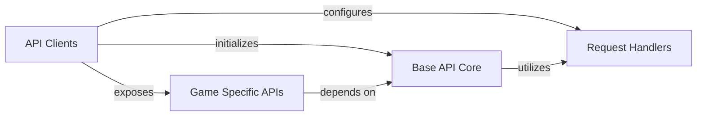

## Component Details

This graph illustrates the structure and interactions within the RiotWatcher library, focusing on how API requests are initiated, processed, and routed to specific game endpoints. The main flow begins with 'API Clients' which serve as the entry points for developers. These clients initialize a 'Base API Core' and configure a chain of 'Request Handlers' to manage various aspects of API interaction. The 'Base API Core' then utilizes these 'Request Handlers' to process requests before and after making the actual network call. Finally, 'API Clients' expose 'Game Specific APIs', which depend on the 'Base API Core' to perform their respective API calls.

### API Clients
The primary client interfaces for interacting with various Riot Games APIs (League of Legends, Legends of Runeterra, Riot Account, Teamfight Tactics, Valorant). Each client initializes a base API interaction layer and specific game API endpoints, applying a common chain of request handlers for consistent API interaction.

**Related Classes/Methods**:

- <a href="https://github.com/pseudonym117/Riot-Watcher/blob/master/src/riotwatcher/LolWatcher.py#L43-L121" target="_blank" rel="noopener noreferrer">`riotwatcher.LolWatcher.LolWatcher:__init__` (43:121)</a>
- <a href="https://github.com/pseudonym117/Riot-Watcher/blob/master/src/riotwatcher/LorWatcher.py#L25-L60" target="_blank" rel="noopener noreferrer">`riotwatcher.LorWatcher.LorWatcher:__init__` (25:60)</a>
- <a href="https://github.com/pseudonym117/Riot-Watcher/blob/master/src/riotwatcher/riotwatcher.py#L25-L58" target="_blank" rel="noopener noreferrer">`riotwatcher.riotwatcher.RiotWatcher:__init__` (25:58)</a>
- <a href="https://github.com/pseudonym117/Riot-Watcher/blob/master/src/riotwatcher/TftWatcher.py#L26-L63" target="_blank" rel="noopener noreferrer">`riotwatcher.TftWatcher.TftWatcher:__init__` (26:63)</a>
- <a href="https://github.com/pseudonym117/Riot-Watcher/blob/master/src/riotwatcher/ValWatcher.py#L25-L60" target="_blank" rel="noopener noreferrer">`riotwatcher.ValWatcher.ValWatcher:__init__` (25:60)</a>

### Base API Core
This component is responsible for handling the fundamental HTTP requests to the Riot API. It orchestrates the chain of request handlers, applying them before and after the actual network call to manage various aspects like rate limiting, deserialization, and error handling.

**Related Classes/Methods**:

- <a href="https://github.com/pseudonym117/Riot-Watcher/blob/master/src/riotwatcher/_apis/BaseApi.py#L4-L85" target="_blank" rel="noopener noreferrer">`riotwatcher._apis.BaseApi.BaseApi` (4:85)</a>

### Request Handlers
A collection of modular handlers that intercept and process API requests and responses. These handlers implement functionalities such as rate limiting, data deserialization, input sanitation, error throwing, type correction, and deprecation warnings, forming a configurable chain applied by the Base API Core.

**Related Classes/Methods**:

- <a href="https://github.com/pseudonym117/Riot-Watcher/blob/master/src/riotwatcher/Handlers/RateLimit/BasicRateLimiter.py#L18-L68" target="_blank" rel="noopener noreferrer">`riotwatcher.Handlers.RateLimit.BasicRateLimiter.BasicRateLimiter` (18:68)</a>
- <a href="https://github.com/pseudonym117/Riot-Watcher/blob/master/src/riotwatcher/Handlers/DictionaryDeserializer.py#L6-L10" target="_blank" rel="noopener noreferrer">`riotwatcher.Handlers.DictionaryDeserializer.DictionaryDeserializer` (6:10)</a>
- <a href="https://github.com/pseudonym117/Riot-Watcher/blob/master/src/riotwatcher/Handlers/SanitationHandler.py#L6-L38" target="_blank" rel="noopener noreferrer">`riotwatcher.Handlers.SanitationHandler.SanitationHandler` (6:38)</a>
- <a href="https://github.com/pseudonym117/Riot-Watcher/blob/master/src/riotwatcher/Handlers/DeserializerAdapter.py#L9-L25" target="_blank" rel="noopener noreferrer">`riotwatcher.Handlers.DeserializerAdapter.DeserializerAdapter` (9:25)</a>
- <a href="https://github.com/pseudonym117/Riot-Watcher/blob/master/src/riotwatcher/Handlers/ThrowOnErrorHandler.py#L8-L20" target="_blank" rel="noopener noreferrer">`riotwatcher.Handlers.ThrowOnErrorHandler.ThrowOnErrorHandler` (8:20)</a>
- <a href="https://github.com/pseudonym117/Riot-Watcher/blob/master/src/riotwatcher/Handlers/TypeCorrectorHandler.py#L4-L43" target="_blank" rel="noopener noreferrer">`riotwatcher.Handlers.TypeCorrectorHandler.TypeCorrectorHandler` (4:43)</a>
- <a href="https://github.com/pseudonym117/Riot-Watcher/blob/master/src/riotwatcher/Handlers/DeprecationHandler.py#L11-L45" target="_blank" rel="noopener noreferrer">`riotwatcher.Handlers.DeprecationHandler.DeprecationHandler` (11:45)</a>
- <a href="https://github.com/pseudonym117/Riot-Watcher/blob/master/src/riotwatcher/Handlers/RateLimiterAdapter.py#L13-L68" target="_blank" rel="noopener noreferrer">`riotwatcher.Handlers.RateLimiterAdapter.RateLimiterAdapter` (13:68)</a>

### Game Specific APIs
This component encompasses all the individual API clients tailored for specific game data and functionalities across different Riot titles (League of Legends, Legends of Runeterra, Teamfight Tactics, Valorant) and general Riot account information. Each client provides methods to interact with a particular set of endpoints.

**Related Classes/Methods**:

- <a href="https://github.com/pseudonym117/Riot-Watcher/blob/master/src/riotwatcher/_apis/league_of_legends/ChampionApiV3.py#L5-L30" target="_blank" rel="noopener noreferrer">`riotwatcher._apis.league_of_legends.ChampionApiV3.ChampionApiV3` (5:30)</a>
- <a href="https://github.com/pseudonym117/Riot-Watcher/blob/master/src/riotwatcher/_apis/league_of_legends/LolStatusApiV3.py#L5-L33" target="_blank" rel="noopener noreferrer">`riotwatcher._apis.league_of_legends.LolStatusApiV3.LolStatusApiV3` (5:33)</a>
- <a href="https://github.com/pseudonym117/Riot-Watcher/blob/master/src/riotwatcher/_apis/league_of_legends/LolStatusApiV4.py#L5-L33" target="_blank" rel="noopener noreferrer">`riotwatcher._apis.league_of_legends.LolStatusApiV4.LolStatusApiV4` (5:33)</a>
- <a href="https://github.com/pseudonym117/Riot-Watcher/blob/master/src/riotwatcher/_apis/league_of_legends/DataDragonApi.py#L7-L53" target="_blank" rel="noopener noreferrer">`riotwatcher._apis.league_of_legends.DataDragonApi.DataDragonApi` (7:53)</a>
- <a href="https://github.com/pseudonym117/Riot-Watcher/blob/master/src/riotwatcher/_apis/league_of_legends/ClashApiV1.py#L5-L93" target="_blank" rel="noopener noreferrer">`riotwatcher._apis.league_of_legends.ClashApiV1.ClashApiV1` (5:93)</a>
- <a href="https://github.com/pseudonym117/Riot-Watcher/blob/master/src/riotwatcher/_apis/league_of_legends/ChampionMasteryApiV4.py#L5-L92" target="_blank" rel="noopener noreferrer">`riotwatcher._apis.league_of_legends.ChampionMasteryApiV4.ChampionMasteryApiV4` (5:92)</a>
- <a href="https://github.com/pseudonym117/Riot-Watcher/blob/master/src/riotwatcher/_apis/league_of_legends/LeagueApiV4.py#L5-L134" target="_blank" rel="noopener noreferrer">`riotwatcher._apis.league_of_legends.LeagueApiV4.LeagueApiV4` (5:134)</a>
- <a href="https://github.com/pseudonym117/Riot-Watcher/blob/master/src/riotwatcher/_apis/league_of_legends/MatchApiV5.py#L6-L103" target="_blank" rel="noopener noreferrer">`riotwatcher._apis.league_of_legends.MatchApiV5.MatchApiV5` (6:103)</a>
- <a href="https://github.com/pseudonym117/Riot-Watcher/blob/master/src/riotwatcher/_apis/league_of_legends/SpectatorApiV5.py#L5-L47" target="_blank" rel="noopener noreferrer">`riotwatcher._apis.league_of_legends.SpectatorApiV5.SpectatorApiV5` (5:47)</a>
- <a href="https://github.com/pseudonym117/Riot-Watcher/blob/master/src/riotwatcher/_apis/league_of_legends/ChallengesApiV1.py#L5-L114" target="_blank" rel="noopener noreferrer">`riotwatcher._apis.league_of_legends.ChallengesApiV1.ChallengesApiV1` (5:114)</a>
- <a href="https://github.com/pseudonym117/Riot-Watcher/blob/master/src/riotwatcher/_apis/league_of_legends/SummonerApiV4.py#L5-L67" target="_blank" rel="noopener noreferrer">`riotwatcher._apis.league_of_legends.SummonerApiV4.SummonerApiV4` (5:67)</a>
- <a href="https://github.com/pseudonym117/Riot-Watcher/blob/master/src/riotwatcher/_apis/legends_of_runeterra/MatchApi.py#L5-L39" target="_blank" rel="noopener noreferrer">`riotwatcher._apis.legends_of_runeterra.MatchApi.MatchApi` (5:39)</a>
- <a href="https://github.com/pseudonym117/Riot-Watcher/blob/master/src/riotwatcher/_apis/legends_of_runeterra/RankedApi.py#L5-L29" target="_blank" rel="noopener noreferrer">`riotwatcher._apis.legends_of_runeterra.RankedApi.RankedApi` (5:29)</a>
- <a href="https://github.com/pseudonym117/Riot-Watcher/blob/master/src/riotwatcher/_apis/team_fight_tactics/LeagueApi.py#L5-L99" target="_blank" rel="noopener noreferrer">`riotwatcher._apis.team_fight_tactics.LeagueApi.LeagueApi` (5:99)</a>
- <a href="https://github.com/pseudonym117/Riot-Watcher/blob/master/src/riotwatcher/_apis/team_fight_tactics/MatchApi.py#L8-L77" target="_blank" rel="noopener noreferrer">`riotwatcher._apis.team_fight_tactics.MatchApi.MatchApi` (8:77)</a>
- <a href="https://github.com/pseudonym117/Riot-Watcher/blob/master/src/riotwatcher/_apis/team_fight_tactics/SummonerApi.py#L5-L68" target="_blank" rel="noopener noreferrer">`riotwatcher._apis.team_fight_tactics.SummonerApi.SummonerApi` (5:68)</a>
- <a href="https://github.com/pseudonym117/Riot-Watcher/blob/master/src/riotwatcher/_apis/team_fight_tactics/DataDragonApi.py#L7-L46" target="_blank" rel="noopener noreferrer">`riotwatcher._apis.team_fight_tactics.DataDragonApi.DataDragonApi` (7:46)</a>
- <a href="https://github.com/pseudonym117/Riot-Watcher/blob/master/src/riotwatcher/_apis/valorant/ContentApi.py#L5-L29" target="_blank" rel="noopener noreferrer">`riotwatcher._apis.valorant.ContentApi.ContentApi` (5:29)</a>
- <a href="https://github.com/pseudonym117/Riot-Watcher/blob/master/src/riotwatcher/_apis/valorant/MatchApi.py#L5-L60" target="_blank" rel="noopener noreferrer">`riotwatcher._apis.valorant.MatchApi.MatchApi` (5:60)</a>
- <a href="https://github.com/pseudonym117/Riot-Watcher/blob/master/src/riotwatcher/_apis/riot/AccountApi.py#L5-L56" target="_blank" rel="noopener noreferrer">`riotwatcher._apis.riot.AccountApi.AccountApi` (5:56)</a>

### [FAQ](https://github.com/CodeBoarding/GeneratedOnBoardings/tree/main?tab=readme-ov-file#faq)