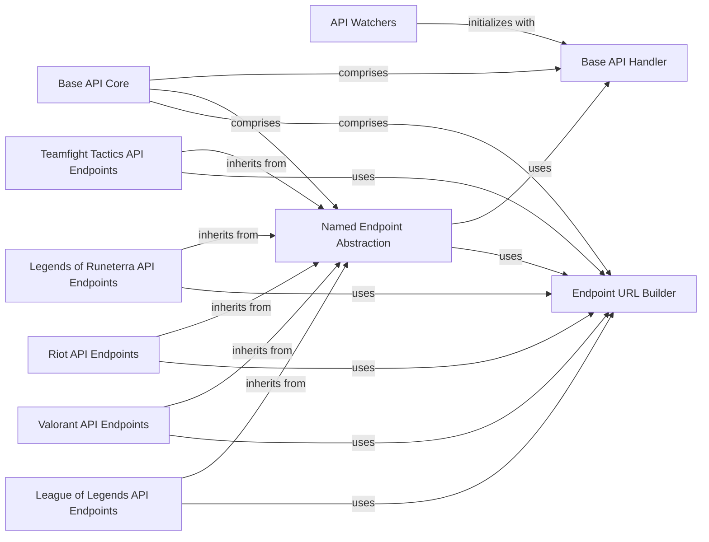

## Component Details

This architecture describes the Riot Games API client library, focusing on how API requests are structured, handled, and dispatched. The core functionality revolves around the `Base API Core` which manages the fundamental aspects of HTTP communication, including API key management and request orchestration. Building upon this, the `Named Endpoint Abstraction` provides a simplified interface for specific API categories by injecting endpoint names. The `Endpoint URL Builder` is crucial for dynamically constructing correct API request URLs. Various `API Watchers` act as entry points for different Riot Games titles, each initializing with the core API handler. Finally, dedicated `API Endpoints` components for each game (League of Legends, Teamfight Tactics, Legends of Runeterra, Valorant, and general Riot APIs) inherit from the `Named Endpoint Abstraction` and utilize the `Endpoint URL Builder` to interact with their respective services.

### Base API Core
Provides the core functionality for making HTTP requests to the Riot Games API. It manages the API key, request timeouts, and orchestrates the execution of the request handling chain before and after sending requests. It also includes foundational classes for defining and constructing API endpoints.

**Related Classes/Methods**:

- <a href="https://github.com/pseudonym117/Riot-Watcher/blob/master/src/riotwatcher/_apis/BaseApi.py#L4-L85" target="_blank" rel="noopener noreferrer">`Riot-Watcher.src.riotwatcher._apis.BaseApi.BaseApi` (4:85)</a>
- <a href="https://github.com/pseudonym117/Riot-Watcher/blob/master/src/riotwatcher/_apis/NamedEndpoint.py#L6-L38" target="_blank" rel="noopener noreferrer">`Riot-Watcher.src.riotwatcher._apis.NamedEndpoint.NamedEndpoint` (6:38)</a>
- <a href="https://github.com/pseudonym117/Riot-Watcher/blob/master/src/riotwatcher/_apis/Endpoint.py#L4-L24" target="_blank" rel="noopener noreferrer">`Riot-Watcher.src.riotwatcher._apis.Endpoint.Endpoint` (4:24)</a>

### API Watchers
These components serve as the entry points for interacting with different Riot Games APIs (League of Legends, Teamfight Tactics, Legends of Runeterra, Valorant, and Riot-wide services). They initialize with a BaseApi instance, which handles the underlying request logic.

**Related Classes/Methods**:

- <a href="https://github.com/pseudonym117/Riot-Watcher/blob/master/src/riotwatcher/LolWatcher.py#L37-L256" target="_blank" rel="noopener noreferrer">`Riot-Watcher.src.riotwatcher.LolWatcher.LolWatcher` (37:256)</a>
- <a href="https://github.com/pseudonym117/Riot-Watcher/blob/master/src/riotwatcher/LorWatcher.py#L19-L78" target="_blank" rel="noopener noreferrer">`Riot-Watcher.src.riotwatcher.LorWatcher.LorWatcher` (19:78)</a>
- <a href="https://github.com/pseudonym117/Riot-Watcher/blob/master/src/riotwatcher/riotwatcher.py#L19-L67" target="_blank" rel="noopener noreferrer">`Riot-Watcher.src.riotwatcher.riotwatcher.RiotWatcher` (19:67)</a>
- <a href="https://github.com/pseudonym117/Riot-Watcher/blob/master/src/riotwatcher/TftWatcher.py#L20-L99" target="_blank" rel="noopener noreferrer">`Riot-Watcher.src.riotwatcher.TftWatcher.TftWatcher` (20:99)</a>
- <a href="https://github.com/pseudonym117/Riot-Watcher/blob/master/src/riotwatcher/ValWatcher.py#L19-L78" target="_blank" rel="noopener noreferrer">`Riot-Watcher.src.riotwatcher.ValWatcher.ValWatcher` (19:78)</a>

### Base API Handler
This component is responsible for making raw HTTP requests to the Riot Games API. It manages the API key, handles request handlers (for previewing and post-processing requests), and uses a `requests` session for efficient communication. It also handles static requests.

**Related Classes/Methods**:

- <a href="https://github.com/pseudonym117/Riot-Watcher/blob/master/src/riotwatcher/_apis/BaseApi.py#L4-L85" target="_blank" rel="noopener noreferrer">`Riot-Watcher.src.riotwatcher._apis.BaseApi.BaseApi` (4:85)</a>
- <a href="https://github.com/pseudonym117/Riot-Watcher/blob/master/src/riotwatcher/_apis/BaseApi.py#L5-L9" target="_blank" rel="noopener noreferrer">`Riot-Watcher.src.riotwatcher._apis.BaseApi.BaseApi:__init__` (5:9)</a>
- <a href="https://github.com/pseudonym117/Riot-Watcher/blob/master/src/riotwatcher/_apis/BaseApi.py#L12-L13" target="_blank" rel="noopener noreferrer">`Riot-Watcher.src.riotwatcher._apis.BaseApi.BaseApi:api_key` (12:13)</a>
- <a href="https://github.com/pseudonym117/Riot-Watcher/blob/master/src/riotwatcher/_apis/BaseApi.py#L15-L57" target="_blank" rel="noopener noreferrer">`Riot-Watcher.src.riotwatcher._apis.BaseApi.BaseApi:raw_request` (15:57)</a>
- <a href="https://github.com/pseudonym117/Riot-Watcher/blob/master/src/riotwatcher/_apis/BaseApi.py#L59-L85" target="_blank" rel="noopener noreferrer">`Riot-Watcher.src.riotwatcher._apis.BaseApi.BaseApi:raw_request_static` (59:85)</a>

### Named Endpoint Abstraction
This component provides a layer of abstraction over the BaseApi, injecting the endpoint name into API calls. This simplifies the development of specific API endpoints by removing the need to explicitly pass the endpoint name in every request.

**Related Classes/Methods**:

- <a href="https://github.com/pseudonym117/Riot-Watcher/blob/master/src/riotwatcher/_apis/NamedEndpoint.py#L6-L38" target="_blank" rel="noopener noreferrer">`Riot-Watcher.src.riotwatcher._apis.NamedEndpoint.NamedEndpoint` (6:38)</a>
- <a href="https://github.com/pseudonym117/Riot-Watcher/blob/master/src/riotwatcher/_apis/NamedEndpoint.py#L12-L21" target="_blank" rel="noopener noreferrer">`Riot-Watcher.src.riotwatcher._apis.NamedEndpoint.NamedEndpoint:__init__` (12:21)</a>
- <a href="https://github.com/pseudonym117/Riot-Watcher/blob/master/src/riotwatcher/_apis/NamedEndpoint.py#L23-L38" target="_blank" rel="noopener noreferrer">`Riot-Watcher.src.riotwatcher._apis.NamedEndpoint.NamedEndpoint._request_endpoint` (23:38)</a>

### Endpoint URL Builder
This component is responsible for constructing the URL and query parameters for API requests. It parses the URL string to identify required parameters and ensures that all necessary parameters are provided before generating the final URL and query string.

**Related Classes/Methods**:

- <a href="https://github.com/pseudonym117/Riot-Watcher/blob/master/src/riotwatcher/_apis/Endpoint.py#L4-L24" target="_blank" rel="noopener noreferrer">`Riot-Watcher.src.riotwatcher._apis.Endpoint.Endpoint` (4:24)</a>
- <a href="https://github.com/pseudonym117/Riot-Watcher/blob/master/src/riotwatcher/_apis/Endpoint.py#L5-L13" target="_blank" rel="noopener noreferrer">`Riot-Watcher.src.riotwatcher._apis.Endpoint.Endpoint:__init__` (5:13)</a>
- <a href="https://github.com/pseudonym117/Riot-Watcher/blob/master/src/riotwatcher/_apis/Endpoint.py#L15-L24" target="_blank" rel="noopener noreferrer">`Riot-Watcher.src.riotwatcher._apis.Endpoint.Endpoint:__call__` (15:24)</a>

### Teamfight Tactics API Endpoints
This component groups all the specific API endpoints related to Teamfight Tactics, such as Summoner, Match, Data Dragon, and League APIs. Each of these APIs inherits from NamedEndpoint and uses the _request_endpoint method to make calls.

**Related Classes/Methods**:

- <a href="https://github.com/pseudonym117/Riot-Watcher/blob/master/src/riotwatcher/_apis/team_fight_tactics/SummonerApi.py#L5-L68" target="_blank" rel="noopener noreferrer">`Riot-Watcher.src.riotwatcher._apis.team_fight_tactics.SummonerApi.SummonerApi` (5:68)</a>
- <a href="https://github.com/pseudonym117/Riot-Watcher/blob/master/src/riotwatcher/_apis/team_fight_tactics/SummonerApi.py#L13-L19" target="_blank" rel="noopener noreferrer">`Riot-Watcher.src.riotwatcher._apis.team_fight_tactics.SummonerApi.SummonerApi:__init__` (13:19)</a>
- <a href="https://github.com/pseudonym117/Riot-Watcher/blob/master/src/riotwatcher/_apis/team_fight_tactics/SummonerApi.py#L21-L32" target="_blank" rel="noopener noreferrer">`Riot-Watcher.src.riotwatcher._apis.team_fight_tactics.SummonerApi.SummonerApi:by_account` (21:32)</a>
- <a href="https://github.com/pseudonym117/Riot-Watcher/blob/master/src/riotwatcher/_apis/team_fight_tactics/SummonerApi.py#L34-L45" target="_blank" rel="noopener noreferrer">`Riot-Watcher.src.riotwatcher._apis.team_fight_tactics.SummonerApi.SummonerApi:by_name` (34:45)</a>
- <a href="https://github.com/pseudonym117/Riot-Watcher/blob/master/src/riotwatcher/_apis/team_fight_tactics/SummonerApi.py#L47-L55" target="_blank" rel="noopener noreferrer">`Riot-Watcher.src.riotwatcher._apis.team_fight_tactics.SummonerApi.SummonerApi:by_puuid` (47:55)</a>
- <a href="https://github.com/pseudonym117/Riot-Watcher/blob/master/src/riotwatcher/_apis/team_fight_tactics/SummonerApi.py#L57-L68" target="_blank" rel="noopener noreferrer">`Riot-Watcher.src.riotwatcher._apis.team_fight_tactics.SummonerApi.SummonerApi:by_id` (57:68)</a>
- <a href="https://github.com/pseudonym117/Riot-Watcher/blob/master/src/riotwatcher/_apis/team_fight_tactics/MatchApi.py#L8-L77" target="_blank" rel="noopener noreferrer">`Riot-Watcher.src.riotwatcher._apis.team_fight_tactics.MatchApi.MatchApi` (8:77)</a>
- <a href="https://github.com/pseudonym117/Riot-Watcher/blob/master/src/riotwatcher/_apis/team_fight_tactics/MatchApi.py#L15-L21" target="_blank" rel="noopener noreferrer">`Riot-Watcher.src.riotwatcher._apis.team_fight_tactics.MatchApi.MatchApi:__init__` (15:21)</a>
- <a href="https://github.com/pseudonym117/Riot-Watcher/blob/master/src/riotwatcher/_apis/team_fight_tactics/MatchApi.py#L24-L63" target="_blank" rel="noopener noreferrer">`Riot-Watcher.src.riotwatcher._apis.team_fight_tactics.MatchApi.MatchApi:by_puuid` (24:63)</a>
- <a href="https://github.com/pseudonym117/Riot-Watcher/blob/master/src/riotwatcher/_apis/team_fight_tactics/MatchApi.py#L66-L77" target="_blank" rel="noopener noreferrer">`Riot-Watcher.src.riotwatcher._apis.team_fight_tactics.MatchApi.MatchApi:by_id` (66:77)</a>
- <a href="https://github.com/pseudonym117/Riot-Watcher/blob/master/src/riotwatcher/_apis/team_fight_tactics/DataDragonApi.py#L7-L46" target="_blank" rel="noopener noreferrer">`Riot-Watcher.src.riotwatcher._apis.team_fight_tactics.DataDragonApi.DataDragonApi` (7:46)</a>
- <a href="https://github.com/pseudonym117/Riot-Watcher/blob/master/src/riotwatcher/_apis/team_fight_tactics/DataDragonApi.py#L35-L38" target="_blank" rel="noopener noreferrer">`Riot-Watcher.src.riotwatcher._apis.team_fight_tactics.DataDragonApi.DataDragonApi:versions_for_region` (35:38)</a>
- <a href="https://github.com/pseudonym117/Riot-Watcher/blob/master/src/riotwatcher/_apis/team_fight_tactics/DataDragonApi.py#L40-L42" target="_blank" rel="noopener noreferrer">`Riot-Watcher.src.riotwatcher._apis.team_fight_tactics.DataDragonApi.DataDragonApi:versions_all` (40:42)</a>
- <a href="https://github.com/pseudonym117/Riot-Watcher/blob/master/src/riotwatcher/_apis/team_fight_tactics/LeagueApi.py#L5-L99" target="_blank" rel="noopener noreferrer">`Riot-Watcher.src.riotwatcher._apis.team_fight_tactics.LeagueApi.LeagueApi` (5:99)</a>
- <a href="https://github.com/pseudonym117/Riot-Watcher/blob/master/src/riotwatcher/_apis/team_fight_tactics/LeagueApi.py#L12-L18" target="_blank" rel="noopener noreferrer">`Riot-Watcher.src.riotwatcher._apis.team_fight_tactics.LeagueApi.LeagueApi:__init__` (12:18)</a>
- <a href="https://github.com/pseudonym117/Riot-Watcher/blob/master/src/riotwatcher/_apis/team_fight_tactics/LeagueApi.py#L20-L28" target="_blank" rel="noopener noreferrer">`Riot-Watcher.src.riotwatcher._apis.team_fight_tactics.LeagueApi.LeagueApi:challenger` (20:28)</a>
- <a href="https://github.com/pseudonym117/Riot-Watcher/blob/master/src/riotwatcher/_apis/team_fight_tactics/LeagueApi.py#L30-L41" target="_blank" rel="noopener noreferrer">`Riot-Watcher.src.riotwatcher._apis.team_fight_tactics.LeagueApi.LeagueApi:by_summoner` (30:41)</a>
- <a href="https://github.com/pseudonym117/Riot-Watcher/blob/master/src/riotwatcher/_apis/team_fight_tactics/LeagueApi.py#L43-L56" target="_blank" rel="noopener noreferrer">`Riot-Watcher.src.riotwatcher._apis.team_fight_tactics.LeagueApi.LeagueApi:entries` (43:56)</a>
- <a href="https://github.com/pseudonym117/Riot-Watcher/blob/master/src/riotwatcher/_apis/team_fight_tactics/LeagueApi.py#L58-L66" target="_blank" rel="noopener noreferrer">`Riot-Watcher.src.riotwatcher._apis.team_fight_tactics.LeagueApi.LeagueApi:grandmaster` (58:66)</a>
- <a href="https://github.com/pseudonym117/Riot-Watcher/blob/master/src/riotwatcher/_apis/team_fight_tactics/LeagueApi.py#L68-L76" target="_blank" rel="noopener noreferrer">`Riot-Watcher.src.riotwatcher._apis.team_fight_tactics.LeagueApi.LeagueApi:by_id` (68:76)</a>
- <a href="https://github.com/pseudonym117/Riot-Watcher/blob/master/src/riotwatcher/_apis/team_fight_tactics/LeagueApi.py#L78-L86" target="_blank" rel="noopener noreferrer">`Riot-Watcher.src.riotwatcher._apis.team_fight_tactics.LeagueApi.LeagueApi:master` (78:86)</a>
- <a href="https://github.com/pseudonym117/Riot-Watcher/blob/master/src/riotwatcher/_apis/team_fight_tactics/LeagueApi.py#L88-L99" target="_blank" rel="noopener noreferrer">`Riot-Watcher.src.riotwatcher._apis.team_fight_tactics.LeagueApi.LeagueApi:rated_ladders` (88:99)</a>
- <a href="https://github.com/pseudonym117/Riot-Watcher/blob/master/src/riotwatcher/_apis/team_fight_tactics/urls/TftEndpoint.py#L8-L12" target="_blank" rel="noopener noreferrer">`Riot-Watcher.src.riotwatcher._apis.team_fight_tactics.urls.TftEndpoint.TftEndpoint:__call__` (8:12)</a>
- <a href="https://github.com/pseudonym117/Riot-Watcher/blob/master/src/riotwatcher/_apis/team_fight_tactics/urls/DataDragonUrls.py#L5-L7" target="_blank" rel="noopener noreferrer">`Riot-Watcher.src.riotwatcher._apis.team_fight_tactics.urls.DataDragonUrls.DataDragonEndpoint:__init__` (5:7)</a>

### Legends of Runeterra API Endpoints
This component encapsulates the API endpoints specific to Legends of Runeterra, including Ranked and Match APIs. Similar to TFT, these APIs leverage the NamedEndpoint for making requests.

**Related Classes/Methods**:

- <a href="https://github.com/pseudonym117/Riot-Watcher/blob/master/src/riotwatcher/_apis/legends_of_runeterra/RankedApi.py#L5-L29" target="_blank" rel="noopener noreferrer">`Riot-Watcher.src.riotwatcher._apis.legends_of_runeterra.RankedApi.RankedApi` (5:29)</a>
- <a href="https://github.com/pseudonym117/Riot-Watcher/blob/master/src/riotwatcher/_apis/legends_of_runeterra/RankedApi.py#L13-L19" target="_blank" rel="noopener noreferrer">`Riot-Watcher.src.riotwatcher._apis.legends_of_runeterra.RankedApi.RankedApi:__init__` (13:19)</a>
- <a href="https://github.com/pseudonym117/Riot-Watcher/blob/master/src/riotwatcher/_apis/legends_of_runeterra/RankedApi.py#L21-L29" target="_blank" rel="noopener noreferrer">`Riot-Watcher.src.riotwatcher._apis.legends_of_runeterra.RankedApi.RankedApi:leaderboards` (21:29)</a>
- <a href="https://github.com/pseudonym117/Riot-Watcher/blob/master/src/riotwatcher/_apis/legends_of_runeterra/MatchApi.py#L5-L39" target="_blank" rel="noopener noreferrer">`Riot-Watcher.src.riotwatcher._apis.legends_of_runeterra.MatchApi.MatchApi` (5:39)</a>
- <a href="https://github.com/pseudonym117/Riot-Watcher/blob/master/src/riotwatcher/_apis/legends_of_runeterra/MatchApi.py#L13-L19" target="_blank" rel="noopener noreferrer">`Riot-Watcher.src.riotwatcher._apis.legends_of_runeterra.MatchApi.MatchApi:__init__` (13:19)</a>
- <a href="https://github.com/pseudonym117/Riot-Watcher/blob/master/src/riotwatcher/_apis/legends_of_runeterra/MatchApi.py#L21-L29" target="_blank" rel="noopener noreferrer">`Riot-Watcher.src.riotwatcher._apis.legends_of_runeterra.MatchApi.MatchApi:by_puuid` (21:29)</a>
- <a href="https://github.com/pseudonym117/Riot-Watcher/blob/master/src/riotwatcher/_apis/legends_of_runeterra/MatchApi.py#L31-L39" target="_blank" rel="noopener noreferrer">`Riot-Watcher.src.riotwatcher._apis.legends_of_runeterra.MatchApi.MatchApi:by_id` (31:39)</a>
- <a href="https://github.com/pseudonym117/Riot-Watcher/blob/master/src/riotwatcher/_apis/legends_of_runeterra/urls/LorEndpoint.py#L8-L12" target="_blank" rel="noopener noreferrer">`Riot-Watcher.src.riotwatcher._apis.legends_of_runeterra.urls.LorEndpoint.LorEndpoint:__call__` (8:12)</a>

### Riot API Endpoints
This component focuses on the general Riot API endpoints, specifically the Account API, which handles operations related to Riot accounts. It also uses the NamedEndpoint for its API calls.

**Related Classes/Methods**:

- <a href="https://github.com/pseudonym117/Riot-Watcher/blob/master/src/riotwatcher/_apis/riot/AccountApi.py#L5-L56" target="_blank" rel="noopener noreferrer">`Riot-Watcher.src.riotwatcher._apis.riot.AccountApi.AccountApi` (5:56)</a>
- <a href="https://github.com/pseudonym117/Riot-Watcher/blob/master/src/riotwatcher/_apis/riot/AccountApi.py#L12-L18" target="_blank" rel="noopener noreferrer">`Riot-Watcher.src.riotwatcher._apis.riot.AccountApi.AccountApi:__init__` (12:18)</a>
- <a href="https://github.com/pseudonym117/Riot-Watcher/blob/master/src/riotwatcher/_apis/riot/AccountApi.py#L20-L28" target="_blank" rel="noopener noreferrer">`Riot-Watcher.src.riotwatcher._apis.riot.AccountApi.AccountApi:by_puuid` (20:28)</a>
- <a href="https://github.com/pseudonym117/Riot-Watcher/blob/master/src/riotwatcher/_apis/riot/AccountApi.py#L30-L42" target="_blank" rel="noopener noreferrer">`Riot-Watcher.src.riotwatcher._apis.riot.AccountApi.AccountApi:by_riot_id` (30:42)</a>
- <a href="https://github.com/pseudonym117/Riot-Watcher/blob/master/src/riotwatcher/_apis/riot/AccountApi.py#L44-L56" target="_blank" rel="noopener noreferrer">`Riot-Watcher.src.riotwatcher._apis.riot.AccountApi.AccountApi:active_shard` (44:56)</a>
- <a href="https://github.com/pseudonym117/Riot-Watcher/blob/master/src/riotwatcher/_apis/riot/urls/RiotEndpoint.py#L8-L12" target="_blank" rel="noopener noreferrer">`Riot-Watcher.src.riotwatcher._apis.riot.urls.RiotEndpoint.RiotEndpoint:__call__` (8:12)</a>

### Valorant API Endpoints
This component contains the API endpoints for Valorant, including Match and Content APIs. These APIs, like others, are built upon the NamedEndpoint for consistent request handling.

**Related Classes/Methods**:

- <a href="https://github.com/pseudonym117/Riot-Watcher/blob/master/src/riotwatcher/_apis/valorant/MatchApi.py#L5-L60" target="_blank" rel="noopener noreferrer">`Riot-Watcher.src.riotwatcher._apis.valorant.MatchApi.MatchApi` (5:60)</a>
- <a href="https://github.com/pseudonym117/Riot-Watcher/blob/master/src/riotwatcher/_apis/valorant/MatchApi.py#L12-L18" target="_blank" rel="noopener noreferrer">`Riot-Watcher.src.riotwatcher._apis.valorant.MatchApi.MatchApi:__init__` (12:18)</a>
- <a href="https://github.com/pseudonym117/Riot-Watcher/blob/master/src/riotwatcher/_apis/valorant/MatchApi.py#L20-L28" target="_blank" rel="noopener noreferrer">`Riot-Watcher.src.riotwatcher._apis.valorant.MatchApi.MatchApi:by_id` (20:28)</a>
- <a href="https://github.com/pseudonym117/Riot-Watcher/blob/master/src/riotwatcher/_apis/valorant/MatchApi.py#L30-L41" target="_blank" rel="noopener noreferrer">`Riot-Watcher.src.riotwatcher._apis.valorant.MatchApi.MatchApi:matchlist_by_puuid` (30:41)</a>
- <a href="https://github.com/pseudonym117/Riot-Watcher/blob/master/src/riotwatcher/_apis/valorant/MatchApi.py#L43-L60" target="_blank" rel="noopener noreferrer">`Riot-Watcher.src.riotwatcher._apis.valorant.MatchApi.MatchApi:recent_matches` (43:60)</a>
- <a href="https://github.com/pseudonym117/Riot-Watcher/blob/master/src/riotwatcher/_apis/valorant/ContentApi.py#L5-L29" target="_blank" rel="noopener noreferrer">`Riot-Watcher.src.riotwatcher._apis.valorant.ContentApi.ContentApi` (5:29)</a>
- <a href="https://github.com/pseudonym117/Riot-Watcher/blob/master/src/riotwatcher/_apis/valorant/ContentApi.py#L13-L19" target="_blank" rel="noopener noreferrer">`Riot-Watcher.src.riotwatcher._apis.valorant.ContentApi.ContentApi:__init__` (13:19)</a>
- <a href="https://github.com/pseudonym117/Riot-Watcher/blob/master/src/riotwatcher/_apis/valorant/ContentApi.py#L21-L29" target="_blank" rel="noopener noreferrer">`Riot-Watcher.src.riotwatcher._apis.valorant.ContentApi.ContentApi:contents` (21:29)</a>
- <a href="https://github.com/pseudonym117/Riot-Watcher/blob/master/src/riotwatcher/_apis/valorant/urls/ValEndpoint.py#L8-L12" target="_blank" rel="noopener noreferrer">`Riot-Watcher.src.riotwatcher._apis.valorant.urls.ValEndpoint.ValEndpoint:__call__` (8:12)</a>

### League of Legends API Endpoints
This component encompasses a wide range of API endpoints for League of Legends, such as Champion Mastery, Spectator, Champion, Clash, Challenges, Summoner, Data Dragon, Match, and Lol Status APIs. All these APIs utilize the NamedEndpoint for their operations.

**Related Classes/Methods**:

- <a href="https://github.com/pseudonym117/Riot-Watcher/blob/master/src/riotwatcher/_apis/league_of_legends/ChampionMasteryApiV4.py#L5-L92" target="_blank" rel="noopener noreferrer">`Riot-Watcher.src.riotwatcher._apis.league_of_legends.ChampionMasteryApiV4.ChampionMasteryApiV4` (5:92)</a>
- <a href="https://github.com/pseudonym117/Riot-Watcher/blob/master/src/riotwatcher/_apis/league_of_legends/ChampionMasteryApiV4.py#L13-L19" target="_blank" rel="noopener noreferrer">`Riot-Watcher.src.riotwatcher._apis.league_of_legends.ChampionMasteryApiV4.ChampionMasteryApiV4:__init__` (13:19)</a>
- <a href="https://github.com/pseudonym117/Riot-Watcher/blob/master/src/riotwatcher/_apis/league_of_legends/ChampionMasteryApiV4.py#L21-L37" target="_blank" rel="noopener noreferrer">`Riot-Watcher.src.riotwatcher._apis.league_of_legends.ChampionMasteryApiV4.ChampionMasteryApiV4:by_puuid` (21:37)</a>
- <a href="https://github.com/pseudonym117/Riot-Watcher/blob/master/src/riotwatcher/_apis/league_of_legends/ChampionMasteryApiV4.py#L39-L56" target="_blank" rel="noopener noreferrer">`Riot-Watcher.src.riotwatcher._apis.league_of_legends.ChampionMasteryApiV4.ChampionMasteryApiV4:by_puuid_by_champion` (39:56)</a>
- <a href="https://github.com/pseudonym117/Riot-Watcher/blob/master/src/riotwatcher/_apis/league_of_legends/ChampionMasteryApiV4.py#L58-L75" target="_blank" rel="noopener noreferrer">`Riot-Watcher.src.riotwatcher._apis.league_of_legends.ChampionMasteryApiV4.ChampionMasteryApiV4:top_by_puuid` (58:75)</a>
- <a href="https://github.com/pseudonym117/Riot-Watcher/blob/master/src/riotwatcher/_apis/league_of_legends/ChampionMasteryApiV4.py#L77-L92" target="_blank" rel="noopener noreferrer">`Riot-Watcher.src.riotwatcher._apis.league_of_legends.ChampionMasteryApiV4.ChampionMasteryApiV4:scores_by_puuid` (77:92)</a>
- <a href="https://github.com/pseudonym117/Riot-Watcher/blob/master/src/riotwatcher/_apis/league_of_legends/SpectatorApiV5.py#L5-L47" target="_blank" rel="noopener noreferrer">`Riot-Watcher.src.riotwatcher._apis.league_of_legends.SpectatorApiV5.SpectatorApiV5` (5:47)</a>
- <a href="https://github.com/pseudonym117/Riot-Watcher/blob/master/src/riotwatcher/_apis/league_of_legends/SpectatorApiV5.py#L13-L19" target="_blank" rel="noopener noreferrer">`Riot-Watcher.src.riotwatcher._apis.league_of_legends.SpectatorApiV5.SpectatorApiV5:__init__` (13:19)</a>
- <a href="https://github.com/pseudonym117/Riot-Watcher/blob/master/src/riotwatcher/_apis/league_of_legends/SpectatorApiV5.py#L21-L35" target="_blank" rel="noopener noreferrer">`Riot-Watcher.src.riotwatcher._apis.league_of_legends.SpectatorApiV5.SpectatorApiV5:by_summoner` (21:35)</a>
- <a href="https://github.com/pseudonym117/Riot-Watcher/blob/master/src/riotwatcher/_apis/league_of_legends/SpectatorApiV5.py#L37-L47" target="_blank" rel="noopener noreferrer">`Riot-Watcher.src.riotwatcher._apis.league_of_legends.SpectatorApiV5.SpectatorApiV5:featured_games` (37:47)</a>
- <a href="https://github.com/pseudonym117/Riot-Watcher/blob/master/src/riotwatcher/_apis/league_of_legends/ChampionApiV3.py#L5-L30" target="_blank" rel="noopener noreferrer">`Riot-Watcher.src.riotwatcher._apis.league_of_legends.ChampionApiV3.ChampionApiV3` (5:30)</a>
- <a href="https://github.com/pseudonym117/Riot-Watcher/blob/master/src/riotwatcher/_apis/league_of_legends/ChampionApiV3.py#L13-L19" target="_blank" rel="noopener noreferrer">`Riot-Watcher.src.riotwatcher._apis.league_of_legends.ChampionApiV3.ChampionApiV3:__init__` (13:19)</a>
- <a href="https://github.com/pseudonym117/Riot-Watcher/blob/master/src/riotwatcher/_apis/league_of_legends/ChampionApiV3.py#L21-L30" target="_blank" rel="noopener noreferrer">`Riot-Watcher.src.riotwatcher._apis.league_of_legends.ChampionApiV3.ChampionApiV3:rotations` (21:30)</a>
- <a href="https://github.com/pseudonym117/Riot-Watcher/blob/master/src/riotwatcher/_apis/league_of_legends/ClashApiV1.py#L5-L93" target="_blank" rel="noopener noreferrer">`Riot-Watcher.src.riotwatcher._apis.league_of_legends.ClashApiV1.ClashApiV1` (5:93)</a>
- <a href="https://github.com/pseudonym117/Riot-Watcher/blob/master/src/riotwatcher/_apis/league_of_legends/ClashApiV1.py#L12-L18" target="_blank" rel="noopener noreferrer">`Riot-Watcher.src.riotwatcher._apis.league_of_legends.ClashApiV1.ClashApiV1:__init__` (12:18)</a>
- <a href="https://github.com/pseudonym117/Riot-Watcher/blob/master/src/riotwatcher/_apis/league_of_legends/ClashApiV1.py#L20-L36" target="_blank" rel="noopener noreferrer">`Riot-Watcher.src.riotwatcher._apis.league_of_legends.ClashApiV1.ClashApiV1:by_summoner` (20:36)</a>
- <a href="https://github.com/pseudonym117/Riot-Watcher/blob/master/src/riotwatcher/_apis/league_of_legends/ClashApiV1.py#L38-L49" target="_blank" rel="noopener noreferrer">`Riot-Watcher.src.riotwatcher._apis.league_of_legends.ClashApiV1.ClashApiV1:by_team` (38:49)</a>
- <a href="https://github.com/pseudonym117/Riot-Watcher/blob/master/src/riotwatcher/_apis/league_of_legends/ClashApiV1.py#L51-L61" target="_blank" rel="noopener noreferrer">`Riot-Watcher.src.riotwatcher._apis.league_of_legends.ClashApiV1.ClashApiV1:tournaments` (51:61)</a>
- <a href="https://github.com/pseudonym117/Riot-Watcher/blob/master/src/riotwatcher/_apis/league_of_legends/ClashApiV1.py#L63-L77" target="_blank" rel="noopener noreferrer">`Riot-Watcher.src.riotwatcher._apis.league_of_legends.ClashApiV1.ClashApiV1:tournament_by_team` (63:77)</a>
- <a href="https://github.com/pseudonym117/Riot-Watcher/blob/master/src/riotwatcher/_apis/league_of_legends/ClashApiV1.py#L79-L93" target="_blank" rel="noopener noreferrer">`Riot-Watcher.src.riotwatcher._apis.league_of_legends.ClashApiV1.ClashApiV1:by_tournament` (79:93)</a>
- <a href="https://github.com/pseudonym117/Riot-Watcher/blob/master/src/riotwatcher/_apis/league_of_legends/ChallengesApiV1.py#L5-L114" target="_blank" rel="noopener noreferrer">`Riot-Watcher.src.riotwatcher._apis.league_of_legends.ChallengesApiV1.ChallengesApiV1` (5:114)</a>
- <a href="https://github.com/pseudonym117/Riot-Watcher/blob/master/src/riotwatcher/_apis/league_of_legends/ChallengesApiV1.py#L13-L19" target="_blank" rel="noopener noreferrer">`Riot-Watcher.src.riotwatcher._apis.league_of_legends.ChallengesApiV1.ChallengesApiV1:__init__` (13:19)</a>
- <a href="https://github.com/pseudonym117/Riot-Watcher/blob/master/src/riotwatcher/_apis/league_of_legends/ChallengesApiV1.py#L21-L31" target="_blank" rel="noopener noreferrer">`Riot-Watcher.src.riotwatcher._apis.league_of_legends.ChallengesApiV1.ChallengesApiV1:config` (21:31)</a>
- <a href="https://github.com/pseudonym117/Riot-Watcher/blob/master/src/riotwatcher/_apis/league_of_legends/ChallengesApiV1.py#L33-L43" target="_blank" rel="noopener noreferrer">`Riot-Watcher.src.riotwatcher._apis.league_of_legends.ChallengesApiV1.ChallengesApiV1:percentiles` (33:43)</a>
- <a href="https://github.com/pseudonym117/Riot-Watcher/blob/master/src/riotwatcher/_apis/league_of_legends/ChallengesApiV1.py#L45-L60" target="_blank" rel="noopener noreferrer">`Riot-Watcher.src.riotwatcher._apis.league_of_legends.ChallengesApiV1.ChallengesApiV1:challenge_config` (45:60)</a>
- <a href="https://github.com/pseudonym117/Riot-Watcher/blob/master/src/riotwatcher/_apis/league_of_legends/ChallengesApiV1.py#L62-L80" target="_blank" rel="noopener noreferrer">`Riot-Watcher.src.riotwatcher._apis.league_of_legends.ChallengesApiV1.ChallengesApiV1:leaderboards` (62:80)</a>
- <a href="https://github.com/pseudonym117/Riot-Watcher/blob/master/src/riotwatcher/_apis/league_of_legends/ChallengesApiV1.py#L82-L97" target="_blank" rel="noopener noreferrer">`Riot-Watcher.src.riotwatcher._apis.league_of_legends.ChallengesApiV1.ChallengesApiV1:percentiles_by_challenge_id` (82:97)</a>
- <a href="https://github.com/pseudonym117/Riot-Watcher/blob/master/src/riotwatcher/_apis/league_of_legends/ChallengesApiV1.py#L99-L114" target="_blank" rel="noopener noreferrer">`Riot-Watcher.src.riotwatcher._apis.league_of_legends.ChallengesApiV1.ChallengesApiV1:by_puuid` (99:114)</a>
- <a href="https://github.com/pseudonym117/Riot-Watcher/blob/master/src/riotwatcher/_apis/league_of_legends/SummonerApiV4.py#L5-L67" target="_blank" rel="noopener noreferrer">`Riot-Watcher.src.riotwatcher._apis.league_of_legends.SummonerApiV4.SummonerApiV4` (5:67)</a>
- <a href="https://github.com/pseudonym117/Riot-Watcher/blob/master/src/riotwatcher/_apis/league_of_legends/SummonerApiV4.py#L13-L19" target="_blank" rel="noopener noreferrer">`Riot-Watcher.src.riotwatcher._apis.league_of_legends.SummonerApiV4.SummonerApiV4:__init__` (13:19)</a>
- <a href="https://github.com/pseudonym117/Riot-Watcher/blob/master/src/riotwatcher/_apis/league_of_legends/SummonerApiV4.py#L21-L35" target="_blank" rel="noopener noreferrer">`Riot-Watcher.src.riotwatcher._apis.league_of_legends.SummonerApiV4.SummonerApiV4:by_account` (21:35)</a>
- <a href="https://github.com/pseudonym117/Riot-Watcher/blob/master/src/riotwatcher/_apis/league_of_legends/SummonerApiV4.py#L37-L51" target="_blank" rel="noopener noreferrer">`Riot-Watcher.src.riotwatcher._apis.league_of_legends.SummonerApiV4.SummonerApiV4:by_puuid` (37:51)</a>
- <a href="https://github.com/pseudonym117/Riot-Watcher/blob/master/src/riotwatcher/_apis/league_of_legends/SummonerApiV4.py#L53-L67" target="_blank" rel="noopener noreferrer">`Riot-Watcher.src.riotwatcher._apis.league_of_legends.SummonerApiV4.SummonerApiV4:by_id` (53:67)</a>
- <a href="https://github.com/pseudonym117/Riot-Watcher/blob/master/src/riotwatcher/_apis/league_of_legends/DataDragonApi.py#L7-L53" target="_blank" rel="noopener noreferrer">`Riot-Watcher.src.riotwatcher._apis.league_of_legends.DataDragonApi.DataDragonApi` (7:53)</a>
- <a href="https://github.com/pseudonym117/Riot-Watcher/blob/master/src/riotwatcher/_apis/league_of_legends/DataDragonApi.py#L42-L45" target="_blank" rel="noopener noreferrer">`Riot-Watcher.src.riotwatcher._apis.league_of_legends.DataDragonApi.DataDragonApi:versions_for_region` (42:45)</a>
- <a href="https://github.com/pseudonym117/Riot-Watcher/blob/master/src/riotwatcher/_apis/league_of_legends/DataDragonApi.py#L47-L49" target="_blank" rel="noopener noreferrer">`Riot-Watcher.src.riotwatcher._apis.league_of_legends.DataDragonApi.DataDragonApi:versions_all` (47:49)</a>
- <a href="https://github.com/pseudonym117/Riot-Watcher/blob/master/src/riotwatcher/_apis/league_of_legends/MatchApiV5.py#L6-L103" target="_blank" rel="noopener noreferrer">`Riot-Watcher.src.riotwatcher._apis.league_of_legends.MatchApiV5.MatchApiV5` (6:103)</a>
- <a href="https://github.com/pseudonym117/Riot-Watcher/blob/master/src/riotwatcher/_apis/league_of_legends/MatchApiV5.py#L14-L20" target="_blank" rel="noopener noreferrer">`Riot-Watcher.src.riotwatcher._apis.league_of_legends.MatchApiV5.MatchApiV5:__init__` (14:20)</a>
- <a href="https://github.com/pseudonym117/Riot-Watcher/blob/master/src/riotwatcher/_apis/league_of_legends/MatchApiV5.py#L23-L34" target="_blank" rel="noopener noreferrer">`Riot-Watcher.src.riotwatcher._apis.league_of_legends.MatchApiV5.MatchApiV5:by_id` (23:34)</a>
- <a href="https://github.com/pseudonym117/Riot-Watcher/blob/master/src/riotwatcher/_apis/league_of_legends/MatchApiV5.py#L37-L84" target="_blank" rel="noopener noreferrer">`Riot-Watcher.src.riotwatcher._apis.league_of_legends.MatchApiV5.MatchApiV5:matchlist_by_puuid` (37:84)</a>
- <a href="https://github.com/pseudonym117/Riot-Watcher/blob/master/src/riotwatcher/_apis/league_of_legends/MatchApiV5.py#L87-L103" target="_blank" rel="noopener noreferrer">`Riot-Watcher.src.riotwatcher._apis.league_of_legends.MatchApiV5.MatchApiV5:timeline_by_match` (87:103)</a>
- <a href="https://github.com/pseudonym117/Riot-Watcher/blob/master/src/riotwatcher/_apis/league_of_legends/LolStatusApiV4.py#L5-L33" target="_blank" rel="noopener noreferrer">`Riot-Watcher.src.riotwatcher._apis.league_of_legends.LolStatusApiV4.LolStatusApiV4` (5:33)</a>
- <a href="https://github.com/pseudonym117/Riot-Watcher/blob/master/src/riotwatcher/_apis/league_of_legends/LolStatusApiV4.py#L13-L19" target="_blank" rel="noopener noreferrer">`Riot-Watcher.src.riotwatcher._apis.league_of_legends.LolStatusApiV4.LolStatusApiV4:__init__` (13:19)</a>
- <a href="https://github.com/pseudonym117/Riot-Watcher/blob/master/src/riotwatcher/_apis/league_of_legends/LolStatusApiV4.py#L21-L33" target="_blank" rel="noopener noreferrer">`Riot-Watcher.src.riotwatcher._apis.league_of_legends.LolStatusApiV4.LolStatusApiV4:platform_data` (21:33)</a>
- <a href="https://github.com/pseudonym117/Riot-Watcher/blob/master/src/riotwatcher/_apis/league_of_legends/LeagueApiV4.py#L5-L134" target="_blank" rel="noopener noreferrer">`Riot-Watcher.src.riotwatcher._apis.league_of_legends.LeagueApiV4.LeagueApiV4` (5:134)</a>
- <a href="https://github.com/pseudonym117/Riot-Watcher/blob/master/src/riotwatcher/_apis/league_of_legends/LeagueApiV4.py#L13-L19" target="_blank" rel="noopener noreferrer">`Riot-Watcher.src.riotwatcher._apis.league_of_legends.LeagueApiV4.LeagueApiV4:__init__` (13:19)</a>
- <a href="https://github.com/pseudonym117/Riot-Watcher/blob/master/src/riotwatcher/_apis/league_of_legends/LeagueApiV4.py#L21-L35" target="_blank" rel="noopener noreferrer">`Riot-Watcher.src.riotwatcher._apis.league_of_legends.LeagueApiV4.LeagueApiV4:challenger_by_queue` (21:35)</a>
- <a href="https://github.com/pseudonym117/Riot-Watcher/blob/master/src/riotwatcher/_apis/league_of_legends/LeagueApiV4.py#L37-L51" target="_blank" rel="noopener noreferrer">`Riot-Watcher.src.riotwatcher._apis.league_of_legends.LeagueApiV4.LeagueApiV4:grandmaster_by_queue` (37:51)</a>
- <a href="https://github.com/pseudonym117/Riot-Watcher/blob/master/src/riotwatcher/_apis/league_of_legends/LeagueApiV4.py#L53-L67" target="_blank" rel="noopener noreferrer">`Riot-Watcher.src.riotwatcher._apis.league_of_legends.LeagueApiV4.LeagueApiV4:masters_by_queue` (53:67)</a>
- <a href="https://github.com/pseudonym117/Riot-Watcher/blob/master/src/riotwatcher/_apis/league_of_legends/LeagueApiV4.py#L69-L80" target="_blank" rel="noopener noreferrer">`Riot-Watcher.src.riotwatcher._apis.league_of_legends.LeagueApiV4.LeagueApiV4:by_id` (69:80)</a>
- <a href="https://github.com/pseudonym117/Riot-Watcher/blob/master/src/riotwatcher/_apis/league_of_legends/LeagueApiV4.py#L82-L96" target="_blank" rel="noopener noreferrer">`Riot-Watcher.src.riotwatcher._apis.league_of_legends.LeagueApiV4.LeagueApiV4:by_summoner` (82:96)</a>
- <a href="https://github.com/pseudonym117/Riot-Watcher/blob/master/src/riotwatcher/_apis/league_of_legends/LeagueApiV4.py#L98-L112" target="_blank" rel="noopener noreferrer">`Riot-Watcher.src.riotwatcher._apis.league_of_legends.LeagueApiV4.LeagueApiV4:by_puuid` (98:112)</a>
- <a href="https://github.com/pseudonym117/Riot-Watcher/blob/master/src/riotwatcher/_apis/league_of_legends/LeagueApiV4.py#L114-L134" target="_blank" rel="noopener noreferrer">`Riot-Watcher.src.riotwatcher._apis.league_of_legends.LeagueApiV4.LeagueApiV4:entries` (114:134)</a>
- <a href="https://github.com/pseudonym117/Riot-Watcher/blob/master/src/riotwatcher/_apis/league_of_legends/LolStatusApiV3.py#L5-L33" target="_blank" rel="noopener noreferrer">`Riot-Watcher.src.riotwatcher._apis.league_of_legends.LolStatusApiV3.LolStatusApiV3` (5:33)</a>
- <a href="https://github.com/pseudonym117/Riot-Watcher/blob/master/src/riotwatcher/_apis/league_of_legends/LolStatusApiV3.py#L13-L19" target="_blank" rel="noopener noreferrer">`Riot-Watcher.src.riotwatcher._apis.league_of_legends.LolStatusApiV3.LolStatusApiV3:__init__` (13:19)</a>
- <a href="https://github.com/pseudonym117/Riot-Watcher/blob/master/src/riotwatcher/_apis/league_of_legends/LolStatusApiV3.py#L21-L33" target="_blank" rel="noopener noreferrer">`Riot-Watcher.src.riotwatcher._apis.league_of_legends.LolStatusApiV3.LolStatusApiV3:shard_data` (21:33)</a>
- <a href="https://github.com/pseudonym117/Riot-Watcher/blob/master/src/riotwatcher/_apis/league_of_legends/urls/LeagueEndpoint.py#L8-L12" target="_blank" rel="noopener noreferrer">`Riot-Watcher.src.riotwatcher._apis.league_of_legends.urls.LeagueEndpoint.LeagueEndpoint:__call__` (8:12)</a>
- <a href="https://github.com/pseudonym117/Riot-Watcher/blob/master/src/riotwatcher/_apis/league_of_legends/urls/DataDragonUrls.py#L5-L7" target="_blank" rel="noopener noreferrer">`Riot-Watcher.src.riotwatcher._apis.league_of_legends.urls.DataDragonUrls.DataDragonEndpoint:__init__` (5:7)</a>

### [FAQ](https://github.com/CodeBoarding/GeneratedOnBoardings/tree/main?tab=readme-ov-file#faq)