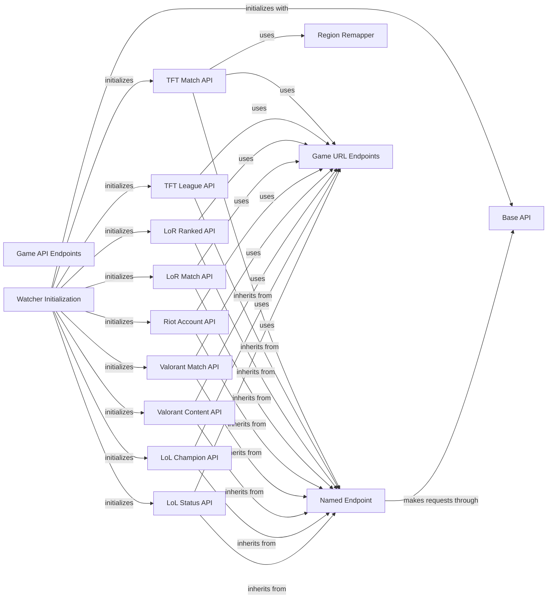

## Component Details

This system provides a comprehensive interface for interacting with various Riot Games APIs. It is built around a core `Base API` for handling raw HTTP requests and a `Named Endpoint` abstraction for specific API categories. Different `Watcher Initialization` components set up game-specific API clients, which then utilize various `Game API Endpoints` (like Champion, Match, Summoner, League, Content, Account APIs) to access game data. Helper components like `Region Remapper` and `Game URL Endpoints` ensure correct request formatting and routing.

### Game API Endpoints
A comprehensive collection of classes, each representing a specific category of API calls for different Riot Games titles (e.g., Champion, Match, Summoner, League, Content, Account). These classes provide structured methods for accessing game-specific data, abstracting the underlying API request details.

**Related Classes/Methods**:

- <a href="https://github.com/pseudonym117/Riot-Watcher/blob/master/src/riotwatcher/_apis/league_of_legends/ChampionApiV3.py#L5-L30" target="_blank" rel="noopener noreferrer">`riotwatcher._apis.league_of_legends.ChampionApiV3.ChampionApiV3` (5:30)</a>
- <a href="https://github.com/pseudonym117/Riot-Watcher/blob/master/src/riotwatcher/_apis/league_of_legends/LolStatusApiV4.py#L5-L33" target="_blank" rel="noopener noreferrer">`riotwatcher._apis.league_of_legends.LolStatusApiV4.LolStatusApiV4` (5:33)</a>
- <a href="https://github.com/pseudonym117/Riot-Watcher/blob/master/src/riotwatcher/_apis/legends_of_runeterra/MatchApi.py#L5-L39" target="_blank" rel="noopener noreferrer">`riotwatcher._apis.legends_of_runeterra.MatchApi.MatchApi` (5:39)</a>
- <a href="https://github.com/pseudonym117/Riot-Watcher/blob/master/src/riotwatcher/_apis/legends_of_runeterra/RankedApi.py#L5-L29" target="_blank" rel="noopener noreferrer">`riotwatcher._apis.legends_of_runeterra.RankedApi.RankedApi` (5:29)</a>
- <a href="https://github.com/pseudonym117/Riot-Watcher/blob/master/src/riotwatcher/_apis/riot/AccountApi.py#L5-L56" target="_blank" rel="noopener noreferrer">`riotwatcher._apis.riot.AccountApi.AccountApi` (5:56)</a>
- <a href="https://github.com/pseudonym117/Riot-Watcher/blob/master/src/riotwatcher/_apis/team_fight_tactics/LeagueApi.py#L5-L99" target="_blank" rel="noopener noreferrer">`riotwatcher._apis.team_fight_tactics.LeagueApi.LeagueApi` (5:99)</a>
- <a href="https://github.com/pseudonym117/Riot-Watcher/blob/master/src/riotwatcher/_apis/team_fight_tactics/MatchApi.py#L8-L77" target="_blank" rel="noopener noreferrer">`riotwatcher._apis.team_fight_tactics.MatchApi.MatchApi` (8:77)</a>
- <a href="https://github.com/pseudonym117/Riot-Watcher/blob/master/src/riotwatcher/_apis/valorant/ContentApi.py#L5-L29" target="_blank" rel="noopener noreferrer">`riotwatcher._apis.valorant.ContentApi.ContentApi` (5:29)</a>
- <a href="https://github.com/pseudonym117/Riot-Watcher/blob/master/src/riotwatcher/_apis/valorant/MatchApi.py#L5-L60" target="_blank" rel="noopener noreferrer">`riotwatcher._apis.valorant.MatchApi.MatchApi` (5:60)</a>

### Watcher Initialization
This component is responsible for initializing the various Watcher classes (LolWatcher, LorWatcher, RiotWatcher, TftWatcher, ValWatcher). It sets up the BaseApi and then initializes specific API endpoints for each game, such as ChampionApiV3, LolStatusApiV4, MatchApi, and AccountApi. It also handles the configuration of request handlers and URL settings.

**Related Classes/Methods**:

- <a href="https://github.com/pseudonym117/Riot-Watcher/blob/master/src/riotwatcher/LolWatcher.py#L43-L121" target="_blank" rel="noopener noreferrer">`riotwatcher.LolWatcher.LolWatcher:__init__` (43:121)</a>
- <a href="https://github.com/pseudonym117/Riot-Watcher/blob/master/src/riotwatcher/LorWatcher.py#L25-L60" target="_blank" rel="noopener noreferrer">`riotwatcher.LorWatcher.LorWatcher:__init__` (25:60)</a>
- <a href="https://github.com/pseudonym117/Riot-Watcher/blob/master/src/riotwatcher/riotwatcher.py#L25-L58" target="_blank" rel="noopener noreferrer">`riotwatcher.riotwatcher.RiotWatcher:__init__` (25:58)</a>
- <a href="https://github.com/pseudonym117/Riot-Watcher/blob/master/src/riotwatcher/TftWatcher.py#L26-L63" target="_blank" rel="noopener noreferrer">`riotwatcher.TftWatcher.TftWatcher:__init__` (26:63)</a>
- <a href="https://github.com/pseudonym117/Riot-Watcher/blob/master/src/riotwatcher/ValWatcher.py#L25-L60" target="_blank" rel="noopener noreferrer">`riotwatcher.ValWatcher.ValWatcher:__init__` (25:60)</a>

### Base API
The BaseApi component provides the fundamental functionality for making raw HTTP requests to the Riot API. It manages the API key, request handlers, and timeouts. It includes methods for both general and static raw requests, and it processes requests through a chain of handlers before and after the actual HTTP call.

**Related Classes/Methods**:

- <a href="https://github.com/pseudonym117/Riot-Watcher/blob/master/src/riotwatcher/_apis/BaseApi.py#L4-L85" target="_blank" rel="noopener noreferrer">`riotwatcher._apis.BaseApi.BaseApi` (4:85)</a>
- <a href="https://github.com/pseudonym117/Riot-Watcher/blob/master/src/riotwatcher/_apis/BaseApi.py#L5-L9" target="_blank" rel="noopener noreferrer">`riotwatcher._apis.BaseApi.BaseApi:__init__` (5:9)</a>
- <a href="https://github.com/pseudonym117/Riot-Watcher/blob/master/src/riotwatcher/_apis/BaseApi.py#L15-L57" target="_blank" rel="noopener noreferrer">`riotwatcher._apis.BaseApi.BaseApi:raw_request` (15:57)</a>
- <a href="https://github.com/pseudonym117/Riot-Watcher/blob/master/src/riotwatcher/_apis/BaseApi.py#L59-L85" target="_blank" rel="noopener noreferrer">`riotwatcher._apis.BaseApi.BaseApi:raw_request_static` (59:85)</a>

### Named Endpoint
The NamedEndpoint component acts as a helper class for API endpoints, injecting the endpoint's name into calls to the BaseApi. This simplifies the process of making requests by abstracting away the need for child classes to explicitly add the endpoint name for each API call. It provides the _request_endpoint method for sending requests.

**Related Classes/Methods**:

- <a href="https://github.com/pseudonym117/Riot-Watcher/blob/master/src/riotwatcher/_apis/NamedEndpoint.py#L6-L38" target="_blank" rel="noopener noreferrer">`riotwatcher._apis.NamedEndpoint.NamedEndpoint` (6:38)</a>
- <a href="https://github.com/pseudonym117/Riot-Watcher/blob/master/src/riotwatcher/_apis/NamedEndpoint.py#L12-L21" target="_blank" rel="noopener noreferrer">`riotwatcher._apis.NamedEndpoint.NamedEndpoint:__init__` (12:21)</a>
- <a href="https://github.com/pseudonym117/Riot-Watcher/blob/master/src/riotwatcher/_apis/NamedEndpoint.py#L23-L38" target="_blank" rel="noopener noreferrer">`riotwatcher._apis.NamedEndpoint.NamedEndpoint._request_endpoint` (23:38)</a>

### TFT Match API
This component provides an interface to the Teamfight Tactics (TFT) Match API. It allows users to retrieve match IDs by PUUID and get detailed match information by match ID. It utilizes the NamedEndpoint for making requests and includes a region remapping helper.

**Related Classes/Methods**:

- <a href="https://github.com/pseudonym117/Riot-Watcher/blob/master/src/riotwatcher/_apis/team_fight_tactics/MatchApi.py#L8-L77" target="_blank" rel="noopener noreferrer">`riotwatcher._apis.team_fight_tactics.MatchApi.MatchApi` (8:77)</a>
- <a href="https://github.com/pseudonym117/Riot-Watcher/blob/master/src/riotwatcher/_apis/team_fight_tactics/MatchApi.py#L15-L21" target="_blank" rel="noopener noreferrer">`riotwatcher._apis.team_fight_tactics.MatchApi.MatchApi:__init__` (15:21)</a>
- <a href="https://github.com/pseudonym117/Riot-Watcher/blob/master/src/riotwatcher/_apis/team_fight_tactics/MatchApi.py#L24-L63" target="_blank" rel="noopener noreferrer">`riotwatcher._apis.team_fight_tactics.MatchApi.MatchApi:by_puuid` (24:63)</a>
- <a href="https://github.com/pseudonym117/Riot-Watcher/blob/master/src/riotwatcher/_apis/team_fight_tactics/MatchApi.py#L66-L77" target="_blank" rel="noopener noreferrer">`riotwatcher._apis.team_fight_tactics.MatchApi.MatchApi:by_id` (66:77)</a>

### TFT League API
This component provides an interface to the Teamfight Tactics (TFT) League API. It allows users to retrieve challenger, grandmaster, and master league entries, as well as entries by summoner ID and league ID. It also provides access to rated ladders.

**Related Classes/Methods**:

- <a href="https://github.com/pseudonym117/Riot-Watcher/blob/master/src/riotwatcher/_apis/team_fight_tactics/LeagueApi.py#L5-L99" target="_blank" rel="noopener noreferrer">`riotwatcher._apis.team_fight_tactics.LeagueApi.LeagueApi` (5:99)</a>
- <a href="https://github.com/pseudonym117/Riot-Watcher/blob/master/src/riotwatcher/_apis/team_fight_tactics/LeagueApi.py#L12-L18" target="_blank" rel="noopener noreferrer">`riotwatcher._apis.team_fight_tactics.LeagueApi.LeagueApi:__init__` (12:18)</a>
- <a href="https://github.com/pseudonym117/Riot-Watcher/blob/master/src/riotwatcher/_apis/team_fight_tactics/LeagueApi.py#L20-L28" target="_blank" rel="noopener noreferrer">`riotwatcher._apis.team_fight_tactics.LeagueApi.LeagueApi:challenger` (20:28)</a>
- <a href="https://github.com/pseudonym117/Riot-Watcher/blob/master/src/riotwatcher/_apis/team_fight_tactics/LeagueApi.py#L30-L41" target="_blank" rel="noopener noreferrer">`riotwatcher._apis.team_fight_tactics.LeagueApi.LeagueApi:by_summoner` (30:41)</a>
- <a href="https://github.com/pseudonym117/Riot-Watcher/blob/master/src/riotwatcher/_apis/team_fight_tactics/LeagueApi.py#L43-L56" target="_blank" rel="noopener noreferrer">`riotwatcher._apis.team_fight_tactics.LeagueApi.LeagueApi:entries` (43:56)</a>
- <a href="https://github.com/pseudonym117/Riot-Watcher/blob/master/src/riotwatcher/_apis/team_fight_tactics/LeagueApi.py#L58-L66" target="_blank" rel="noopener noreferrer">`riotwatcher._apis.team_fight_tactics.LeagueApi.LeagueApi:grandmaster` (58:66)</a>
- <a href="https://github.com/pseudonym117/Riot-Watcher/blob/master/src/riotwatcher/_apis/team_fight_tactics/LeagueApi.py#L68-L76" target="_blank" rel="noopener noreferrer">`riotwatcher._apis.team_fight_tactics.LeagueApi.LeagueApi:by_id` (68:76)</a>
- <a href="https://github.com/pseudonym117/Riot-Watcher/blob/master/src/riotwatcher/_apis/team_fight_tactics/LeagueApi.py#L78-L86" target="_blank" rel="noopener noreferrer">`riotwatcher._apis.team_fight_tactics.LeagueApi.LeagueApi:master` (78:86)</a>
- <a href="https://github.com/pseudonym117/Riot-Watcher/blob/master/src/riotwatcher/_apis/team_fight_tactics/LeagueApi.py#L88-L99" target="_blank" rel="noopener noreferrer">`riotwatcher._apis.team_fight_tactics.LeagueApi.LeagueApi:rated_ladders` (88:99)</a>

### LoR Ranked API
This component provides an interface to the Legends of Runeterra (LoR) Ranked API. It allows users to retrieve ranked leaderboards.

**Related Classes/Methods**:

- <a href="https://github.com/pseudonym117/Riot-Watcher/blob/master/src/riotwatcher/_apis/legends_of_runeterra/RankedApi.py#L5-L29" target="_blank" rel="noopener noreferrer">`riotwatcher._apis.legends_of_runeterra.RankedApi.RankedApi` (5:29)</a>
- <a href="https://github.com/pseudonym117/Riot-Watcher/blob/master/src/riotwatcher/_apis/legends_of_runeterra/RankedApi.py#L13-L19" target="_blank" rel="noopener noreferrer">`riotwatcher._apis.legends_of_runeterra.RankedApi.RankedApi:__init__` (13:19)</a>
- <a href="https://github.com/pseudonym117/Riot-Watcher/blob/master/src/riotwatcher/_apis/legends_of_runeterra/RankedApi.py#L21-L29" target="_blank" rel="noopener noreferrer">`riotwatcher._apis.legends_of_runeterra.RankedApi.RankedApi:leaderboards` (21:29)</a>

### LoR Match API
This component provides an interface to the Legends of Runeterra (LoR) Match API. It allows users to retrieve match information by PUUID and by match ID.

**Related Classes/Methods**:

- <a href="https://github.com/pseudonym117/Riot-Watcher/blob/master/src/riotwatcher/_apis/legends_of_runeterra/MatchApi.py#L5-L39" target="_blank" rel="noopener noreferrer">`riotwatcher._apis.legends_of_runeterra.MatchApi.MatchApi` (5:39)</a>
- <a href="https://github.com/pseudonym117/Riot-Watcher/blob/master/src/riotwatcher/_apis/legends_of_runeterra/MatchApi.py#L13-L19" target="_blank" rel="noopener noreferrer">`riotwatcher._apis.legends_of_runeterra.MatchApi.MatchApi:__init__` (13:19)</a>
- <a href="https://github.com/pseudonym117/Riot-Watcher/blob/master/src/riotwatcher/_apis/legends_of_runeterra/MatchApi.py#L21-L29" target="_blank" rel="noopener noreferrer">`riotwatcher._apis.legends_of_runeterra.MatchApi.MatchApi:by_puuid` (21:29)</a>
- <a href="https://github.com/pseudonym117/Riot-Watcher/blob/master/src/riotwatcher/_apis/legends_of_runeterra/MatchApi.py#L31-L39" target="_blank" rel="noopener noreferrer">`riotwatcher._apis.legends_of_runeterra.MatchApi.MatchApi:by_id` (31:39)</a>

### Riot Account API
This component provides an interface to the Riot Account API. It allows users to retrieve account information by PUUID, by Riot ID, and to check active shards.

**Related Classes/Methods**:

- <a href="https://github.com/pseudonym117/Riot-Watcher/blob/master/src/riotwatcher/_apis/riot/AccountApi.py#L5-L56" target="_blank" rel="noopener noreferrer">`riotwatcher._apis.riot.AccountApi.AccountApi` (5:56)</a>
- <a href="https://github.com/pseudonym117/Riot-Watcher/blob/master/src/riotwatcher/_apis/riot/AccountApi.py#L12-L18" target="_blank" rel="noopener noreferrer">`riotwatcher._apis.riot.AccountApi.AccountApi:__init__` (12:18)</a>
- <a href="https://github.com/pseudonym117/Riot-Watcher/blob/master/src/riotwatcher/_apis/riot/AccountApi.py#L20-L28" target="_blank" rel="noopener noreferrer">`riotwatcher._apis.riot.AccountApi.AccountApi:by_puuid` (20:28)</a>
- <a href="https://github.com/pseudonym117/Riot-Watcher/blob/master/src/riotwatcher/_apis/riot/AccountApi.py#L30-L42" target="_blank" rel="noopener noreferrer">`riotwatcher._apis.riot.AccountApi.AccountApi:by_riot_id` (30:42)</a>
- <a href="https://github.com/pseudonym117/Riot-Watcher/blob/master/src/riotwatcher/_apis/riot/AccountApi.py#L44-L56" target="_blank" rel="noopener noreferrer">`riotwatcher._apis.riot.AccountApi.AccountApi:active_shard` (44:56)</a>

### Valorant Match API
This component provides an interface to the Valorant Match API. It allows users to retrieve match information by ID, match lists by PUUID, and recent matches.

**Related Classes/Methods**:

- <a href="https://github.com/pseudonym117/Riot-Watcher/blob/master/src/riotwatcher/_apis/valorant/MatchApi.py#L5-L60" target="_blank" rel="noopener noreferrer">`riotwatcher._apis.valorant.MatchApi.MatchApi` (5:60)</a>
- <a href="https://github.com/pseudonym117/Riot-Watcher/blob/master/src/riotwatcher/_apis/valorant/MatchApi.py#L12-L18" target="_blank" rel="noopener noreferrer">`riotwatcher._apis.valorant.MatchApi.MatchApi:__init__` (12:18)</a>
- <a href="https://github.com/pseudonym117/Riot-Watcher/blob/master/src/riotwatcher/_apis/valorant/MatchApi.py#L20-L28" target="_blank" rel="noopener noreferrer">`riotwatcher._apis.valorant.MatchApi.MatchApi:by_id` (20:28)</a>
- <a href="https://github.com/pseudonym117/Riot-Watcher/blob/master/src/riotwatcher/_apis/valorant/MatchApi.py#L30-L41" target="_blank" rel="noopener noreferrer">`riotwatcher._apis.valorant.MatchApi.MatchApi:matchlist_by_puuid` (30:41)</a>
- <a href="https://github.com/pseudonym117/Riot-Watcher/blob/master/src/riotwatcher/_apis/valorant/MatchApi.py#L43-L60" target="_blank" rel="noopener noreferrer">`riotwatcher._apis.valorant.MatchApi.MatchApi:recent_matches` (43:60)</a>

### Valorant Content API
This component provides an interface to the Valorant Content API. It allows users to retrieve game content.

**Related Classes/Methods**:

- <a href="https://github.com/pseudonym117/Riot-Watcher/blob/master/src/riotwatcher/_apis/valorant/ContentApi.py#L5-L29" target="_blank" rel="noopener noreferrer">`riotwatcher._apis.valorant.ContentApi.ContentApi` (5:29)</a>
- <a href="https://github.com/pseudonym117/Riot-Watcher/blob/master/src/riotwatcher/_apis/valorant/ContentApi.py#L13-L19" target="_blank" rel="noopener noreferrer">`riotwatcher._apis.valorant.ContentApi.ContentApi:__init__` (13:19)</a>
- <a href="https://github.com/pseudonym117/Riot-Watcher/blob/master/src/riotwatcher/_apis/valorant/ContentApi.py#L21-L29" target="_blank" rel="noopener noreferrer">`riotwatcher._apis.valorant.ContentApi.ContentApi:contents` (21:29)</a>

### LoL Champion API
This component provides an interface to the League of Legends Champion API. It allows users to retrieve champion rotations.

**Related Classes/Methods**:

- <a href="https://github.com/pseudonym117/Riot-Watcher/blob/master/src/riotwatcher/_apis/league_of_legends/ChampionApiV3.py#L5-L30" target="_blank" rel="noopener noreferrer">`riotwatcher._apis.league_of_legends.ChampionApiV3.ChampionApiV3` (5:30)</a>
- <a href="https://github.com/pseudonym117/Riot-Watcher/blob/master/src/riotwatcher/_apis/league_of_legends/ChampionApiV3.py#L13-L19" target="_blank" rel="noopener noreferrer">`riotwatcher._apis.league_of_legends.ChampionApiV3.ChampionApiV3:__init__` (13:19)</a>
- <a href="https://github.com/pseudonym117/Riot-Watcher/blob/master/src/riotwatcher/_apis/league_of_legends/ChampionApiV3.py#L21-L30" target="_blank" rel="noopener noreferrer">`riotwatcher._apis.league_of_legends.ChampionApiV3.ChampionApiV3:rotations` (21:30)</a>

### LoL Status API
This component provides an interface to the League of Legends Status API. It allows users to retrieve platform data.

**Related Classes/Methods**:

- <a href="https://github.com/pseudonym117/Riot-Watcher/blob/master/src/riotwatcher/_apis/league_of_legends/LolStatusApiV4.py#L5-L33" target="_blank" rel="noopener noreferrer">`riotwatcher._apis.league_of_legends.LolStatusApiV4.LolStatusApiV4` (5:33)</a>
- <a href="https://github.com/pseudonym117/Riot-Watcher/blob/master/src/riotwatcher/_apis/league_of_legends/LolStatusApiV4.py#L13-L19" target="_blank" rel="noopener noreferrer">`riotwatcher._apis.league_of_legends.LolStatusApiV4.LolStatusApiV4:__init__` (13:19)</a>
- <a href="https://github.com/pseudonym117/Riot-Watcher/blob/master/src/riotwatcher/_apis/league_of_legends/LolStatusApiV4.py#L21-L33" target="_blank" rel="noopener noreferrer">`riotwatcher._apis.league_of_legends.LolStatusApiV4.LolStatusApiV4:platform_data` (21:33)</a>

### Region Remapper
This helper component is responsible for remapping region strings to platform strings, which is often required by the Riot API. It's implemented as a decorator that modifies the 'region' argument of API calls.

**Related Classes/Methods**:

- <a href="https://github.com/pseudonym117/Riot-Watcher/blob/master/src/riotwatcher/_apis/helpers.py#L4-L41" target="_blank" rel="noopener noreferrer">`riotwatcher._apis.helpers.remap_region_to_platform` (4:41)</a>

### Game URL Endpoints
This component defines the URL structures for various Riot Games APIs. It includes base endpoint classes for each game (e.g., LeagueEndpoint, LorEndpoint) and specific URL classes for individual API categories (e.g., ChallengesApiV1Urls, MatchApiUrls). These classes are used by the Game API Endpoints to construct the correct API request URLs.

**Related Classes/Methods**:

- <a href="https://github.com/pseudonym117/Riot-Watcher/blob/master/src/riotwatcher/_apis/league_of_legends/urls/ChallengesApiV1Urls.py#L10-L16" target="_blank" rel="noopener noreferrer">`riotwatcher._apis.league_of_legends.urls.ChallengesApiV1Urls` (10:16)</a>
- `riotwatcher._apis.league_of_legends.urls.ChampionApiUrls` (full file reference)
- `riotwatcher._apis.league_of_legends.urls.ChampionMasteryApiUrls` (full file reference)
- `riotwatcher._apis.league_of_legends.urls.ClashApiUrls` (full file reference)
- <a href="https://github.com/pseudonym117/Riot-Watcher/blob/master/src/riotwatcher/_apis/league_of_legends/urls/DataDragonUrls.py#L16-L28" target="_blank" rel="noopener noreferrer">`riotwatcher._apis.league_of_legends.urls.DataDragonUrls` (16:28)</a>
- `riotwatcher._apis.league_of_legends.urls.LeagueApiUrls` (full file reference)
- `riotwatcher._apis.league_of_legends.urls.LolStatusApiV3` (full file reference)
- <a href="https://github.com/pseudonym117/Riot-Watcher/blob/master/src/riotwatcher/_apis/league_of_legends/urls/LolStatusApiV4Urls.py#L4-L5" target="_blank" rel="noopener noreferrer">`riotwatcher._apis.league_of_legends.urls.LolStatusApiV4Urls` (4:5)</a>
- <a href="https://github.com/pseudonym117/Riot-Watcher/blob/master/src/riotwatcher/_apis/league_of_legends/urls/MatchApiV5Urls.py#L10-L15" target="_blank" rel="noopener noreferrer">`riotwatcher._apis.league_of_legends.urls.MatchApiV5Urls` (10:15)</a>
- `riotwatcher._apis.league_of_legends.urls.SpectatorApiUrls` (full file reference)
- `riotwatcher._apis.league_of_legends.urls.SummonerApiUrls` (full file reference)
- <a href="https://github.com/pseudonym117/Riot-Watcher/blob/master/src/riotwatcher/_apis/legends_of_runeterra/urls/MatchApiUrls.py#L9-L11" target="_blank" rel="noopener noreferrer">`riotwatcher._apis.legends_of_runeterra.urls.MatchApiUrls` (9:11)</a>
- <a href="https://github.com/pseudonym117/Riot-Watcher/blob/master/src/riotwatcher/_apis/legends_of_runeterra/urls/RankedApiUrls.py#L4-L5" target="_blank" rel="noopener noreferrer">`riotwatcher._apis.legends_of_runeterra.urls.RankedApiUrls` (4:5)</a>
- <a href="https://github.com/pseudonym117/Riot-Watcher/blob/master/src/riotwatcher/_apis/riot/urls/AccountApiUrls.py#L9-L12" target="_blank" rel="noopener noreferrer">`riotwatcher._apis.riot.urls.AccountApiUrls` (9:12)</a>
- <a href="https://github.com/pseudonym117/Riot-Watcher/blob/master/src/riotwatcher/_apis/team_fight_tactics/urls/DataDragonUrls.py#L16-L26" target="_blank" rel="noopener noreferrer">`riotwatcher._apis.team_fight_tactics.urls.DataDragonUrls` (16:26)</a>
- <a href="https://github.com/pseudonym117/Riot-Watcher/blob/master/src/riotwatcher/_apis/team_fight_tactics/urls/LeagueApiUrls.py#L10-L17" target="_blank" rel="noopener noreferrer">`riotwatcher._apis.team_fight_tactics.urls.LeagueApiUrls` (10:17)</a>
- <a href="https://github.com/pseudonym117/Riot-Watcher/blob/master/src/riotwatcher/_apis/team_fight_tactics/urls/MatchApiUrls.py#L10-L12" target="_blank" rel="noopener noreferrer">`riotwatcher._apis.team_fight_tactics.urls.MatchApiUrls` (10:12)</a>
- <a href="https://github.com/pseudonym117/Riot-Watcher/blob/master/src/riotwatcher/_apis/team_fight_tactics/urls/SummonerApiUrls.py#L10-L14" target="_blank" rel="noopener noreferrer">`riotwatcher._apis.team_fight_tactics.urls.SummonerApiUrls` (10:14)</a>
- <a href="https://github.com/pseudonym117/Riot-Watcher/blob/master/src/riotwatcher/_apis/valorant/urls/ContentApiUrls.py#L4-L5" target="_blank" rel="noopener noreferrer">`riotwatcher._apis.valorant.urls.ContentApiUrls` (4:5)</a>
- <a href="https://github.com/pseudonym117/Riot-Watcher/blob/master/src/riotwatcher/_apis/valorant/urls/MatchApiUrls.py#L9-L12" target="_blank" rel="noopener noreferrer">`riotwatcher._apis.valorant.urls.MatchApiUrls` (9:12)</a>

### [FAQ](https://github.com/CodeBoarding/GeneratedOnBoardings/tree/main?tab=readme-ov-file#faq)