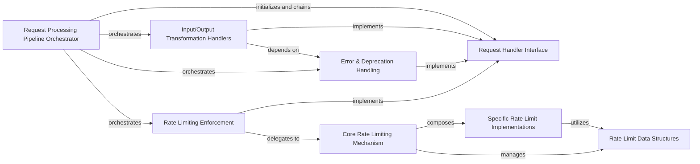

## Component Details

The Request Processing Pipeline is a core subsystem responsible for handling all outgoing API requests and incoming API responses within the Riot-Watcher library. It employs a modular, chained handler architecture to perform various operations such as input sanitization, type correction, rate limiting, error detection, and response deserialization, ensuring robust and compliant interactions with the Riot API.

### Request Processing Pipeline Orchestrator
The entry point for API requests, responsible for assembling and orchestrating the sequence of request and response handlers.

**Related Classes/Methods**:

- <a href="https://github.com/pseudonym117/Riot-Watcher/blob/master/src/riotwatcher/LolWatcher.py#L37-L256" target="_blank" rel="noopener noreferrer">`riotwatcher.LolWatcher.LolWatcher` (37:256)</a>
- <a href="https://github.com/pseudonym117/Riot-Watcher/blob/master/src/riotwatcher/LorWatcher.py#L19-L78" target="_blank" rel="noopener noreferrer">`riotwatcher.LorWatcher.LorWatcher` (19:78)</a>
- <a href="https://github.com/pseudonym117/Riot-Watcher/blob/master/src/riotwatcher/riotwatcher.py#L19-L67" target="_blank" rel="noopener noreferrer">`riotwatcher.riotwatcher.RiotWatcher` (19:67)</a>
- <a href="https://github.com/pseudonym117/Riot-Watcher/blob/master/src/riotwatcher/TftWatcher.py#L20-L99" target="_blank" rel="noopener noreferrer">`riotwatcher.TftWatcher.TftWatcher` (20:99)</a>
- <a href="https://github.com/pseudonym117/Riot-Watcher/blob/master/src/riotwatcher/ValWatcher.py#L19-L78" target="_blank" rel="noopener noreferrer">`riotwatcher.ValWatcher.ValWatcher` (19:78)</a>

### Request Handler Interface
Defines the common interface and abstract methods for all request and response handlers, enabling a pluggable pipeline architecture.

**Related Classes/Methods**:

- <a href="https://github.com/pseudonym117/Riot-Watcher/blob/master/src/riotwatcher/Handlers/RequestHandler.py#L1-L52" target="_blank" rel="noopener noreferrer">`riotwatcher.Handlers.RequestHandler.RequestHandler` (1:52)</a>

### Input/Output Transformation Handlers
A group of handlers responsible for sanitizing input parameters, correcting data types, and deserializing API responses into structured Python objects.

**Related Classes/Methods**:

- <a href="https://github.com/pseudonym117/Riot-Watcher/blob/master/src/riotwatcher/Handlers/SanitationHandler.py#L15-L17" target="_blank" rel="noopener noreferrer">`riotwatcher.Handlers.SanitationHandler.SanitationHandler:__init__` (15:17)</a>
- <a href="https://github.com/pseudonym117/Riot-Watcher/blob/master/src/riotwatcher/Handlers/TypeCorrectorHandler.py#L4-L43" target="_blank" rel="noopener noreferrer">`riotwatcher.Handlers.TypeCorrectorHandler.TypeCorrectorHandler` (4:43)</a>
- <a href="https://github.com/pseudonym117/Riot-Watcher/blob/master/src/riotwatcher/Handlers/DeserializerAdapter.py#L10-L12" target="_blank" rel="noopener noreferrer">`riotwatcher.Handlers.DeserializerAdapter.DeserializerAdapter:__init__` (10:12)</a>
- <a href="https://github.com/pseudonym117/Riot-Watcher/blob/master/src/riotwatcher/Handlers/DictionaryDeserializer.py#L6-L10" target="_blank" rel="noopener noreferrer">`riotwatcher.Handlers.DictionaryDeserializer.DictionaryDeserializer` (6:10)</a>

### Error & Deprecation Handling
Handlers dedicated to detecting and raising errors based on HTTP status codes and logging deprecation warnings from API responses.

**Related Classes/Methods**:

- <a href="https://github.com/pseudonym117/Riot-Watcher/blob/master/src/riotwatcher/Handlers/ThrowOnErrorHandler.py#L8-L20" target="_blank" rel="noopener noreferrer">`riotwatcher.Handlers.ThrowOnErrorHandler.ThrowOnErrorHandler` (8:20)</a>
- <a href="https://github.com/pseudonym117/Riot-Watcher/blob/master/src/riotwatcher/Handlers/DeprecationHandler.py#L12-L14" target="_blank" rel="noopener noreferrer">`riotwatcher.Handlers.DeprecationHandler.DeprecationHandler:__init__` (12:14)</a>
- <a href="https://github.com/pseudonym117/Riot-Watcher/blob/master/src/riotwatcher/Handlers/IllegalArgumentError.py#L1-L11" target="_blank" rel="noopener noreferrer">`riotwatcher.Handlers.IllegalArgumentError.IllegalArgumentError` (1:11)</a>

### Rate Limiting Enforcement
Integrates the rate limiting mechanism into the request processing flow, pausing requests when limits are approached or exceeded.

**Related Classes/Methods**:

- <a href="https://github.com/pseudonym117/Riot-Watcher/blob/master/src/riotwatcher/Handlers/RateLimiterAdapter.py#L14-L16" target="_blank" rel="noopener noreferrer">`riotwatcher.Handlers.RateLimiterAdapter.RateLimiterAdapter:__init__` (14:16)</a>

### Core Rate Limiting Mechanism
Provides the fundamental logic for coordinating and applying various types of rate limits (application, method, and error-based).

**Related Classes/Methods**:

- <a href="https://github.com/pseudonym117/Riot-Watcher/blob/master/src/riotwatcher/Handlers/RateLimit/BasicRateLimiter.py#L18-L68" target="_blank" rel="noopener noreferrer">`riotwatcher.Handlers.RateLimit.BasicRateLimiter.BasicRateLimiter` (18:68)</a>
- <a href="https://github.com/pseudonym117/Riot-Watcher/blob/master/src/riotwatcher/Handlers/RateLimit/HeaderBasedLimiter.py#L13-L124" target="_blank" rel="noopener noreferrer">`riotwatcher.Handlers.RateLimit.HeaderBasedLimiter.HeaderBasedLimiter` (13:124)</a>

### Specific Rate Limit Implementations
Specialized rate limiters that handle different scopes of API limits, such as per-method, per-application, and specific handling for 429 (Too Many Requests) responses.

**Related Classes/Methods**:

- <a href="https://github.com/pseudonym117/Riot-Watcher/blob/master/src/riotwatcher/Handlers/RateLimit/MethodRateLimiter.py#L4-L11" target="_blank" rel="noopener noreferrer">`riotwatcher.Handlers.RateLimit.MethodRateLimiter.MethodRateLimiter` (4:11)</a>
- <a href="https://github.com/pseudonym117/Riot-Watcher/blob/master/src/riotwatcher/Handlers/RateLimit/ApplicationRateLimiter.py#L5-L6" target="_blank" rel="noopener noreferrer">`riotwatcher.Handlers.RateLimit.ApplicationRateLimiter.ApplicationRateLimiter:__init__` (5:6)</a>
- <a href="https://github.com/pseudonym117/Riot-Watcher/blob/master/src/riotwatcher/Handlers/RateLimit/OopsRateLimiter.py#L11-L52" target="_blank" rel="noopener noreferrer">`riotwatcher.Handlers.RateLimit.OopsRateLimiter.OopsRateLimiter` (11:52)</a>

### Rate Limit Data Structures
Defines the data structures used to store and manage rate limit information, including collections of limits and individual limit details.

**Related Classes/Methods**:

- <a href="https://github.com/pseudonym117/Riot-Watcher/blob/master/src/riotwatcher/Handlers/RateLimit/Limits.py#L14-L33" target="_blank" rel="noopener noreferrer">`riotwatcher.Handlers.RateLimit.Limits.LimitCollection` (14:33)</a>

### [FAQ](https://github.com/CodeBoarding/GeneratedOnBoardings/tree/main?tab=readme-ov-file#faq)