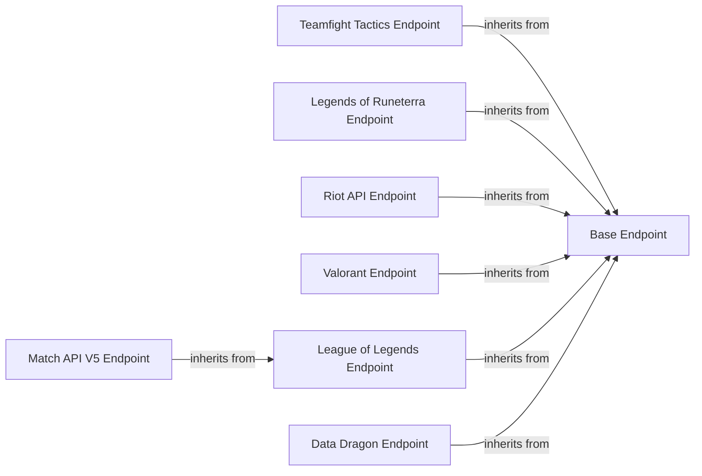

## Component Details

This component is responsible for defining and constructing the precise URL paths and query parameters for all API endpoints across various games and versions. It ensures that requests are directed to the correct API resources.

### Base Endpoint
The Base Endpoint component provides the fundamental structure and logic for handling API endpoint URLs. It parses URL parameters and query parameters, and formats the URL for requests. This component serves as a base class for all specific game API endpoints.

**Related Classes/Methods**:

- <a href="https://github.com/pseudonym117/Riot-Watcher/blob/master/src/riotwatcher/_apis/Endpoint.py#L5-L13" target="_blank" rel="noopener noreferrer">`riotwatcher._apis.Endpoint.Endpoint.__init__` (5:13)</a>
- <a href="https://github.com/pseudonym117/Riot-Watcher/blob/master/src/riotwatcher/_apis/Endpoint.py#L15-L24" target="_blank" rel="noopener noreferrer">`riotwatcher._apis.Endpoint.Endpoint:__call__` (15:24)</a>

### Teamfight Tactics Endpoint
The Teamfight Tactics Endpoint component represents the API endpoints specific to the Teamfight Tactics game. It extends the Base Endpoint to provide specialized URL handling for TFT-related API calls.

**Related Classes/Methods**:

- <a href="https://github.com/pseudonym117/Riot-Watcher/blob/master/src/riotwatcher/_apis/team_fight_tactics/urls/TftEndpoint.py#L8-L12" target="_blank" rel="noopener noreferrer">`riotwatcher._apis.team_fight_tactics.urls.TftEndpoint.TftEndpoint:__call__` (8:12)</a>

### Legends of Runeterra Endpoint
The Legends of Runeterra Endpoint component represents the API endpoints specific to the Legends of Runeterra game. It extends the Base Endpoint to provide specialized URL handling for LoR-related API calls.

**Related Classes/Methods**:

- <a href="https://github.com/pseudonym117/Riot-Watcher/blob/master/src/riotwatcher/_apis/legends_of_runeterra/urls/LorEndpoint.py#L8-L12" target="_blank" rel="noopener noreferrer">`riotwatcher._apis.legends_of_runeterra.urls.LorEndpoint.LorEndpoint:__call__` (8:12)</a>

### Riot API Endpoint
The Riot API Endpoint component represents the general Riot API endpoints, which are not specific to a single game but cover broader Riot services. It extends the Base Endpoint to handle these general API calls.

**Related Classes/Methods**:

- <a href="https://github.com/pseudonym117/Riot-Watcher/blob/master/src/riotwatcher/_apis/riot/urls/RiotEndpoint.py#L8-L12" target="_blank" rel="noopener noreferrer">`riotwatcher._apis.riot.urls.RiotEndpoint.RiotEndpoint:__call__` (8:12)</a>

### Valorant Endpoint
The Valorant Endpoint component represents the API endpoints specific to the Valorant game. It extends the Base Endpoint to provide specialized URL handling for Valorant-related API calls.

**Related Classes/Methods**:

- <a href="https://github.com/pseudonym117/Riot-Watcher/blob/master/src/riotwatcher/_apis/valorant/urls/ValEndpoint.py#L8-L12" target="_blank" rel="noopener noreferrer">`riotwatcher._apis.valorant.urls.ValEndpoint.ValEndpoint:__call__` (8:12)</a>

### League of Legends Endpoint
The League of Legends Endpoint component represents the API endpoints specific to the League of Legends game. It extends the Base Endpoint to provide specialized URL handling for LoL-related API calls.

**Related Classes/Methods**:

- <a href="https://github.com/pseudonym117/Riot-Watcher/blob/master/src/riotwatcher/_apis/league_of_legends/urls/LeagueEndpoint.py#L8-L12" target="_blank" rel="noopener noreferrer">`riotwatcher._apis.league_of_legends.urls.LeagueEndpoint.LeagueEndpoint:__call__` (8:12)</a>
- <a href="https://github.com/pseudonym117/Riot-Watcher/blob/master/src/riotwatcher/_apis/league_of_legends/urls/LeagueEndpoint.py#L5-L6" target="_blank" rel="noopener noreferrer">`riotwatcher._apis.league_of_legends.urls.LeagueEndpoint.LeagueEndpoint.__init__` (5:6)</a>

### Match API V5 Endpoint
The Match API V5 Endpoint component is a specialized endpoint for League of Legends match data, specifically for API version 5. It extends the League of Legends Endpoint to handle match-related API calls.

**Related Classes/Methods**:

- <a href="https://github.com/pseudonym117/Riot-Watcher/blob/master/src/riotwatcher/_apis/league_of_legends/urls/MatchApiV5Urls.py#L5-L7" target="_blank" rel="noopener noreferrer">`riotwatcher._apis.league_of_legends.urls.MatchApiV5Urls.MatchV5Endpoint:__init__` (5:7)</a>

### Data Dragon Endpoint
The Data Dragon Endpoint component handles API calls related to Riot's Data Dragon service, which provides game data and assets. It extends the Base Endpoint to manage Data Dragon specific URLs.

**Related Classes/Methods**:

- <a href="https://github.com/pseudonym117/Riot-Watcher/blob/master/src/riotwatcher/_apis/team_fight_tactics/urls/DataDragonUrls.py#L5-L7" target="_blank" rel="noopener noreferrer">`riotwatcher._apis.team_fight_tactics.urls.DataDragonUrls.DataDragonEndpoint:__init__` (5:7)</a>

### [FAQ](https://github.com/CodeBoarding/GeneratedOnBoardings/tree/main?tab=readme-ov-file#faq)