```mermaid
graph LR
    API_Clients["API Clients"]
    Request_Processing_Pipeline["Request Processing Pipeline"]
    Base_API_Core["Base API Core"]
    Game_API_Endpoints["Game API Endpoints"]
    URL_Routing_System["URL Routing System"]
    API_Clients -- "initializes" --> Request_Processing_Pipeline
    API_Clients -- "uses" --> Base_API_Core
    API_Clients -- "provides access to" --> Game_API_Endpoints
    Request_Processing_Pipeline -- "orchestrates" --> Base_API_Core
    Base_API_Core -- "utilizes" --> Request_Processing_Pipeline
    Base_API_Core -- "constructs URLs via" --> URL_Routing_System
    Base_API_Core -- "serves" --> Game_API_Endpoints
    Game_API_Endpoints -- "leverages" --> Base_API_Core
    Game_API_Endpoints -- "depends on" --> URL_Routing_System
    URL_Routing_System -- "generates URLs for" --> Base_API_Core
    URL_Routing_System -- "supports" --> Game_API_Endpoints
    click API_Clients href "https://github.com/CodeBoarding/GeneratedOnBoardings/blob/main/Riot-Watcher/API Clients.md" "Details"
    click Request_Processing_Pipeline href "https://github.com/CodeBoarding/GeneratedOnBoardings/blob/main/Riot-Watcher/Request Processing Pipeline.md" "Details"
    click Base_API_Core href "https://github.com/CodeBoarding/GeneratedOnBoardings/blob/main/Riot-Watcher/Base API Core.md" "Details"
    click Game_API_Endpoints href "https://github.com/CodeBoarding/GeneratedOnBoardings/blob/main/Riot-Watcher/Game API Endpoints.md" "Details"
    click URL_Routing_System href "https://github.com/CodeBoarding/GeneratedOnBoardings/blob/main/Riot-Watcher/URL Routing System.md" "Details"
```

## Component Details

The `Riot-Watcher` library provides a comprehensive Python interface for interacting with various Riot Games APIs, including League of Legends, Legends of Runeterra, Teamfight Tactics, Valorant, and the Riot Account API. It features a modular architecture with dedicated client interfaces for each game, a robust request processing pipeline that handles rate limiting, deserialization, and error management, and a flexible URL routing system to accurately construct API endpoints. The core functionality is built upon a base API infrastructure that manages HTTP requests and API key authentication, ensuring efficient and compliant data retrieval from Riot Games services.

### API Clients
The primary client interfaces for interacting with various Riot Games APIs (League of Legends, Legends of Runeterra, Riot Account, Teamfight Tactics, Valorant). Each client initializes a base API interaction layer and specific game API endpoints, applying a common chain of request handlers for consistent API interaction.

**Related Classes/Methods**:

- <a href="https://github.com/pseudonym117/Riot-Watcher/blob/master/src/riotwatcher/LolWatcher.py#L43-L121" target="_blank" rel="noopener noreferrer">`Riot-Watcher.src.riotwatcher.LolWatcher.LolWatcher:__init__` (43:121)</a>
- <a href="https://github.com/pseudonym117/Riot-Watcher/blob/master/src/riotwatcher/LorWatcher.py#L25-L60" target="_blank" rel="noopener noreferrer">`Riot-Watcher.src.riotwatcher.LorWatcher.LorWatcher:__init__` (25:60)</a>
- <a href="https://github.com/pseudonym117/Riot-Watcher/blob/master/src/riotwatcher/riotwatcher.py#L25-L58" target="_blank" rel="noopener noreferrer">`Riot-Watcher.src.riotwatcher.riotwatcher.RiotWatcher:__init__` (25:58)</a>
- <a href="https://github.com/pseudonym117/Riot-Watcher/blob/master/src/riotwatcher/TftWatcher.py#L26-L63" target="_blank" rel="noopener noreferrer">`Riot-Watcher.src.riotwatcher.TftWatcher.TftWatcher:__init__` (26:63)</a>
- <a href="https://github.com/pseudonym117/Riot-Watcher/blob/master/src/riotwatcher/ValWatcher.py#L25-L60" target="_blank" rel="noopener noreferrer">`Riot-Watcher.src.riotwatcher.ValWatcher.ValWatcher:__init__` (25:60)</a>

### Request Processing Pipeline
A modular pipeline of handlers responsible for preprocessing outgoing API requests and post-processing incoming API responses. This includes tasks such as sanitizing input, deserializing responses, handling errors, correcting data types, applying rate limits, and managing API deprecation warnings.

**Related Classes/Methods**:

- <a href="https://github.com/pseudonym117/Riot-Watcher/blob/master/src/riotwatcher/Handlers/RateLimiterAdapter.py#L14-L16" target="_blank" rel="noopener noreferrer">`Riot-Watcher.src.riotwatcher.Handlers.RateLimiterAdapter.RateLimiterAdapter:__init__` (14:16)</a>
- <a href="https://github.com/pseudonym117/Riot-Watcher/blob/master/src/riotwatcher/Handlers/DeserializerAdapter.py#L10-L12" target="_blank" rel="noopener noreferrer">`Riot-Watcher.src.riotwatcher.Handlers.DeserializerAdapter.DeserializerAdapter:__init__` (10:12)</a>
- <a href="https://github.com/pseudonym117/Riot-Watcher/blob/master/src/riotwatcher/Handlers/DeprecationHandler.py#L12-L14" target="_blank" rel="noopener noreferrer">`Riot-Watcher.src.riotwatcher.Handlers.DeprecationHandler.DeprecationHandler:__init__` (12:14)</a>
- <a href="https://github.com/pseudonym117/Riot-Watcher/blob/master/src/riotwatcher/Handlers/SanitationHandler.py#L15-L17" target="_blank" rel="noopener noreferrer">`Riot-Watcher.src.riotwatcher.Handlers.SanitationHandler.SanitationHandler:__init__` (15:17)</a>
- <a href="https://github.com/pseudonym117/Riot-Watcher/blob/master/src/riotwatcher/Handlers/ThrowOnErrorHandler.py#L8-L20" target="_blank" rel="noopener noreferrer">`Riot-Watcher.src.riotwatcher.Handlers.ThrowOnErrorHandler.ThrowOnErrorHandler` (8:20)</a>
- <a href="https://github.com/pseudonym117/Riot-Watcher/blob/master/src/riotwatcher/Handlers/TypeCorrectorHandler.py#L4-L43" target="_blank" rel="noopener noreferrer">`Riot-Watcher.src.riotwatcher.Handlers.TypeCorrectorHandler.TypeCorrectorHandler` (4:43)</a>
- <a href="https://github.com/pseudonym117/Riot-Watcher/blob/master/src/riotwatcher/Handlers/DictionaryDeserializer.py#L6-L10" target="_blank" rel="noopener noreferrer">`Riot-Watcher.src.riotwatcher.Handlers.DictionaryDeserializer.DictionaryDeserializer` (6:10)</a>
- <a href="https://github.com/pseudonym117/Riot-Watcher/blob/master/src/riotwatcher/Handlers/IllegalArgumentError.py#L1-L11" target="_blank" rel="noopener noreferrer">`Riot-Watcher.src.riotwatcher.Handlers.IllegalArgumentError.IllegalArgumentError` (1:11)</a>
- <a href="https://github.com/pseudonym117/Riot-Watcher/blob/master/src/riotwatcher/Handlers/RequestHandler.py#L2-L3" target="_blank" rel="noopener noreferrer">`Riot-Watcher.src.riotwatcher.Handlers.RequestHandler.RequestHandler.__init__` (2:3)</a>
- <a href="https://github.com/pseudonym117/Riot-Watcher/blob/master/src/riotwatcher/Handlers/RateLimit/BasicRateLimiter.py#L18-L68" target="_blank" rel="noopener noreferrer">`Riot-Watcher.src.riotwatcher.Handlers.RateLimit.BasicRateLimiter.BasicRateLimiter` (18:68)</a>
- <a href="https://github.com/pseudonym117/Riot-Watcher/blob/master/src/riotwatcher/Handlers/RateLimit/HeaderBasedLimiter.py#L13-L124" target="_blank" rel="noopener noreferrer">`Riot-Watcher.src.riotwatcher.Handlers.RateLimit.HeaderBasedLimiter.HeaderBasedLimiter` (13:124)</a>
- <a href="https://github.com/pseudonym117/Riot-Watcher/blob/master/src/riotwatcher/Handlers/RateLimit/MethodRateLimiter.py#L4-L11" target="_blank" rel="noopener noreferrer">`Riot-Watcher.src.riotwatcher.Handlers.RateLimit.MethodRateLimiter.MethodRateLimiter` (4:11)</a>
- <a href="https://github.com/pseudonym117/Riot-Watcher/blob/master/src/riotwatcher/Handlers/RateLimit/ApplicationRateLimiter.py#L5-L6" target="_blank" rel="noopener noreferrer">`Riot-Watcher.src.riotwatcher.Handlers.RateLimit.ApplicationRateLimiter.ApplicationRateLimiter:__init__` (5:6)</a>
- <a href="https://github.com/pseudonym117/Riot-Watcher/blob/master/src/riotwatcher/Handlers/RateLimit/OopsRateLimiter.py#L11-L52" target="_blank" rel="noopener noreferrer">`Riot-Watcher.src.riotwatcher.Handlers.RateLimit.OopsRateLimiter.OopsRateLimiter` (11:52)</a>
- <a href="https://github.com/pseudonym117/Riot-Watcher/blob/master/src/riotwatcher/Handlers/RateLimit/Limits.py#L14-L33" target="_blank" rel="noopener noreferrer">`Riot-Watcher.src.riotwatcher.Handlers.RateLimit.Limits.LimitCollection` (14:33)</a>

### Base API Core
Provides the core functionality for making HTTP requests to the Riot Games API. It manages the API key, request timeouts, and orchestrates the execution of the request handling chain before and after sending requests. It also includes foundational classes for defining and constructing API endpoints.

**Related Classes/Methods**:

- <a href="https://github.com/pseudonym117/Riot-Watcher/blob/master/src/riotwatcher/_apis/BaseApi.py#L4-L85" target="_blank" rel="noopener noreferrer">`Riot-Watcher.src.riotwatcher._apis.BaseApi.BaseApi` (4:85)</a>
- <a href="https://github.com/pseudonym117/Riot-Watcher/blob/master/src/riotwatcher/_apis/NamedEndpoint.py#L6-L38" target="_blank" rel="noopener noreferrer">`Riot-Watcher.src.riotwatcher._apis.NamedEndpoint.NamedEndpoint` (6:38)</a>
- <a href="https://github.com/pseudonym117/Riot-Watcher/blob/master/src/riotwatcher/_apis/Endpoint.py#L4-L24" target="_blank" rel="noopener noreferrer">`Riot-Watcher.src.riotwatcher._apis.Endpoint.Endpoint` (4:24)</a>

### Game API Endpoints
A comprehensive collection of classes, each representing a specific category of API calls for different Riot Games titles (e.g., Champion, Match, Summoner, League, Content, Account). These classes provide structured methods for accessing game-specific data, abstracting the underlying API request details.

**Related Classes/Methods**:

- <a href="https://github.com/pseudonym117/Riot-Watcher/blob/master/src/riotwatcher/_apis/league_of_legends/ChampionApiV3.py#L5-L30" target="_blank" rel="noopener noreferrer">`Riot-Watcher.src.riotwatcher._apis.league_of_legends.ChampionApiV3.ChampionApiV3` (5:30)</a>
- <a href="https://github.com/pseudonym117/Riot-Watcher/blob/master/src/riotwatcher/_apis/league_of_legends/LolStatusApiV4.py#L5-L33" target="_blank" rel="noopener noreferrer">`Riot-Watcher.src.riotwatcher._apis.league_of_legends.LolStatusApiV4.LolStatusApiV4` (5:33)</a>
- <a href="https://github.com/pseudonym117/Riot-Watcher/blob/master/src/riotwatcher/_apis/legends_of_runeterra/MatchApi.py#L5-L39" target="_blank" rel="noopener noreferrer">`Riot-Watcher.src.riotwatcher._apis.legends_of_runeterra.MatchApi.MatchApi` (5:39)</a>
- <a href="https://github.com/pseudonym117/Riot-Watcher/blob/master/src/riotwatcher/_apis/legends_of_runeterra/RankedApi.py#L5-L29" target="_blank" rel="noopener noreferrer">`Riot-Watcher.src.riotwatcher._apis.legends_of_runeterra.RankedApi.RankedApi` (5:29)</a>
- <a href="https://github.com/pseudonym117/Riot-Watcher/blob/master/src/riotwatcher/_apis/riot/AccountApi.py#L5-L56" target="_blank" rel="noopener noreferrer">`Riot-Watcher.src.riotwatcher._apis.riot.AccountApi.AccountApi` (5:56)</a>
- <a href="https://github.com/pseudonym117/Riot-Watcher/blob/master/src/riotwatcher/_apis/team_fight_tactics/LeagueApi.py#L5-L99" target="_blank" rel="noopener noreferrer">`Riot-Watcher.src.riotwatcher._apis.team_fight_tactics.LeagueApi.LeagueApi` (5:99)</a>
- <a href="https://github.com/pseudonym117/Riot-Watcher/blob/master/src/riotwatcher/_apis/team_fight_tactics/MatchApi.py#L8-L77" target="_blank" rel="noopener noreferrer">`Riot-Watcher.src.riotwatcher._apis.team_fight_tactics.MatchApi.MatchApi` (8:77)</a>
- <a href="https://github.com/pseudonym117/Riot-Watcher/blob/master/src/riotwatcher/_apis/valorant/ContentApi.py#L5-L29" target="_blank" rel="noopener noreferrer">`Riot-Watcher.src.riotwatcher._apis.valorant.ContentApi.ContentApi` (5:29)</a>
- <a href="https://github.com/pseudonym117/Riot-Watcher/blob/master/src/riotwatcher/_apis/valorant/MatchApi.py#L5-L60" target="_blank" rel="noopener noreferrer">`Riot-Watcher.src.riotwatcher._apis.valorant.MatchApi.MatchApi` (5:60)</a>

### URL Routing System
This component is responsible for defining and constructing the precise URL paths and query parameters for all API endpoints across various games and versions. It ensures that requests are directed to the correct API resources.

**Related Classes/Methods**:

- <a href="https://github.com/pseudonym117/Riot-Watcher/blob/master/src/riotwatcher/_apis/team_fight_tactics/urls/TftEndpoint.py#L8-L12" target="_blank" rel="noopener noreferrer">`Riot-Watcher.src.riotwatcher._apis.team_fight_tactics.urls.TftEndpoint.TftEndpoint:__call__` (8:12)</a>
- <a href="https://github.com/pseudonym117/Riot-Watcher/blob/master/src/riotwatcher/_apis/legends_of_runeterra/urls/LorEndpoint.py#L8-L12" target="_blank" rel="noopener noreferrer">`Riot-Watcher.src.riotwatcher._apis.legends_of_runeterra.urls.LorEndpoint.LorEndpoint:__call__` (8:12)</a>
- <a href="https://github.com/pseudonym117/Riot-Watcher/blob/master/src/riotwatcher/_apis/riot/urls/RiotEndpoint.py#L8-L12" target="_blank" rel="noopener noreferrer">`Riot-Watcher.src.riotwatcher._apis.riot.urls.RiotEndpoint.RiotEndpoint:__call__` (8:12)</a>
- <a href="https://github.com/pseudonym117/Riot-Watcher/blob/master/src/riotwatcher/_apis/valorant/urls/ValEndpoint.py#L8-L12" target="_blank" rel="noopener noreferrer">`Riot-Watcher.src.riotwatcher._apis.valorant.urls.ValEndpoint.ValEndpoint:__call__` (8:12)</a>
- <a href="https://github.com/pseudonym117/Riot-Watcher/blob/master/src/riotwatcher/_apis/league_of_legends/urls/LeagueEndpoint.py#L8-L12" target="_blank" rel="noopener noreferrer">`Riot-Watcher.src.riotwatcher._apis.league_of_legends.urls.LeagueEndpoint.LeagueEndpoint:__call__` (8:12)</a>
- <a href="https://github.com/pseudonym117/Riot-Watcher/blob/master/src/riotwatcher/_apis/league_of_legends/urls/MatchApiV5Urls.py#L5-L7" target="_blank" rel="noopener noreferrer">`Riot-Watcher.src.riotwatcher._apis.league_of_legends.urls.MatchApiV5Urls.MatchV5Endpoint:__init__` (5:7)</a>
- <a href="https://github.com/pseudonym117/Riot-Watcher/blob/master/src/riotwatcher/_apis/team_fight_tactics/urls/DataDragonUrls.py#L5-L7" target="_blank" rel="noopener noreferrer">`Riot-Watcher.src.riotwatcher._apis.team_fight_tactics.urls.DataDragonUrls.DataDragonEndpoint:__init__` (5:7)</a>

### [FAQ](https://github.com/CodeBoarding/GeneratedOnBoardings/tree/main?tab=readme-ov-file#faq)