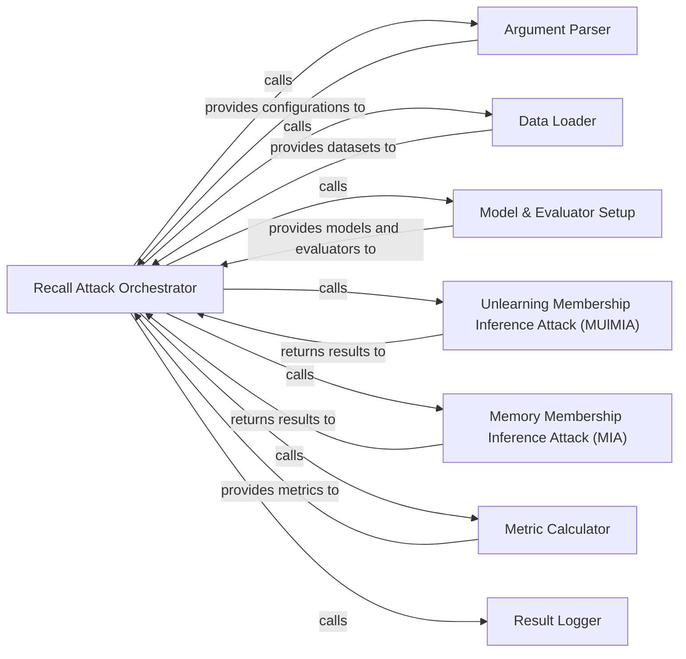

## Details

The Attack Simulation subsystem is primarily defined by the `core.attack` package, specifically the `unlearn_attack.py` and `memory_attack.py` modules, and the orchestration logic within `core.recall_main.py`. Its core functionality revolves around executing various privacy attacks, managing their setup, execution, and result logging. This subsystem operates as a pipeline orchestrated by the `Recall Attack Orchestrator`. The orchestrator acts as the central hub, sequentially invoking the `Argument Parser`, `Data Loader`, and `Model & Evaluator Setup` to prepare the environment. Once set up, it delegates the core attack execution to either `Unlearning Membership Inference Attack (MUlMIA)` or `Memory Membership Inference Attack (MIA)`. The results from these attack components are then fed back to the orchestrator, which passes them to the `Metric Calculator` for quantification. Finally, the orchestrator uses the `Result Logger` to persist all relevant information, ensuring the reproducibility and traceability of the attack simulation. This tightly coupled, sequential flow is characteristic of an experimentation pipeline in a research project.

### Recall Attack Orchestrator
The central control component for the recall attack pipeline. It coordinates the sequence of operations, from argument parsing and data loading to model setup, attack execution, and result logging. This aligns with the "Pipeline/Workflow" pattern, acting as the main driver for attack simulations.

**Related Classes/Methods**:

- <a href="https://github.com/datasec-lab/Ruli/blob/main/core/recall_main.py" target="_blank" rel="noopener noreferrer">`core.recall_main`</a>

### Unlearning Membership Inference Attack (MUlMIA)
Implements a specialized Membership Inference Attack designed to evaluate the effectiveness of machine unlearning. It encapsulates the specific logic for training shadow models and performing the MIA in the context of unlearning.

**Related Classes/Methods**:

- <a href="https://github.com/datasec-lab/Ruli/blob/main/core/attack/unlearn_attack.py" target="_blank" rel="noopener noreferrer">`core.attack.unlearn_attack`</a>

### Memory Membership Inference Attack (MIA)
Provides a general implementation of a Membership Inference Attack, quantifying model memorization and privacy leakage. It handles the core MIA logic, independent of unlearning specifics.

**Related Classes/Methods**:

- <a href="https://github.com/datasec-lab/Ruli/blob/main/core/attack/memory_attack.py" target="_blank" rel="noopener noreferrer">`core.attack.memory_attack`</a>

### Argument Parser
Responsible for parsing command-line arguments and configuration settings, providing the necessary parameters for attack execution. This is crucial for the "Configuration Management" aspect of a research project, enabling flexible experimentation.

**Related Classes/Methods**:

- <a href="https://github.com/datasec-lab/Ruli/blob/main/core/recall_main.py" target="_blank" rel="noopener noreferrer">`core.recall_main`</a>

### Data Loader
Manages the loading, preprocessing, and preparation of datasets required for the attack simulations, including shadow model training and attack-specific data. This aligns with the "Data Management" pattern.

**Related Classes/Methods**:

- <a href="https://github.com/datasec-lab/Ruli/blob/main/core/recall_main.py" target="_blank" rel="noopener noreferrer">`core.recall_main`</a>

### Model & Evaluator Setup
Initializes and configures the target machine learning models and the evaluation environment (e.g., loss functions, optimizers) necessary for both shadow model training and the actual attack execution. This is vital for "Model Operations" and the "Experimentation/Evaluation Framework."

**Related Classes/Methods**:

- <a href="https://github.com/datasec-lab/Ruli/blob/main/core/recall_main.py" target="_blank" rel="noopener noreferrer">`core.recall_main`</a>

### Metric Calculator
Computes specific performance metrics (e.g., TPR at FPR) to quantify the effectiveness and impact of the privacy attacks. This is a core part of the "Evaluation & Reporting" framework.

**Related Classes/Methods**:

- <a href="https://github.com/datasec-lab/Ruli/blob/main/core/recall_main.py" target="_blank" rel="noopener noreferrer">`core.recall_main`</a>

### Result Logger
Handles the recording and persistence of attack outcomes, metrics, and configuration details, ensuring reproducibility and facilitating analysis. This is essential for "Evaluation & Reporting" and "reproducibility."

**Related Classes/Methods**:

- <a href="https://github.com/datasec-lab/Ruli/blob/main/core/recall_main.py" target="_blank" rel="noopener noreferrer">`core.recall_main`</a>

### [FAQ](https://github.com/CodeBoarding/GeneratedOnBoardings/tree/main?tab=readme-ov-file#faq)