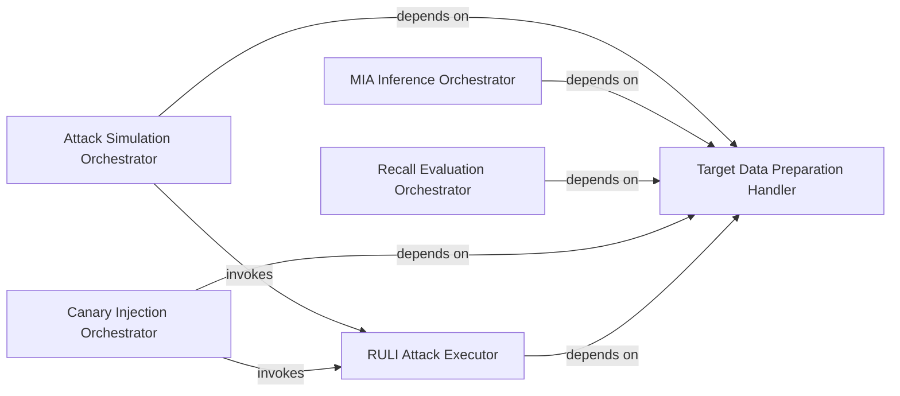

## Details

The `Configuration & Orchestration` subsystem serves as the central control plane for the Ruli project, managing experiment configurations, parsing command-line arguments, and orchestrating the high-level workflow of various unlearning and attack simulations. It provides the primary entry points for initiating different research experiments and delegates control to specialized execution and evaluation modules.

### Attack Simulation Orchestrator
This component acts as the primary entry point for configuring and initiating end-to-end attack simulation experiments. It handles argument parsing, environment setup, and orchestrates the sequence of operations required for various attack scenarios.

**Related Classes/Methods**:

- <a href="https://github.com/datasec-lab/Ruli/blob/main/text/attack_main.py#L15-L63" target="_blank" rel="noopener noreferrer">`text.attack_main.main`:15-63</a>

### MIA Inference Orchestrator
Specializes in orchestrating the Membership Inference Attack (MIA) inference process. It manages the loading of models and datasets, and triggers the specific logic for evaluating privacy leakage through MIA.

**Related Classes/Methods**:

- <a href="https://github.com/datasec-lab/Ruli/blob/main/text/mia_inference.py#L16-L125" target="_blank" rel="noopener noreferrer">`text.mia_inference.main`:16-125</a>

### Recall Evaluation Orchestrator
Responsible for orchestrating the evaluation of unlearning methods based on recall metrics. It sets up the necessary data and models, and initiates the calculation and reporting of recall performance.

**Related Classes/Methods**:

- <a href="https://github.com/datasec-lab/Ruli/blob/main/core/recall_main.py#L46-L101" target="_blank" rel="noopener noreferrer">`core.recall_main.main`:46-101</a>

### Canary Injection Orchestrator
Manages the process of injecting "canary" data points into datasets. This is typically done to track the removal of specific data during unlearning, serving as a ground truth for evaluation.

**Related Classes/Methods**:

- <a href="https://github.com/datasec-lab/Ruli/blob/main/core/unlearn_mia_canary.py#L173-L175" target="_blank" rel="noopener noreferrer">`core.unlearn_mia_canary.main`:173-175</a>

### Target Data Preparation Handler
This component is responsible for the preparation, loading, and management of target datasets used across various unlearning and attack experiments. It ensures data consistency and availability for subsequent processing.

**Related Classes/Methods**:

- <a href="https://github.com/datasec-lab/Ruli/blob/main/text/target_data.py#L10-L45" target="_blank" rel="noopener noreferrer">`text.target_data.main`:10-45</a>

### RULI Attack Executor
Encapsulates the core algorithmic logic for executing the RULI (Robust Unlearning with Label Information) attack. This component performs the actual unlearning operation on models based on specified configurations.

**Related Classes/Methods**:

- <a href="https://github.com/datasec-lab/Ruli/blob/main/core/unlearn_mia.py#L52-L172" target="_blank" rel="noopener noreferrer">`core.unlearn_mia.ruli_attack`:52-172</a>

### [FAQ](https://github.com/CodeBoarding/GeneratedOnBoardings/tree/main?tab=readme-ov-file#faq)