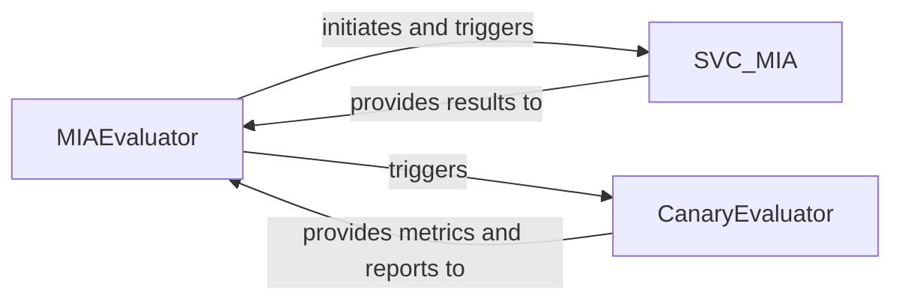

## Details

The `Evaluation & Reporting` subsystem is responsible for assessing the effectiveness of machine unlearning algorithms and the success of privacy attacks. It encompasses tools and methodologies for processing inference results and attack outcomes to generate quantifiable metrics and comprehensive reports, crucial for research and experimentation reproducibility.

### MIAEvaluator
Acts as the primary orchestrator for Membership Inference Attack (MIA) evaluations. It coordinates different evaluation methodologies, aggregates results, and provides a unified interface for initiating MIA assessments. This component embodies the "Experimentation/Evaluation Framework" pattern, serving as a central control point for various evaluation experiments.

**Related Classes/Methods**:

- <a href="https://github.com/datasec-lab/Ruli/blob/main/text/utils.py#L264-L420" target="_blank" rel="noopener noreferrer">`text.utils.MIAEvaluator`:264-420</a>

### SVC_MIA
Implements a specific Membership Inference Attack evaluation method using Support Vector Classification (SVC). It handles the statistical analysis, model fitting, and probability collection necessary for this type of attack. This component represents a specialized "tool" within the broader evaluation framework, providing a concrete MIA methodology.

**Related Classes/Methods**:

- <a href="https://github.com/datasec-lab/Ruli/blob/main/core/evaluation/svc_mia.py#L92-L157" target="_blank" rel="noopener noreferrer">`core.evaluation.svc_mia.SVC_MIA`:92-157</a>

### CanaryEvaluator
Evaluates the effectiveness of unlearning attacks, specifically by assessing the presence or absence of "canary" data points post-unlearning. This component is specialized in measuring the success of unlearning, contributing to the "Evaluation & Reporting" aspect by providing unlearning-specific metrics and reports.

**Related Classes/Methods**:

- <a href="https://github.com/datasec-lab/Ruli/blob/main/core/attack/unlearn_attack_canary.py#L20-L263" target="_blank" rel="noopener noreferrer">`core.attack.unlearn_attack_canary.CanaryEvaluator`:20-263</a>

### [FAQ](https://github.com/CodeBoarding/GeneratedOnBoardings/tree/main?tab=readme-ov-file#faq)