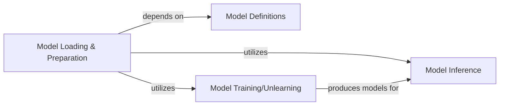

## Details

The `Model Operations` subsystem encompasses the full lifecycle of machine learning models within the Ruli project. Its boundaries are defined by the following core functionalities and their associated code: Model definition and architecture (`core.models.*`), Model instantiation, loading, and preparation (`core.utils.load_model.prepare_model`), Model training and unlearning processes (`core.attack.train.Retrain`), Model inference and prediction generation (`core.utils.inference.Inference`).

### Model Definitions
Provides the architectural blueprints for various neural network models (e.g., EfficientNet, ResNet, VGG, WRN, DenseNet, ResNet_CIFAR100). These classes define the layers, connections, and forward pass logic for each model type, serving as the foundational structures for all model-related operations.

**Related Classes/Methods**:

- <a href="https://github.com/datasec-lab/Ruli/blob/main/core/models/effnet.py" target="_blank" rel="noopener noreferrer">`core.models.EfficientNet`</a>
- <a href="https://github.com/datasec-lab/Ruli/blob/main/core/models/resnet.py" target="_blank" rel="noopener noreferrer">`core.models.ResNet`</a>
- <a href="https://github.com/datasec-lab/Ruli/blob/main/core/models/vgg.py" target="_blank" rel="noopener noreferrer">`core.models.VGG`</a>
- <a href="https://github.com/datasec-lab/Ruli/blob/main/core/models/wrn.py" target="_blank" rel="noopener noreferrer">`core.models.WRN`</a>
- <a href="https://github.com/datasec-lab/Ruli/blob/main/core/models/resnet_cifar100.py" target="_blank" rel="noopener noreferrer">`core.models.ResNet_CIFAR100`</a>
- <a href="https://github.com/datasec-lab/Ruli/blob/main/core/models/densenet.py" target="_blank" rel="noopener noreferrer">`core.models.DenseNet`</a>

### Model Loading & Preparation
Handles the instantiation of model architectures, loading pre-trained weights, restoring models from checkpoints, and ensuring experimental reproducibility through consistent seeding. It acts as the entry point for models into the system's operational flow, preparing them for training, unlearning, or inference.

**Related Classes/Methods**:

- <a href="https://github.com/datasec-lab/Ruli/blob/main/core/utils/load_model.py#L66-L83" target="_blank" rel="noopener noreferrer">`core.utils.load_model.prepare_model`:66-83</a>

### Model Training/Unlearning
Manages the iterative training loops for models, including forward and backward passes, optimization, and specific logic for retraining or simulating unlearning scenarios. This component is crucial for the project's focus on AI security and privacy research, enabling the modification of model knowledge.

**Related Classes/Methods**:

- <a href="https://github.com/datasec-lab/Ruli/blob/main/core/attack/train.py#L146-L284" target="_blank" rel="noopener noreferrer">`core.attack.train.Retrain`:146-284</a>

### Model Inference
Executes the forward pass of models to generate predictions, embeddings, or evaluate their performance. This is essential for assessing the impact of training/unlearning, for analyzing model behavior during inference attacks, and for general model application.

**Related Classes/Methods**:

- <a href="https://github.com/datasec-lab/Ruli/blob/main/core/utils/inference.py" target="_blank" rel="noopener noreferrer">`core.utils.inference.Inference`</a>

### [FAQ](https://github.com/CodeBoarding/GeneratedOnBoardings/tree/main?tab=readme-ov-file#faq)