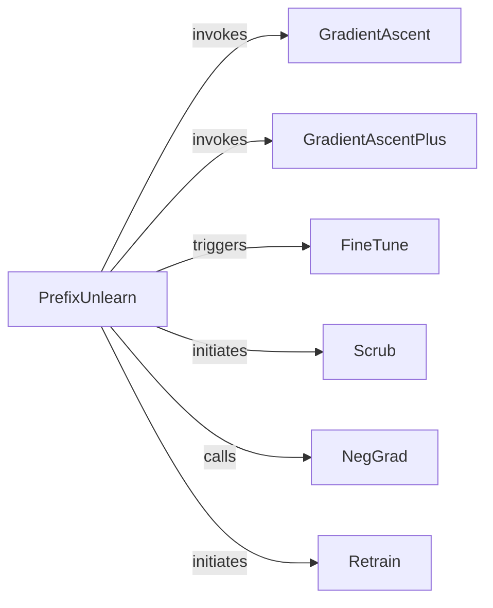

## Details

The Unlearning Algorithms subsystem is a core part of the project, focusing on implementing and orchestrating various machine unlearning techniques.

### PrefixUnlearn
Acts as the orchestrator and high-level entry point for initiating various unlearning processes. It provides a unified interface for triggering different unlearning algorithms and manages the overall unlearning workflow.

**Related Classes/Methods**:

- <a href="https://github.com/datasec-lab/Ruli/blob/main/text/unlearner.py#L9-L142" target="_blank" rel="noopener noreferrer">`text.unlearner.PrefixUnlearn`:9-142</a>

### GradientAscent
Implements the Gradient Ascent unlearning algorithm. Its core function is to modify a given model to remove the influence of specified "forget" data, adhering to its respective algorithmic principles.

**Related Classes/Methods**:

- <a href="https://github.com/datasec-lab/Ruli/blob/main/core/unlearn/gradient_ascent.py#L12-L60" target="_blank" rel="noopener noreferrer">`core.unlearn.gradient_ascent.GradientAscent`:12-60</a>

### GradientAscentPlus
An enhanced variant of the Gradient Ascent algorithm. It implements a distinct machine unlearning technique to modify a model and remove the influence of specified "forget" data.

**Related Classes/Methods**:

- <a href="https://github.com/datasec-lab/Ruli/blob/main/core/unlearn/gradient_ascent.py#L63-L182" target="_blank" rel="noopener noreferrer">`core.unlearn.gradient_ascent.GradientAscentPlus`:63-182</a>

### FineTune
Implements an unlearning strategy based on fine-tuning. Its core function is to modify a given model to remove the influence of specified "forget" data, adhering to its respective algorithmic principles.

**Related Classes/Methods**:

- <a href="https://github.com/datasec-lab/Ruli/blob/main/core/unlearn/fine_tune.py#L29-L96" target="_blank" rel="noopener noreferrer">`core.unlearn.fine_tune.FineTune`:29-96</a>

### Scrub
Implements a "scrubbing" or data sanitization unlearning method. Its core function is to modify a given model to remove the influence of specified "forget" data, adhering to its respective algorithmic principles.

**Related Classes/Methods**:

- <a href="https://github.com/datasec-lab/Ruli/blob/main/core/unlearn/scrub.py#L31-L127" target="_blank" rel="noopener noreferrer">`core.unlearn.scrub.Scrub`:31-127</a>

### NegGrad
Implements the Negative Gradient unlearning algorithm. Its core function is to modify a given model to remove the influence of specified "forget" data, adhering to its respective algorithmic principles.

**Related Classes/Methods**:

- <a href="https://github.com/datasec-lab/Ruli/blob/main/core/unlearn/negrad.py#L44-L162" target="_blank" rel="noopener noreferrer">`core.unlearn.negrad.NegGrad`:44-162</a>

### Retrain
Represents a baseline unlearning method by retraining the model from scratch on the "retain" data. Its core function is to modify a given model to remove the influence of specified "forget" data, adhering to its respective algorithmic principles.

**Related Classes/Methods**:

- <a href="https://github.com/datasec-lab/Ruli/blob/main/core/unlearn/retrain.py#L10-L112" target="_blank" rel="noopener noreferrer">`core.unlearn.retrain.Retrain`:10-112</a>

### [FAQ](https://github.com/CodeBoarding/GeneratedOnBoardings/tree/main?tab=readme-ov-file#faq)