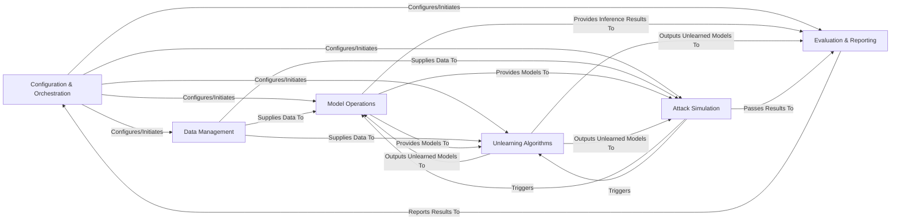

## Details

The Ruli project is structured around a core set of components designed to facilitate research in machine unlearning and privacy attacks. The `Configuration & Orchestration` component acts as the central control, initiating and managing experiments. It interacts with `Data Management` to load and preprocess datasets, and with `Model Operations` to define, load, and save machine learning models. `Unlearning Algorithms` receive models and data to perform unlearning, while `Attack Simulation` conducts privacy attacks, often leveraging models from `Model Operations` and data from `Data Management`. Finally, `Evaluation & Reporting` processes the outcomes from unlearning and attack simulations, providing metrics and reports back to the `Configuration & Orchestration` component. This modular design allows for clear separation of concerns and facilitates the integration of new unlearning techniques, attack methodologies, and evaluation metrics.

### Configuration & Orchestration [[Expand]](./Configuration_Orchestration.md)
The central control hub managing experiment configurations, command-line arguments, and orchestrating the entire workflow of unlearning and attack simulations. It acts as the primary entry point for initiating various research experiments.

**Related Classes/Methods**:

- <a href="https://github.com/datasec-lab/Ruli/blob/main/text/attack_main.py#L15-L63" target="_blank" rel="noopener noreferrer">`text.attack_main.main`:15-63</a>
- <a href="https://github.com/datasec-lab/Ruli/blob/main/text/mia_inference.py#L16-L125" target="_blank" rel="noopener noreferrer">`text.mia_inference.main`:16-125</a>
- <a href="https://github.com/datasec-lab/Ruli/blob/main/core/unlearn_mia.py#L52-L172" target="_blank" rel="noopener noreferrer">`core.unlearn_mia.ruli_attack`:52-172</a>
- <a href="https://github.com/datasec-lab/Ruli/blob/main/core/recall_main.py#L46-L101" target="_blank" rel="noopener noreferrer">`core.recall_main.main`:46-101</a>
- <a href="https://github.com/datasec-lab/Ruli/blob/main/core/unlearn_mia_canary.py#L173-L175" target="_blank" rel="noopener noreferrer">`core.unlearn_mia_canary.main`:173-175</a>
- <a href="https://github.com/datasec-lab/Ruli/blob/main/text/target_data.py#L10-L45" target="_blank" rel="noopener noreferrer">`text.target_data.main`:10-45</a>

### Data Management [[Expand]](./Data_Management.md)
Handles all data-related tasks, including loading diverse datasets (e.g., WikiText-103, CIFAR-100), preprocessing, tokenization for text, and splitting data into specific subsets (training, validation, forget, retain, attack-specific).

**Related Classes/Methods**:

- <a href="https://github.com/datasec-lab/Ruli/blob/main/core/utils/loader.py#L43-L136" target="_blank" rel="noopener noreferrer">`core.utils.loader.load_data`:43-136</a>
- <a href="https://github.com/datasec-lab/Ruli/blob/main/text/target_data.py#L10-L45" target="_blank" rel="noopener noreferrer">`text.target_data.main`:10-45</a>

### Model Operations [[Expand]](./Model_Operations.md)
Manages the full lifecycle of machine learning models, encompassing model definition, instantiation, loading from checkpoints, saving trained/unlearned models, executing training loops, and performing inference to generate predictions or embeddings.

**Related Classes/Methods**:

- <a href="https://github.com/datasec-lab/Ruli/blob/main/core/utils/load_model.py#L66-L83" target="_blank" rel="noopener noreferrer">`core.utils.load_model.prepare_model`:66-83</a>
- <a href="https://github.com/datasec-lab/Ruli/blob/main/core/attack/train.py#L146-L284" target="_blank" rel="noopener noreferrer">`core.attack.train.Retrain`:146-284</a>
- <a href="https://github.com/datasec-lab/Ruli/blob/main/core/utils/inference.py" target="_blank" rel="noopener noreferrer">`core.utils.inference.Inference`</a>
- <a href="https://github.com/datasec-lab/Ruli/blob/main/core/models/effnet.py" target="_blank" rel="noopener noreferrer">`core.models.EfficientNet`</a>
- <a href="https://github.com/datasec-lab/Ruli/blob/main/core/models/resnet.py" target="_blank" rel="noopener noreferrer">`core.models.ResNet`</a>
- <a href="https://github.com/datasec-lab/Ruli/blob/main/core/models/vgg.py" target="_blank" rel="noopener noreferrer">`core.models.VGG`</a>
- <a href="https://github.com/datasec-lab/Ruli/blob/main/core/models/wrn.py" target="_blank" rel="noopener noreferrer">`core.models.WRN`</a>
- <a href="https://github.com/datasec-lab/Ruli/blob/main/core/models/resnet_cifar100.py" target="_blank" rel="noopener noreferrer">`core.models.ResNet_CIFAR100`</a>
- <a href="https://github.com/datasec-lab/Ruli/blob/main/core/models/densenet.py" target="_blank" rel="noopener noreferrer">`core.models.DenseNet`</a>

### Unlearning Algorithms [[Expand]](./Unlearning_Algorithms.md)
Contains the implementations of various machine unlearning techniques (e.g., Gradient Ascent, Fine-tune, Scrub, NegGrad, Retrain, PrefixUnlearn). This component applies these algorithms to models to remove the influence of specified "forget" data.

**Related Classes/Methods**:

- <a href="https://github.com/datasec-lab/Ruli/blob/main/core/unlearn/gradient_ascent.py#L12-L60" target="_blank" rel="noopener noreferrer">`core.unlearn.gradient_ascent.GradientAscent`:12-60</a>
- <a href="https://github.com/datasec-lab/Ruli/blob/main/core/unlearn/fine_tune.py#L29-L96" target="_blank" rel="noopener noreferrer">`core.unlearn.fine_tune.FineTune`:29-96</a>
- <a href="https://github.com/datasec-lab/Ruli/blob/main/core/unlearn/scrub.py#L31-L127" target="_blank" rel="noopener noreferrer">`core.unlearn.scrub.Scrub`:31-127</a>
- <a href="https://github.com/datasec-lab/Ruli/blob/main/core/unlearn/negrad.py#L44-L162" target="_blank" rel="noopener noreferrer">`core.unlearn.negrad.NegGrad`:44-162</a>
- <a href="https://github.com/datasec-lab/Ruli/blob/main/core/unlearn/retrain.py#L10-L112" target="_blank" rel="noopener noreferrer">`core.unlearn.retrain.Retrain`:10-112</a>
- <a href="https://github.com/datasec-lab/Ruli/blob/main/text/unlearner.py#L9-L142" target="_blank" rel="noopener noreferrer">`text.unlearner.PrefixUnlearn`:9-142</a>

### Attack Simulation [[Expand]](./Attack_Simulation.md)
Orchestrates and executes privacy attacks, primarily Membership Inference Attacks (MIA) and Recall Attacks. This involves managing shadow model training, preparing attack-specific datasets, and running the attack logic to quantify model memorization and privacy leakage.

**Related Classes/Methods**:

- <a href="https://github.com/datasec-lab/Ruli/blob/main/core/attack/unlearn_attack.py#L24-L300" target="_blank" rel="noopener noreferrer">`core.attack.unlearn_attack.MUlMIA`:24-300</a>
- <a href="https://github.com/datasec-lab/Ruli/blob/main/core/attack/memory_attack.py#L17-L165" target="_blank" rel="noopener noreferrer">`core.attack.memory_attack.MIA`:17-165</a>
- <a href="https://github.com/datasec-lab/Ruli/blob/main/core/recall_main.py#L46-L101" target="_blank" rel="noopener noreferrer">`core.recall_main.main`:46-101</a>

### Evaluation & Reporting [[Expand]](./Evaluation_Reporting.md)
Provides tools and metrics for assessing the effectiveness of unlearning algorithms and the success of privacy attacks. It processes inference results and attack outcomes to generate quantifiable metrics and comprehensive reports.

**Related Classes/Methods**:

- <a href="https://github.com/datasec-lab/Ruli/blob/main/core/evaluation/svc_mia.py#L92-L157" target="_blank" rel="noopener noreferrer">`core.evaluation.svc_mia.SVC_MIA`:92-157</a>
- <a href="https://github.com/datasec-lab/Ruli/blob/main/text/utils.py#L264-L420" target="_blank" rel="noopener noreferrer">`text.utils.MIAEvaluator`:264-420</a>
- <a href="https://github.com/datasec-lab/Ruli/blob/main/core/attack/unlearn_attack_canary.py#L20-L263" target="_blank" rel="noopener noreferrer">`core.attack.unlearn_attack_canary.CanaryEvaluator`:20-263</a>

### [FAQ](https://github.com/CodeBoarding/GeneratedOnBoardings/tree/main?tab=readme-ov-file#faq)