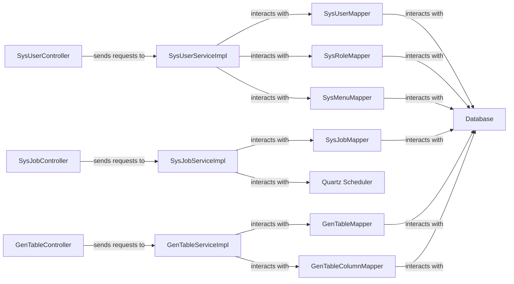

## Details

The project's core subsystem is designed with a robust, layered architecture to efficiently manage key administrative functions. The Web Controllers serve as the external interface, processing user requests and directing them to the appropriate Service Implementations. These services, acting as the central business logic components, orchestrate complex operations by interacting with the Mapper components. The Mappers, in turn, provide a clean abstraction for direct communication with the underlying database, ensuring data integrity and efficient persistence. This structured design facilitates clear responsibilities, enhances system maintainability, and supports scalable development across user management, scheduled tasks, and automated code generation functionalities.

### SysUserServiceImpl
Manages comprehensive user, role, and menu administration, including user lifecycle (creation, update, deletion), password management, and role assignment. It enforces data scope and uniqueness constraints.

**Related Classes/Methods**:

- `com.ruoyi.system.service.impl.SysUserServiceImpl`:1-9999

### SysJobServiceImpl
Orchestrates the scheduling, execution, and monitoring of background tasks. It provides functionalities to pause, resume, delete, and immediately trigger jobs, and initializes tasks on application startup.

**Related Classes/Methods**:

- `com.ruoyi.quartz.service.impl.SysJobServiceImpl`:1-9999

### GenTableServiceImpl
Facilitates automated code generation by processing database table schemas. It supports importing table structures, previewing generated code, and generating code files to a specified path or for download.

**Related Classes/Methods**:

- `com.ruoyi.generator.service.impl.GenTableServiceImpl`:1-9999

### SysUserController
Serves as the presentation layer, handling incoming HTTP requests from the user interface. Responsible for user management domain, validating input, and delegating business logic to the appropriate service layer component.

**Related Classes/Methods**:

- `com.ruoyi.web.controller.system.SysUserController`:1-9999

### SysJobController
Serves as the presentation layer, handling incoming HTTP requests from the user interface. Responsible for scheduled job management domain, validating input, and delegating business logic to the appropriate service layer component.

**Related Classes/Methods**:

- `com.ruoyi.quartz.controller.SysJobController`:1-9999

### GenTableController
Serves as the presentation layer, handling incoming HTTP requests from the user interface. Responsible for code generation domain, validating input, and delegating business logic to the appropriate service layer component.

**Related Classes/Methods**:

- `com.ruoyi.generator.controller.GenController`:1-9999

### SysUserMapper
Provides direct data access operations for user-related entities, including querying, inserting, updating, and deleting user records in the database.

**Related Classes/Methods**:

- `com.ruoyi.system.mapper.SysUserMapper`:1-9999

### SysRoleMapper
Manages the persistence of role data, offering functionalities to retrieve, add, modify, and remove roles from the database.

**Related Classes/Methods**:

- `com.ruoyi.system.mapper.SysRoleMapper`:1-9999

### SysMenuMapper
Handles data access for menu and permission entities, enabling the retrieval of menu structures and user/role-specific permissions from the database.

**Related Classes/Methods**:

- `com.ruoyi.system.mapper.SysMenuMapper`:1-9999

### SysJobMapper
Provides data persistence operations for scheduled job configurations, including retrieving, adding, updating, and deleting job definitions.

**Related Classes/Methods**:

- `com.ruoyi.quartz.mapper.SysJobMapper`:1-9999

### GenTableMapper
Provides data access operations for code generation table metadata.

**Related Classes/Methods**:

- `com.ruoyi.generator.mapper.GenTableMapper`:1-9999

### GenTableColumnMapper
Provides data access operations for code generation table column details.

**Related Classes/Methods**:

- `com.ruoyi.generator.mapper.GenTableColumnMapper`:1-9999

### Database
Underlying data storage for the system.

**Related Classes/Methods**: _None_

### Quartz Scheduler
Third-party library for task scheduling.

**Related Classes/Methods**: _None_

### [FAQ](https://github.com/CodeBoarding/GeneratedOnBoardings/tree/main?tab=readme-ov-file#faq)