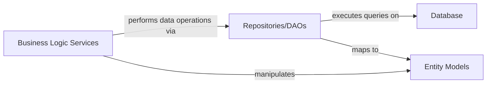

## Details

The `ruoyi-admin` subsystem employs a layered architecture, primarily focusing on the interaction between its core business logic and data persistence mechanisms. At its foundation, Entity Models define the data structures representing the application's domain. The Repositories/DAOs layer acts as an intermediary, abstracting direct interactions with the Database and handling the persistence and retrieval of these Entity Models. Above this, Business Logic Services encapsulate the application's core business rules, orchestrating operations by leveraging the Repositories/DAOs to manage Entity Models. This clear separation of concerns ensures maintainability, testability, and scalability, with Business Logic Services driving the application's functionality through well-defined data access interfaces.

### Entity Models
Represents the data structures of business entities, serving as data carriers between layers and directly mapped to database tables. These models encapsulate the state of the application's domain objects.

**Related Classes/Methods**:

- `com.ruoyi.web.controller.demo.domain.CustomerModel`

### Repositories/DAOs
Provides an abstraction layer for data access operations, performing Create, Read, Update, and Delete (CRUD) operations on Entity Models and interacting directly with the Database. It encapsulates the logic for data retrieval and storage.

**Related Classes/Methods**:

- `com.ruoyi.system.mapper.SysUserMapper`

### Database
The persistent storage for application data. It is the ultimate destination for data managed by the Data Access Layer.

**Related Classes/Methods**: _None_

### Business Logic Services
Components responsible for implementing the core business rules and orchestrating operations. While not strictly part of the Data Access Layer, they are its primary consumers, initiating data operations.

**Related Classes/Methods**:

- `com.ruoyi.system.service.impl.SysUserServiceImpl`

### [FAQ](https://github.com/CodeBoarding/GeneratedOnBoardings/tree/main?tab=readme-ov-file#faq)