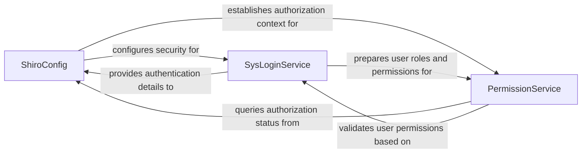

## Details

The security subsystem of {project_name} is primarily driven by Apache Shiro, with ShiroConfig serving as the core configuration component. It establishes the foundational security environment, including authentication realms and authorization mechanisms. SysLoginService is responsible for user authentication, validating credentials, and preparing user-specific roles and permissions upon successful login. These prepared permissions are then utilized by PermissionService, which acts as the authorization enforcement point, querying the Shiro security context (established by ShiroConfig) to validate user access rights against specific resources or actions. This interconnected design ensures a robust and centralized approach to user authentication and authorization within the application.

### ShiroConfig
Acts as the central orchestrator for the security module. It configures and initializes Apache Shiro, defining security realms, filters, and the overall security infrastructure. This component is fundamental as it sets up the entire security framework.

**Related Classes/Methods**:

- `com.ruoyi.framework.config.ShiroConfig`

### SysLoginService
Manages user authentication processes. It validates user credentials against the system's data store and handles login-related operations, serving as the primary interface for user sign-in. This component is essential for user access.

**Related Classes/Methods**:

- `com.ruoyi.framework.shiro.service.SysLoginService`

### PermissionService
Handles user authorization, managing roles and permissions. It is responsible for verifying if a user has the necessary rights to access specific resources or perform actions, thereby enforcing access control policies. This component is crucial for enforcing access control.

**Related Classes/Methods**:

- `com.ruoyi.framework.web.service.PermissionService`

### [FAQ](https://github.com/CodeBoarding/GeneratedOnBoardings/tree/main?tab=readme-ov-file#faq)