```mermaid
graph LR
    User_Client["User/Client"]
    Presentation_Layer["Presentation Layer"]
    Security_Module["Security Module"]
    Business_Logic_Layer["Business Logic Layer"]
    Data_Access_Layer["Data Access Layer"]
    Relational_Database["Relational Database"]
    User_Client -- "sends requests to" --> Presentation_Layer
    Presentation_Layer -- "interacts with" --> Security_Module
    Presentation_Layer -- "delegates to" --> Business_Logic_Layer
    Security_Module -- "authorizes" --> Business_Logic_Layer
    Business_Logic_Layer -- "accesses" --> Data_Access_Layer
    Data_Access_Layer -- "performs CRUD on" --> Relational_Database
    click Security_Module href "https://github.com/CodeBoarding/GeneratedOnBoardings/blob/main/RuoYi/Security_Module.md" "Details"
    click Business_Logic_Layer href "https://github.com/CodeBoarding/GeneratedOnBoardings/blob/main/RuoYi/Business_Logic_Layer.md" "Details"
    click Data_Access_Layer href "https://github.com/CodeBoarding/GeneratedOnBoardings/blob/main/RuoYi/Data_Access_Layer.md" "Details"
```

## Details

The {project_name} application follows a layered architecture, with the User/Client initiating interactions through the Presentation Layer. This layer, comprising web controllers and static/template resources, handles user input and renders views. All incoming requests are first routed through the Security Module, which is responsible for authenticating users and authorizing their actions, ensuring secure access to application functionalities. Once authenticated and authorized, requests are passed to the Business Logic Layer, the core of the application, where business rules are applied, and complex operations are orchestrated. This layer interacts with the Data Access Layer to persist and retrieve data from the Relational Database. The Data Access Layer acts as an abstraction, mapping business entities to database records and handling all direct database communications. This clear separation of concerns enhances modularity, allowing for independent development, testing, and scaling of each layer.

### User/Client
Represents external users or client applications interacting with the system. This component initiates requests and consumes responses.

**Related Classes/Methods**: _None_

### Presentation Layer
The user-facing part of the application, handling web requests, rendering views, and serving static assets. It acts as the primary entry point for user interactions, translating user actions into system requests and displaying results.

**Related Classes/Methods**:

- ``
- ``

### Security Module [[Expand]](./Security_Module.md)
A cross-cutting concern responsible for user authentication, authorization, and access control, ensuring secure interactions across layers. It validates user credentials and manages permissions.

**Related Classes/Methods**:

### Business Logic Layer [[Expand]](./Business_Logic_Layer.md)
Encapsulates the core business rules and orchestrates application operations. This layer contains the primary application logic and specialized management services for system entities (e.g., User, Role, Menu), job scheduling, and code generation. It processes requests from the Presentation Layer and interacts with the Data Access Layer.

**Related Classes/Methods**:

### Data Access Layer [[Expand]](./Data_Access_Layer.md)
Provides an abstraction layer for data persistence, handling direct interactions with the database and mapping data to entity models. It translates business logic requests into database operations (CRUD).

**Related Classes/Methods**:

### Relational Database
The persistent storage for all application data (e.g., MySQL). It stores and retrieves structured data managed by the Data Access Layer.

**Related Classes/Methods**: _None_

### [FAQ](https://github.com/CodeBoarding/GeneratedOnBoardings/tree/main?tab=readme-ov-file#faq)