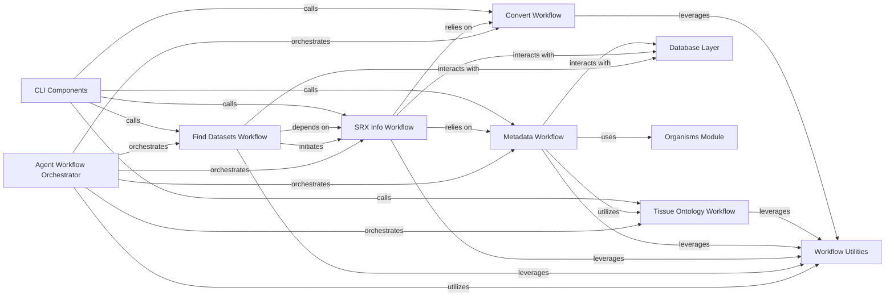

## Details

The Agent Workflow Orchestrator is a pivotal component within the SRAgent system, designed to manage and sequence complex, multi-step bioinformatics data curation and retrieval processes. It acts as the central coordination point, defining the execution order of various sub-workflows and managing their interactions to accomplish high-level tasks. This orchestration ensures a structured, automated, and efficient approach to handling diverse bioinformatics data.

### Agent Workflow Orchestrator [[Expand]](./Agent_Workflow_Orchestrator.md)
The overarching component responsible for defining, coordinating, and executing complex, multi-step data curation and retrieval processes. It ensures the structured flow and interaction of various sub-workflows to achieve high-level bioinformatics tasks.

**Related Classes/Methods**: _None_

### Find Datasets Workflow
Manages the process of identifying and retrieving relevant bioinformatics datasets based on specified criteria.

**Related Classes/Methods**: _None_

### SRX Info Workflow
Focuses on gathering and processing detailed information related to SRX (SRA Experiment) accessions, often involving external data sources.

**Related Classes/Methods**: _None_

### Metadata Workflow
Handles the extraction, processing, and curation of metadata associated with various bioinformatics data entities, ensuring data quality and consistency.

**Related Classes/Methods**: _None_

### Tissue Ontology Workflow
Integrates and processes tissue-specific ontological information, crucial for standardizing and enriching biological sample annotations.

**Related Classes/Methods**: _None_

### Convert Workflow
Responsible for managing data format conversions between different bioinformatics standards or internal representations.

**Related Classes/Methods**: _None_

### Workflow Utilities
Provides a collection of common utility functions and helper methods that are leveraged across multiple workflow components, promoting code reusability and maintainability.

**Related Classes/Methods**: _None_

### Database Layer
Manages all interactions with the underlying database, handling data persistence, retrieval, and updates for the entire SRAgent system.

**Related Classes/Methods**: _None_

### Organisms Module
Provides functionalities related to organism-specific data handling, validation, or lookup, ensuring biological accuracy in data processing.

**Related Classes/Methods**: _None_

### CLI Components
Provides the command-line interface for user interaction, serving as the entry point for initiating various workflows and system operations.

**Related Classes/Methods**: _None_

### [FAQ](https://github.com/CodeBoarding/GeneratedOnBoardings/tree/main?tab=readme-ov-file#faq)