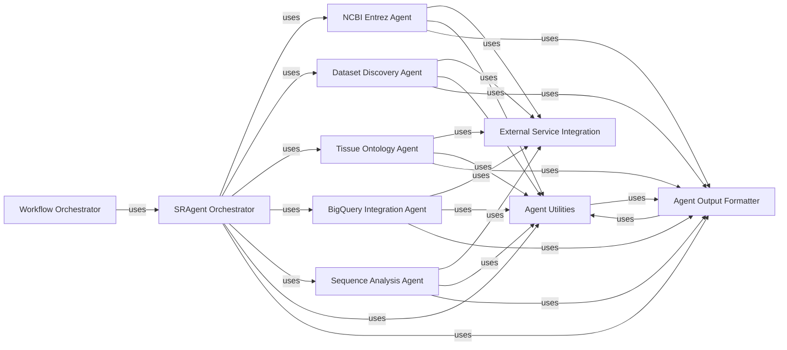

## Details

The Core AI Agents component is the intelligent backbone of the system, encapsulating the LLM-driven reasoning and decision-making logic for specialized bioinformatics tasks. It comprises various specialized agents, each designed to handle specific aspects of data curation and retrieval. These agents leverage External Service Integration tools to perform atomic operations and contribute to complex bioinformatics workflows. These components are fundamental because they embody the "Agent-Oriented Architecture" of the project. Each agent is a specialized, LLM-driven entity responsible for a distinct set of bioinformatics tasks, promoting modularity and reusability. Their interactions demonstrate the "Orchestration Pattern" where the SRAgent Orchestrator coordinates the activities of other agents, and the "Tool-Use/Function Calling" pattern as they all rely on External Service Integration to interact with the outside world. This clear separation of concerns makes the system scalable, maintainable, and adaptable to new bioinformatics challenges.

### SRAgent Orchestrator
The primary agent responsible for orchestrating high-level, SRA-specific bioinformatics workflows and coordinating tasks among other specialized agents. It acts as the central control point for SRA data curation and retrieval processes.

**Related Classes/Methods**:

- `SRAgent Orchestrator` (1:1)

### NCBI Entrez Agent
Manages all interactions with the NCBI Entrez suite of databases. This includes performing searches (ESearch), fetching detailed records (EFetch), linking related entries (ELink), summarizing results (ESummary), and converting data formats.

**Related Classes/Methods**:

- `NCBI Entrez Agent` (1:1)
- `NCBI Entrez Agent` (1:1)
- `NCBI Entrez Agent` (1:1)
- `NCBI Entrez Agent` (1:1)
- `NCBI Entrez Agent` (1:1)
- `NCBI Entrez Agent` (1:1)
- `NCBI Entrez Agent` (1:1)

### Dataset Discovery Agent
Specializes in identifying and locating relevant bioinformatics datasets based on user queries or internal logic. It leverages various tools to search for and filter datasets across different sources.

**Related Classes/Methods**:

- `Dataset Discovery Agent` (1:1)

### Tissue Ontology Agent
Handles the processing, interpretation, and application of tissue-related ontological information. This agent ensures consistency and accuracy in classifying and retrieving data based on tissue types.

**Related Classes/Methods**:

- `Tissue Ontology Agent` (1:1)

### BigQuery Integration Agent
Facilitates direct interaction with Google Cloud BigQuery for querying and retrieving large-scale bioinformatics datasets stored within the BigQuery environment.

**Related Classes/Methods**:

- `BigQuery Integration Agent` (1:1)

### Sequence Analysis Agent
Focuses on tasks related to the processing, manipulation, and basic analysis of biological sequence data (e.g., DNA, RNA, protein sequences).

**Related Classes/Methods**:

- `Sequence Analysis Agent` (1:1)

### Agent Output Formatter
Responsible for formatting and displaying the progress, intermediate results, and final outputs of the various agents in a user-friendly and consistent manner.

**Related Classes/Methods**:

- `Agent Output Formatter` (1:1)

### Agent Utilities
Provides a collection of common helper functions, reusable logic, and utility methods that support the operations of multiple agents within the subsystem.

**Related Classes/Methods**:

- `Agent Utilities` (1:1)

### Workflow Orchestrator [[Expand]](./Workflow_Orchestrator.md)
Manages overall bioinformatics workflows.

**Related Classes/Methods**: _None_

### External Service Integration [[Expand]](./External_Service_Integration.md)
Provides tools for interacting with external APIs and services.

**Related Classes/Methods**: _None_

### [FAQ](https://github.com/CodeBoarding/GeneratedOnBoardings/tree/main?tab=readme-ov-file#faq)