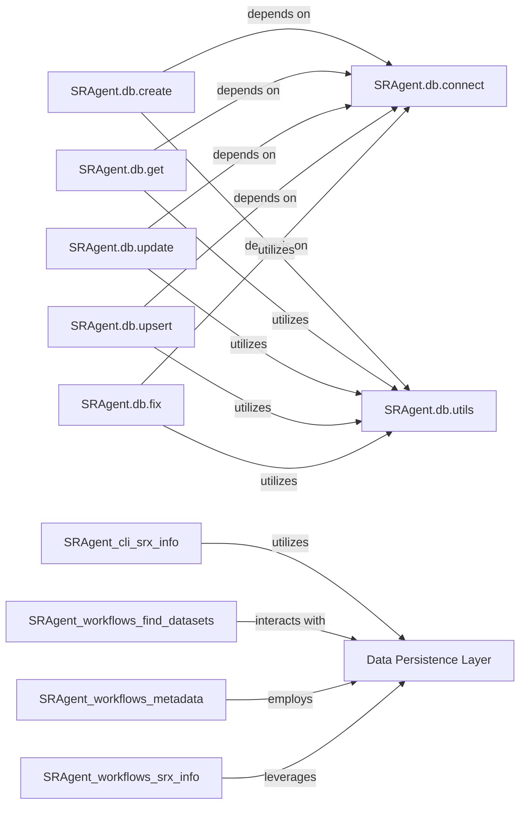

## Details

The `Data Persistence Layer` and its sub-components (`SRAgent.db.connect`, `SRAgent.db.create`, `SRAgent.db.get`, `SRAgent.db.update`, `SRAgent.db.upsert`, `SRAgent.db.fix`, `SRAgent.db.utils`) are fundamental to the AI Agent-based Bioinformatics Data Curation and Retrieval System for the following reasons:

1.  **Core Data Management**: As an AI agent system dealing with bioinformatics data, the ability to reliably store, retrieve, and manage large volumes of structured and semi-structured data is paramount. This layer provides the essential infrastructure for all data operations.
2.  **Abstraction and Decoupling**: By abstracting the underlying PostgreSQL database interactions, this layer decouples the business logic (agents, workflows) from the specifics of database technology. This promotes modularity, makes the system easier to maintain, and allows for potential database changes without impacting other components significantly.
3.  **Data Consistency and Integrity**: Dedicated modules for creation, retrieval, updates, upserts, and fixes ensure that data is handled consistently and that its integrity is maintained throughout its lifecycle within the system. This is critical for bioinformatics data, where accuracy is vital.
4.  **Efficiency and Performance**: The `connect` module, by managing connections, likely contributes to efficient resource utilization (e.g., connection pooling). The `upsert` functionality is particularly useful for optimizing data ingestion processes common in data curation.
5.  **Reusability**: The `utils` module centralizes common database helper functions, preventing code duplication and ensuring a consistent approach to database interactions across the entire persistence layer.
6.  **Support for Agent Operations**: AI agents often need to store intermediate results, retrieve historical data for context, or persist curated information. This persistence layer directly supports these needs, enabling the agents to perform complex, multi-step reasoning and data processing tasks effectively. For example, the `SRAgent.workflows.find_datasets` and `SRAgent.workflows.metadata` components heavily rely on this layer to store and retrieve information about datasets and their associated metadata.

### Data Persistence Layer [[Expand]](./Data_Persistence_Layer.md)
This component is responsible for all persistent data storage and retrieval operations, primarily interacting with a PostgreSQL database. It provides a robust abstraction over raw database interactions, managing connection pooling, schema creation, and CRUD (Create, Read, Update, Delete) operations for various data entities. It ensures data consistency and integrity across the system, abstracting the underlying database interactions from other components.

**Related Classes/Methods**:

- `SRAgent.db`

### SRAgent.db.connect
Manages the establishment and maintenance of connections to the PostgreSQL database. It handles connection pooling and ensures that other database operations have a stable and efficient way to interact with the database.

**Related Classes/Methods**:

- <a href="https://github.com/ArcInstitute/SRAgent/blob/main/SRAgent/db/connect.py" target="_blank" rel="noopener noreferrer">`SRAgent.db.connect`</a>

### SRAgent.db.create
Handles the insertion of new data records into the database. This includes defining the schema for new entries and executing the necessary SQL commands to persist data.

**Related Classes/Methods**:

- <a href="https://github.com/ArcInstitute/SRAgent/blob/main/SRAgent/db/create.py" target="_blank" rel="noopener noreferrer">`SRAgent.db.create`</a>

### SRAgent.db.get
Provides functionalities for retrieving data from the database based on specified criteria. It abstracts the querying process, allowing other components to fetch data without direct SQL knowledge.

**Related Classes/Methods**:

- <a href="https://github.com/ArcInstitute/SRAgent/blob/main/SRAgent/db/get.py" target="_blank" rel="noopener noreferrer">`SRAgent.db.get`</a>

### SRAgent.db.update
Manages the modification of existing data records in the database. It ensures that updates are applied correctly and efficiently, maintaining data integrity.

**Related Classes/Methods**:

- <a href="https://github.com/ArcInstitute/SRAgent/blob/main/SRAgent/db/update.py" target="_blank" rel="noopener noreferrer">`SRAgent.db.update`</a>

### SRAgent.db.upsert
Implements a combined "update or insert" operation, allowing for atomic creation or modification of records. This is particularly useful for data synchronization and avoiding duplicate entries.

**Related Classes/Methods**:

- <a href="https://github.com/ArcInstitute/SRAgent/blob/main/SRAgent/db/upsert.py" target="_blank" rel="noopener noreferrer">`SRAgent.db.upsert`</a>

### SRAgent.db.fix
Contains logic for data integrity checks and potential repair operations within the database. This component helps in maintaining the quality and consistency of stored bioinformatics data.

**Related Classes/Methods**:

- <a href="https://github.com/ArcInstitute/SRAgent/blob/main/SRAgent/db/fix.py" target="_blank" rel="noopener noreferrer">`SRAgent.db.fix`</a>

### SRAgent.db.utils
Provides a collection of utility functions and helper methods used across various database operations. This promotes code reusability and consistency in database interactions.

**Related Classes/Methods**:

- <a href="https://github.com/ArcInstitute/SRAgent/blob/main/SRAgent/db/utils.py" target="_blank" rel="noopener noreferrer">`SRAgent.db.utils`</a>

### [FAQ](https://github.com/CodeBoarding/GeneratedOnBoardings/tree/main?tab=readme-ov-file#faq)