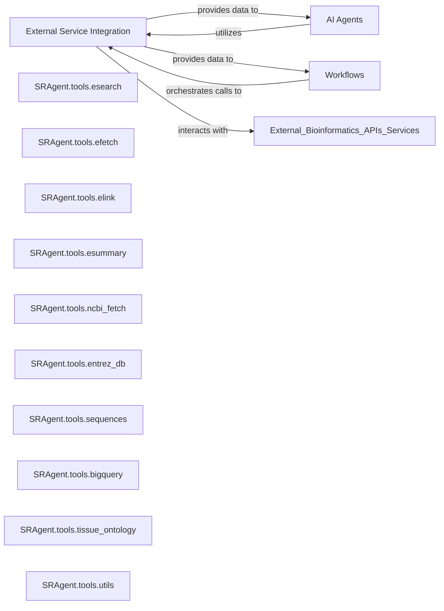

## Details

This component provides a standardized and abstracted interface for interacting with various external bioinformatics APIs and services. It encapsulates the logic for querying and retrieving data from sources such as NCBI Entrez databases (e.g., PubMed, SRA), Google Cloud BigQuery for large-scale data, and the UBERON tissue ontology service for standardized biological annotations. It acts as a crucial wrapper, simplifying external interactions for other components like AI agents and workflows.

### External Service Integration [[Expand]](./External_Service_Integration.md)
This component provides a standardized and abstracted interface for interacting with various external bioinformatics APIs and services. It encapsulates the logic for querying and retrieving data from sources such as NCBI Entrez databases (e.g., PubMed, SRA), Google Cloud BigQuery for large-scale data, and the UBERON tissue ontology service for standardized biological annotations. It acts as a crucial wrapper, simplifying external interactions for other components like AI agents and workflows.

**Related Classes/Methods**:

- <a href="https://github.com/ArcInstitute/SRAgent/blob/main/SRAgent/tools/esearch.py#L180-L250" target="_blank" rel="noopener noreferrer">`SRAgent.tools.esearch` (180:250)</a>
- <a href="https://github.com/ArcInstitute/SRAgent/blob/main/SRAgent/tools/efetch.py#L15-L68" target="_blank" rel="noopener noreferrer">`SRAgent.tools.efetch` (15:68)</a>
- <a href="https://github.com/ArcInstitute/SRAgent/blob/main/SRAgent/tools/elink.py#L44-L129" target="_blank" rel="noopener noreferrer">`SRAgent.tools.elink` (44:129)</a>
- <a href="https://github.com/ArcInstitute/SRAgent/blob/main/SRAgent/tools/esummary.py#L13-L69" target="_blank" rel="noopener noreferrer">`SRAgent.tools.esummary` (13:69)</a>
- <a href="https://github.com/ArcInstitute/SRAgent/blob/main/SRAgent/tools/ncbi_fetch.py#L1-L1" target="_blank" rel="noopener noreferrer">`SRAgent.tools.ncbi_fetch` (1:1)</a>
- <a href="https://github.com/ArcInstitute/SRAgent/blob/main/SRAgent/tools/entrez_db.py#L1-L1" target="_blank" rel="noopener noreferrer">`SRAgent.tools.entrez_db` (1:1)</a>
- <a href="https://github.com/ArcInstitute/SRAgent/blob/main/SRAgent/tools/sequences.py#L1-L1" target="_blank" rel="noopener noreferrer">`SRAgent.tools.sequences` (1:1)</a>
- <a href="https://github.com/ArcInstitute/SRAgent/blob/main/SRAgent/tools/bigquery.py#L1-L1" target="_blank" rel="noopener noreferrer">`SRAgent.tools.bigquery` (1:1)</a>
- <a href="https://github.com/ArcInstitute/SRAgent/blob/main/SRAgent/tools/tissue_ontology.py#L1-L1" target="_blank" rel="noopener noreferrer">`SRAgent.tools.tissue_ontology` (1:1)</a>
- <a href="https://github.com/ArcInstitute/SRAgent/blob/main/SRAgent/tools/utils.py#L1-L1" target="_blank" rel="noopener noreferrer">`SRAgent.tools.utils` (1:1)</a>

### SRAgent.tools.esearch
Handles search queries against NCBI Entrez databases (e.g., SRA, PubMed, GEO). It's crucial for initiating data retrieval by identifying relevant entries based on user queries.

**Related Classes/Methods**:

- <a href="https://github.com/ArcInstitute/SRAgent/blob/main/SRAgent/tools/esearch.py#L180-L250" target="_blank" rel="noopener noreferrer">`SRAgent.tools.esearch` (180:250)</a>

### SRAgent.tools.efetch
Retrieves full records from NCBI Entrez databases based on IDs obtained from `esearch` or other means. This is vital for getting detailed information about biological entities.

**Related Classes/Methods**:

- <a href="https://github.com/ArcInstitute/SRAgent/blob/main/SRAgent/tools/efetch.py#L15-L68" target="_blank" rel="noopener noreferrer">`SRAgent.tools.efetch` (15:68)</a>

### SRAgent.tools.elink
Facilitates linking between related entries across different NCBI Entrez databases. This is essential for navigating the interconnectedness of biological data (e.g., linking a SRA experiment to a PubMed article).

**Related Classes/Methods**:

- <a href="https://github.com/ArcInstitute/SRAgent/blob/main/SRAgent/tools/elink.py#L44-L129" target="_blank" rel="noopener noreferrer">`SRAgent.tools.elink` (44:129)</a>

### SRAgent.tools.esummary
Retrieves summaries of records from NCBI Entrez databases. This is useful for quickly getting an overview of an entry without fetching the entire detailed record.

**Related Classes/Methods**:

- <a href="https://github.com/ArcInstitute/SRAgent/blob/main/SRAgent/tools/esummary.py#L13-L69" target="_blank" rel="noopener noreferrer">`SRAgent.tools.esummary` (13:69)</a>

### SRAgent.tools.ncbi_fetch
A more general-purpose tool for fetching data from NCBI, potentially encapsulating or orchestrating calls to `esearch`, `efetch`, `elink`, and `esummary` for more complex NCBI interactions.

**Related Classes/Methods**:

- <a href="https://github.com/ArcInstitute/SRAgent/blob/main/SRAgent/tools/ncbi_fetch.py#L1-L1" target="_blank" rel="noopener noreferrer">`SRAgent.tools.ncbi_fetch` (1:1)</a>

### SRAgent.tools.entrez_db
Likely provides utilities or configurations related to managing and interacting with different Entrez databases, such as listing available databases or setting up database-specific parameters.

**Related Classes/Methods**:

- <a href="https://github.com/ArcInstitute/SRAgent/blob/main/SRAgent/tools/entrez_db.py#L1-L1" target="_blank" rel="noopener noreferrer">`SRAgent.tools.entrez_db` (1:1)</a>

### SRAgent.tools.sequences
Focuses on retrieving and potentially processing biological sequence data, likely from NCBI or other sequence repositories.

**Related Classes/Methods**:

- <a href="https://github.com/ArcInstitute/SRAgent/blob/main/SRAgent/tools/sequences.py#L1-L1" target="_blank" rel="noopener noreferrer">`SRAgent.tools.sequences` (1:1)</a>

### SRAgent.tools.bigquery
Provides an interface for querying and retrieving data from Google Cloud BigQuery, enabling access to large-scale public or private bioinformatics datasets.

**Related Classes/Methods**:

- <a href="https://github.com/ArcInstitute/SRAgent/blob/main/SRAgent/tools/bigquery.py#L1-L1" target="_blank" rel="noopener noreferrer">`SRAgent.tools.bigquery` (1:1)</a>

### SRAgent.tools.tissue_ontology
Interacts with the UBERON tissue ontology service, allowing for standardized annotation and retrieval of information based on anatomical structures and tissues.

**Related Classes/Methods**:

- <a href="https://github.com/ArcInstitute/SRAgent/blob/main/SRAgent/tools/tissue_ontology.py#L1-L1" target="_blank" rel="noopener noreferrer">`SRAgent.tools.tissue_ontology` (1:1)</a>

### SRAgent.tools.utils
Contains common utility functions used across various external service interactions, such as XML parsing, error handling, or request formatting.

**Related Classes/Methods**:

- <a href="https://github.com/ArcInstitute/SRAgent/blob/main/SRAgent/tools/utils.py#L1-L1" target="_blank" rel="noopener noreferrer">`SRAgent.tools.utils` (1:1)</a>

### AI Agents [[Expand]](./AI_Agents.md)
AI agents (e.g., Entrez Agent, SRAgent Agent, Tissue-ontology Agent, Find-datasets Agent) that utilize external service integration.

**Related Classes/Methods**: _None_

### Workflows
Workflows (e.g., Convert Workflow, Find Datasets Workflow, Metadata Workflow, SRX Info Workflow) that orchestrate calls to external service integration.

**Related Classes/Methods**: _None_

### [FAQ](https://github.com/CodeBoarding/GeneratedOnBoardings/tree/main?tab=readme-ov-file#faq)