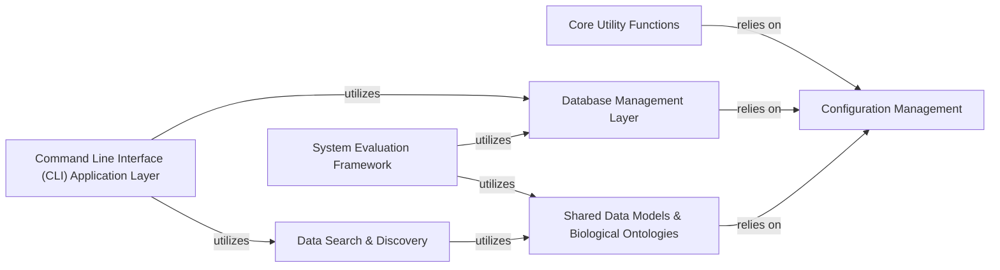

## Details

The System Utilities & Support Scripts component serves as the foundational backbone of the SRAgent project, providing essential shared functionalities, configuration management, and operational scripts. It encapsulates general data manipulation, command execution, initial data ingestion, format transformations, database administration, metadata enrichment, dataset discovery, and the evaluation framework. These components are fundamental because they embody the project's architectural principles of modularity, reusability, and abstraction. They ensure that core functionalities are centralized, configurable, and accessible, supporting the complex operations of an AI Agent-based Bioinformatics Data Curation and Retrieval System.

### Core Utility Functions
A collection of foundational, shared helper functions for general data manipulation, string processing, and other common operations used across the entire system. These functions ensure code reusability and consistency.

**Related Classes/Methods**:

- <a href="https://github.com/ArcInstitute/SRAgent/blob/main/SRAgent/utils.py#L1-L1" target="_blank" rel="noopener noreferrer">`SRAgent/utils.py` (1:1)</a>
- <a href="https://github.com/ArcInstitute/SRAgent/blob/main/SRAgent/tools/utils.py#L1-L1" target="_blank" rel="noopener noreferrer">`SRAgent/tools/utils.py` (1:1)</a>
- <a href="https://github.com/ArcInstitute/SRAgent/blob/main/SRAgent/agents/utils.py#L1-L1" target="_blank" rel="noopener noreferrer">`SRAgent/agents/utils.py` (1:1)</a>
- <a href="https://github.com/ArcInstitute/SRAgent/blob/main/SRAgent/db/utils.py#L1-L1" target="_blank" rel="noopener noreferrer">`SRAgent/db/utils.py` (1:1)</a>
- <a href="https://github.com/ArcInstitute/SRAgent/blob/main/SRAgent/cli/utils.py#L1-L1" target="_blank" rel="noopener noreferrer">`SRAgent/cli/utils.py` (1:1)</a>
- <a href="https://github.com/ArcInstitute/SRAgent/blob/main/SRAgent/workflows/utils.py#L1-L1" target="_blank" rel="noopener noreferrer">`SRAgent/workflows/utils.py` (1:1)</a>

### Configuration Management
Manages application settings, API keys, database credentials, and other configurable parameters. This component is crucial for ensuring secure, flexible, and environment-agnostic deployment of the system.

**Related Classes/Methods**:

- `SRAgent/settings.yml` (1:1)

### Database Management Layer
Encapsulates all interactions with the PostgreSQL database. It provides functionalities for connection, schema creation, data retrieval, insertion/updating (upsert), and general database administration tasks, supporting initial data ingestion and ongoing data management.

**Related Classes/Methods**:

- <a href="https://github.com/ArcInstitute/SRAgent/blob/main/SRAgent/db/__init__.py#L1-L1" target="_blank" rel="noopener noreferrer">`SRAgent/db/__init__.py` (1:1)</a>
- <a href="https://github.com/ArcInstitute/SRAgent/blob/main/SRAgent/db/connect.py#L1-L1" target="_blank" rel="noopener noreferrer">`SRAgent/db/connect.py` (1:1)</a>
- <a href="https://github.com/ArcInstitute/SRAgent/blob/main/SRAgent/db/create.py#L1-L1" target="_blank" rel="noopener noreferrer">`SRAgent/db/create.py` (1:1)</a>
- <a href="https://github.com/ArcInstitute/SRAgent/blob/main/SRAgent/db/fix.py#L1-L1" target="_blank" rel="noopener noreferrer">`SRAgent/db/fix.py` (1:1)</a>
- <a href="https://github.com/ArcInstitute/SRAgent/blob/main/SRAgent/db/get.py#L1-L1" target="_blank" rel="noopener noreferrer">`SRAgent/db/get.py` (1:1)</a>
- <a href="https://github.com/ArcInstitute/SRAgent/blob/main/SRAgent/db/update.py#L1-L1" target="_blank" rel="noopener noreferrer">`SRAgent/db/update.py` (1:1)</a>
- <a href="https://github.com/ArcInstitute/SRAgent/blob/main/SRAgent/db/upsert.py#L1-L1" target="_blank" rel="noopener noreferrer">`SRAgent/db/upsert.py` (1:1)</a>
- <a href="https://github.com/ArcInstitute/SRAgent/blob/main/SRAgent/db/utils.py#L1-L1" target="_blank" rel="noopener noreferrer">`SRAgent/db/utils.py` (1:1)</a>

### Shared Data Models & Biological Ontologies
Defines data structures for biological entities and manages organism-related data. This includes the integration and embedding of biological ontologies (e.g., Uberon), which is crucial for metadata enrichment and providing a structured basis for biological data.

**Related Classes/Methods**:

- <a href="https://github.com/ArcInstitute/SRAgent/blob/main/SRAgent/organisms.py#L1-L1" target="_blank" rel="noopener noreferrer">`SRAgent/organisms.py` (1:1)</a>

### Data Search & Discovery
Provides mechanisms and interfaces for searching, querying, and discovering datasets and associated metadata within the system. It leverages structured data and potentially integrates with external search services to enable efficient data access.

**Related Classes/Methods**:

- <a href="https://github.com/ArcInstitute/SRAgent/blob/main/SRAgent/search.py#L1-L1" target="_blank" rel="noopener noreferrer">`SRAgent/search.py` (1:1)</a>

### Command Line Interface (CLI) Application Layer
The primary user-facing component that provides command-line entry points for various operations. It parses user arguments and orchestrates calls to underlying workflows, agents, and utility scripts, effectively serving as the execution environment for many standalone support scripts.

**Related Classes/Methods**:

- <a href="https://github.com/ArcInstitute/SRAgent/blob/main/SRAgent/cli/__init__.py#L1-L1" target="_blank" rel="noopener noreferrer">`SRAgent/cli/__init__.py` (1:1)</a>
- <a href="https://github.com/ArcInstitute/SRAgent/blob/main/SRAgent/cli/__main__.py#L1-L1" target="_blank" rel="noopener noreferrer">`SRAgent/cli/__main__.py` (1:1)</a>
- <a href="https://github.com/ArcInstitute/SRAgent/blob/main/SRAgent/cli/entrez.py#L1-L1" target="_blank" rel="noopener noreferrer">`SRAgent/cli/entrez.py` (1:1)</a>
- <a href="https://github.com/ArcInstitute/SRAgent/blob/main/SRAgent/cli/find_datasets.py#L1-L1" target="_blank" rel="noopener noreferrer">`SRAgent/cli/find_datasets.py` (1:1)</a>
- <a href="https://github.com/ArcInstitute/SRAgent/blob/main/SRAgent/cli/metadata.py#L1-L1" target="_blank" rel="noopener noreferrer">`SRAgent/cli/metadata.py` (1:1)</a>
- <a href="https://github.com/ArcInstitute/SRAgent/blob/main/SRAgent/cli/sragent.py#L1-L1" target="_blank" rel="noopener noreferrer">`SRAgent/cli/sragent.py` (1:1)</a>
- <a href="https://github.com/ArcInstitute/SRAgent/blob/main/SRAgent/cli/srx_info.py#L1-L1" target="_blank" rel="noopener noreferrer">`SRAgent/cli/srx_info.py` (1:1)</a>
- <a href="https://github.com/ArcInstitute/SRAgent/blob/main/SRAgent/cli/tissue_ontology.py#L1-L1" target="_blank" rel="noopener noreferrer">`SRAgent/cli/tissue_ontology.py` (1:1)</a>
- <a href="https://github.com/ArcInstitute/SRAgent/blob/main/SRAgent/cli/utils.py#L1-L1" target="_blank" rel="noopener noreferrer">`SRAgent/cli/utils.py` (1:1)</a>

### System Evaluation Framework
Provides tools and methodologies for evaluating the performance, accuracy, and effectiveness of the system's components, particularly the AI agents and data curation processes. This is vital for continuous improvement and validation.

**Related Classes/Methods**: _None_

### [FAQ](https://github.com/CodeBoarding/GeneratedOnBoardings/tree/main?tab=readme-ov-file#faq)