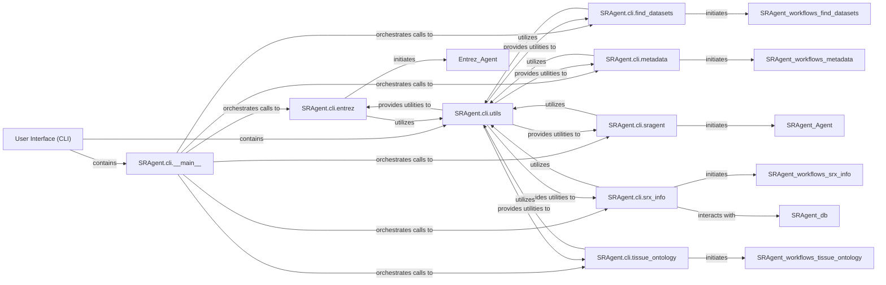

## Details

The User Interface (CLI) subsystem serves as the primary interactive gateway for users to engage with the SRAgent system. It is meticulously designed to parse user commands, validate inputs, and subsequently trigger the appropriate bioinformatics data curation and retrieval workflows. This component embodies the Command Line Interface (CLI) Application architectural pattern, providing a robust and user-friendly command-line experience.

### User Interface (CLI) [[Expand]](./User_Interface_CLI_.md)
The overarching component that provides the interactive command-line experience. It is responsible for the overall structure and flow of user interactions, encompassing all sub-commands and utilities.

**Related Classes/Methods**:

- `SRAgent.cli` (1:1)

### SRAgent.cli.__main__
This is the core entry point of the CLI application. It is responsible for setting up the command-line argument parser, defining the available top-level commands, and dispatching control to the relevant command-specific modules based on user input. It acts as the central orchestrator for all CLI interactions.

**Related Classes/Methods**:

- <a href="https://github.com/ArcInstitute/SRAgent/blob/main/SRAgent/cli/__main__.py#L1-L1" target="_blank" rel="noopener noreferrer">`SRAgent.cli.__main__` (1:1)</a>

### SRAgent.cli.utils
This module provides a collection of common utility functions that are leveraged by various command-specific modules within the `SRAgent.cli` package. These utilities include functions for argument parsing, input validation, output formatting, and other helper functionalities that promote code reusability and consistency across the CLI.

**Related Classes/Methods**:

- <a href="https://github.com/ArcInstitute/SRAgent/blob/main/SRAgent/cli/utils.py#L1-L1" target="_blank" rel="noopener noreferrer">`SRAgent.cli.utils` (1:1)</a>

### SRAgent.cli.entrez
Encapsulates the logic for handling Entrez-specific user commands. It parses arguments relevant to Entrez operations, performs necessary input validation, and initiates the corresponding `Entrez Agent` or related workflows to interact with the Entrez database.

**Related Classes/Methods**:

- <a href="https://github.com/ArcInstitute/SRAgent/blob/main/SRAgent/cli/entrez.py#L1-L1" target="_blank" rel="noopener noreferrer">`SRAgent.cli.entrez` (1:1)</a>

### SRAgent.cli.find_datasets
Manages commands for discovering and retrieving datasets. It parses arguments, validates input, and initiates the `Find-datasets Agent` or the `SRAgent.workflows.find_datasets` workflow to fulfill the user's request.

**Related Classes/Methods**:

- <a href="https://github.com/ArcInstitute/SRAgent/blob/main/SRAgent/cli/find_datasets.py#L1-L1" target="_blank" rel="noopener noreferrer">`SRAgent.cli.find_datasets` (1:1)</a>

### SRAgent.cli.metadata
Handles commands related to metadata curation and retrieval. It parses arguments, validates input, and initiates the `Metadata Agent` or the `SRAgent.workflows.metadata` workflow to process metadata-related queries.

**Related Classes/Methods**:

- <a href="https://github.com/ArcInstitute/SRAgent/blob/main/SRAgent/cli/metadata.py#L1-L1" target="_blank" rel="noopener noreferrer">`SRAgent.cli.metadata` (1:1)</a>

### SRAgent.cli.sragent
Encapsulates the logic for general SRAgent commands that might not fall under specific categories like Entrez or SRX info. It parses arguments, validates input, and initiates the core `SRAgent Agent` or related workflows.

**Related Classes/Methods**:

- <a href="https://github.com/ArcInstitute/SRAgent/blob/main/SRAgent/cli/sragent.py#L1-L1" target="_blank" rel="noopener noreferrer">`SRAgent.cli.sragent` (1:1)</a>

### SRAgent.cli.srx_info
Manages commands for retrieving detailed information about SRX (SRA Experiment) accessions. It parses arguments, validates input, and initiates the `SRX-info Agent` or the `SRAgent.workflows.srx_info` workflow, potentially interacting with the database for data retrieval.

**Related Classes/Methods**:

- <a href="https://github.com/ArcInstitute/SRAgent/blob/main/SRAgent/cli/srx_info.py#L1-L1" target="_blank" rel="noopener noreferrer">`SRAgent.cli.srx_info` (1:1)</a>

### SRAgent.cli.tissue_ontology
Handles commands related to tissue ontology, likely for mapping or querying tissue-specific data. It parses arguments, validates input, and initiates the `Tissue-ontology Agent` or the `SRAgent.workflows.tissue_ontology` workflow.

**Related Classes/Methods**:

- <a href="https://github.com/ArcInstitute/SRAgent/blob/main/SRAgent/cli/tissue_ontology.py#L1-L1" target="_blank" rel="noopener noreferrer">`SRAgent.cli.tissue_ontology` (1:1)</a>

### [FAQ](https://github.com/CodeBoarding/GeneratedOnBoardings/tree/main?tab=readme-ov-file#faq)