```mermaid
graph LR
    User_Interface_CLI_["User Interface (CLI)"]
    Agent_Workflow_Orchestrator["Agent Workflow Orchestrator"]
    Core_AI_Agents["Core AI Agents"]
    External_Service_Integration["External Service Integration"]
    Data_Persistence_Layer["Data Persistence Layer"]
    System_Utilities_Support_Scripts["System Utilities & Support Scripts"]
    User_Interface_CLI_ -- "initiates and receives output from" --> Agent_Workflow_Orchestrator
    Agent_Workflow_Orchestrator -- "coordinates and invokes" --> Core_AI_Agents
    Agent_Workflow_Orchestrator -- "interacts with for workflow state" --> Data_Persistence_Layer
    Agent_Workflow_Orchestrator -- "utilizes" --> System_Utilities_Support_Scripts
    Core_AI_Agents -- "utilize for external data access" --> External_Service_Integration
    Core_AI_Agents -- "interact with for agent-specific data" --> Data_Persistence_Layer
    Core_AI_Agents -- "leverage for common functions" --> System_Utilities_Support_Scripts
    Core_AI_Agents -- "reports results back to" --> Agent_Workflow_Orchestrator
    External_Service_Integration -- "relies on for configuration and common helpers" --> System_Utilities_Support_Scripts
    Data_Persistence_Layer -- "leverages for database-specific utilities" --> System_Utilities_Support_Scripts
    System_Utilities_Support_Scripts -- "manages and populates" --> Data_Persistence_Layer
    System_Utilities_Support_Scripts -- "may fetch raw data using" --> External_Service_Integration
    click User_Interface_CLI_ href "https://github.com/CodeBoarding/GeneratedOnBoardings/blob/main/SRAgent/User_Interface_CLI_.md" "Details"
    click Agent_Workflow_Orchestrator href "https://github.com/CodeBoarding/GeneratedOnBoardings/blob/main/SRAgent/Agent_Workflow_Orchestrator.md" "Details"
    click Core_AI_Agents href "https://github.com/CodeBoarding/GeneratedOnBoardings/blob/main/SRAgent/Core_AI_Agents.md" "Details"
    click External_Service_Integration href "https://github.com/CodeBoarding/GeneratedOnBoardings/blob/main/SRAgent/External_Service_Integration.md" "Details"
    click Data_Persistence_Layer href "https://github.com/CodeBoarding/GeneratedOnBoardings/blob/main/SRAgent/Data_Persistence_Layer.md" "Details"
    click System_Utilities_Support_Scripts href "https://github.com/CodeBoarding/GeneratedOnBoardings/blob/main/SRAgent/System_Utilities_Support_Scripts.md" "Details"
```

## Details

The `SRAgent` project, an AI Agent-based Bioinformatics Data Curation and Retrieval System, is architected around a modular design with a clear separation of concerns. The system leverages an agent-oriented approach, orchestrating various AI agents and specialized tools to interact with external bioinformatics services and manage internal data.

### User Interface (CLI) [[Expand]](./User_Interface_CLI_.md)
The primary entry point for users, responsible for parsing commands, validating inputs, and initiating specific data curation and retrieval workflows. It provides the interactive command-line experience.

**Related Classes/Methods**:

- <a href="https://github.com/ArcInstitute/SRAgent/blob/main/SRAgent/cli/__main__.py#L1-L1" target="_blank" rel="noopener noreferrer">`SRAgent.cli.__main__` (1:1)</a>
- <a href="https://github.com/ArcInstitute/SRAgent/blob/main/SRAgent/cli/entrez.py#L1-L1" target="_blank" rel="noopener noreferrer">`SRAgent.cli.entrez` (1:1)</a>
- <a href="https://github.com/ArcInstitute/SRAgent/blob/main/SRAgent/cli/sragent.py#L1-L1" target="_blank" rel="noopener noreferrer">`SRAgent.cli.sragent` (1:1)</a>
- <a href="https://github.com/ArcInstitute/SRAgent/blob/main/SRAgent/cli/metadata.py#L1-L1" target="_blank" rel="noopener noreferrer">`SRAgent.cli.metadata` (1:1)</a>
- <a href="https://github.com/ArcInstitute/SRAgent/blob/main/SRAgent/cli/tissue_ontology.py#L1-L1" target="_blank" rel="noopener noreferrer">`SRAgent.cli.tissue_ontology` (1:1)</a>
- <a href="https://github.com/ArcInstitute/SRAgent/blob/main/SRAgent/cli/srx_info.py#L1-L1" target="_blank" rel="noopener noreferrer">`SRAgent.cli.srx_info` (1:1)</a>
- <a href="https://github.com/ArcInstitute/SRAgent/blob/main/SRAgent/cli/find_datasets.py#L1-L1" target="_blank" rel="noopener noreferrer">`SRAgent.cli.find_datasets` (1:1)</a>
- <a href="https://github.com/ArcInstitute/SRAgent/blob/main/SRAgent/cli/utils.py#L1-L1" target="_blank" rel="noopener noreferrer">`SRAgent.cli.utils` (1:1)</a>

### Agent Workflow Orchestrator [[Expand]](./Agent_Workflow_Orchestrator.md)
Orchestrates complex, multi-step data curation and retrieval processes. It defines the sequence of operations, coordinates the execution of various `Core AI Agents`, and manages their interactions to achieve high-level bioinformatics tasks.

**Related Classes/Methods**:

- <a href="https://github.com/ArcInstitute/SRAgent/blob/main/SRAgent/workflows/find_datasets.py#L1-L1" target="_blank" rel="noopener noreferrer">`SRAgent.workflows.find_datasets` (1:1)</a>
- <a href="https://github.com/ArcInstitute/SRAgent/blob/main/SRAgent/workflows/metadata.py#L1-L1" target="_blank" rel="noopener noreferrer">`SRAgent.workflows.metadata` (1:1)</a>
- <a href="https://github.com/ArcInstitute/SRAgent/blob/main/SRAgent/workflows/tissue_ontology.py#L1-L1" target="_blank" rel="noopener noreferrer">`SRAgent.workflows.tissue_ontology` (1:1)</a>
- <a href="https://github.com/ArcInstitute/SRAgent/blob/main/SRAgent/workflows/srx_info.py#L1-L1" target="_blank" rel="noopener noreferrer">`SRAgent.workflows.srx_info` (1:1)</a>
- <a href="https://github.com/ArcInstitute/SRAgent/blob/main/SRAgent/workflows/convert.py#L1-L1" target="_blank" rel="noopener noreferrer">`SRAgent.workflows.convert` (1:1)</a>
- <a href="https://github.com/ArcInstitute/SRAgent/blob/main/SRAgent/workflows/utils.py#L1-L1" target="_blank" rel="noopener noreferrer">`SRAgent.workflows.utils` (1:1)</a>

### Core AI Agents [[Expand]](./Core_AI_Agents.md)
Encapsulates the LLM-driven reasoning and decision-making logic for specialized bioinformatics tasks. Each agent leverages `External Service Integration` tools to perform atomic operations and contributes to the overall workflow. This component also handles formatting and displaying agent progress.

**Related Classes/Methods**:

- <a href="https://github.com/ArcInstitute/SRAgent/blob/main/SRAgent/agents/sragent.py#L1-L1" target="_blank" rel="noopener noreferrer">`SRAgent.agents.sragent` (1:1)</a>
- <a href="https://github.com/ArcInstitute/SRAgent/blob/main/SRAgent/agents/entrez.py#L1-L1" target="_blank" rel="noopener noreferrer">`SRAgent.agents.entrez` (1:1)</a>
- <a href="https://github.com/ArcInstitute/SRAgent/blob/main/SRAgent/agents/find_datasets.py#L1-L1" target="_blank" rel="noopener noreferrer">`SRAgent.agents.find_datasets` (1:1)</a>
- <a href="https://github.com/ArcInstitute/SRAgent/blob/main/SRAgent/agents/tissue_ontology.py#L1-L1" target="_blank" rel="noopener noreferrer">`SRAgent.agents.tissue_ontology` (1:1)</a>
- <a href="https://github.com/ArcInstitute/SRAgent/blob/main/SRAgent/agents/ncbi_fetch.py#L1-L1" target="_blank" rel="noopener noreferrer">`SRAgent.agents.ncbi_fetch` (1:1)</a>
- <a href="https://github.com/ArcInstitute/SRAgent/blob/main/SRAgent/agents/esearch.py#L1-L1" target="_blank" rel="noopener noreferrer">`SRAgent.agents.esearch` (1:1)</a>
- <a href="https://github.com/ArcInstitute/SRAgent/blob/main/SRAgent/agents/efetch.py#L1-L1" target="_blank" rel="noopener noreferrer">`SRAgent.agents.efetch` (1:1)</a>
- <a href="https://github.com/ArcInstitute/SRAgent/blob/main/SRAgent/agents/elink.py#L1-L1" target="_blank" rel="noopener noreferrer">`SRAgent.agents.elink` (1:1)</a>
- <a href="https://github.com/ArcInstitute/SRAgent/blob/main/SRAgent/agents/esummary.py#L1-L1" target="_blank" rel="noopener noreferrer">`SRAgent.agents.esummary` (1:1)</a>
- <a href="https://github.com/ArcInstitute/SRAgent/blob/main/SRAgent/agents/bigquery.py#L1-L1" target="_blank" rel="noopener noreferrer">`SRAgent.agents.bigquery` (1:1)</a>
- <a href="https://github.com/ArcInstitute/SRAgent/blob/main/SRAgent/agents/sequences.py#L1-L1" target="_blank" rel="noopener noreferrer">`SRAgent.agents.sequences` (1:1)</a>
- <a href="https://github.com/ArcInstitute/SRAgent/blob/main/SRAgent/agents/entrez_convert.py#L1-L1" target="_blank" rel="noopener noreferrer">`SRAgent.agents.entrez_convert` (1:1)</a>
- <a href="https://github.com/ArcInstitute/SRAgent/blob/main/SRAgent/agents/display.py#L1-L1" target="_blank" rel="noopener noreferrer">`SRAgent.agents.display` (1:1)</a>
- <a href="https://github.com/ArcInstitute/SRAgent/blob/main/SRAgent/agents/utils.py#L1-L1" target="_blank" rel="noopener noreferrer">`SRAgent.agents.utils` (1:1)</a>

### External Service Integration [[Expand]](./External_Service_Integration.md)
Provides a standardized and abstracted interface for interacting with various external bioinformatics APIs and services. This includes NCBI Entrez databases, SRA data processing utilities, Google Cloud BigQuery, and the UBERON tissue ontology service. It acts as a wrapper for external interactions.

**Related Classes/Methods**:

- <a href="https://github.com/ArcInstitute/SRAgent/blob/main/SRAgent/tools/esearch.py#L180-L250" target="_blank" rel="noopener noreferrer">`SRAgent.tools.esearch` (180:250)</a>
- <a href="https://github.com/ArcInstitute/SRAgent/blob/main/SRAgent/tools/efetch.py#L15-L68" target="_blank" rel="noopener noreferrer">`SRAgent.tools.efetch` (15:68)</a>
- <a href="https://github.com/ArcInstitute/SRAgent/blob/main/SRAgent/tools/elink.py#L44-L129" target="_blank" rel="noopener noreferrer">`SRAgent.tools.elink` (44:129)</a>
- <a href="https://github.com/ArcInstitute/SRAgent/blob/main/SRAgent/tools/esummary.py#L13-L69" target="_blank" rel="noopener noreferrer">`SRAgent.tools.esummary` (13:69)</a>
- <a href="https://github.com/ArcInstitute/SRAgent/blob/main/SRAgent/tools/ncbi_fetch.py#L1-L1" target="_blank" rel="noopener noreferrer">`SRAgent.tools.ncbi_fetch` (1:1)</a>
- <a href="https://github.com/ArcInstitute/SRAgent/blob/main/SRAgent/tools/entrez_db.py#L1-L1" target="_blank" rel="noopener noreferrer">`SRAgent.tools.entrez_db` (1:1)</a>
- <a href="https://github.com/ArcInstitute/SRAgent/blob/main/SRAgent/tools/sequences.py#L1-L1" target="_blank" rel="noopener noreferrer">`SRAgent.tools.sequences` (1:1)</a>
- <a href="https://github.com/ArcInstitute/SRAgent/blob/main/SRAgent/tools/bigquery.py#L1-L1" target="_blank" rel="noopener noreferrer">`SRAgent.tools.bigquery` (1:1)</a>
- <a href="https://github.com/ArcInstitute/SRAgent/blob/main/SRAgent/tools/tissue_ontology.py#L1-L1" target="_blank" rel="noopener noreferrer">`SRAgent.tools.tissue_ontology` (1:1)</a>
- <a href="https://github.com/ArcInstitute/SRAgent/blob/main/SRAgent/tools/utils.py#L1-L1" target="_blank" rel="noopener noreferrer">`SRAgent.tools.utils` (1:1)</a>

### Data Persistence Layer [[Expand]](./Data_Persistence_Layer.md)
Manages all persistent data storage and retrieval operations, primarily with the PostgreSQL database. It handles connection management, schema creation, data insertion, updates, and querying, abstracting the underlying database interactions from other components.

**Related Classes/Methods**:

- <a href="https://github.com/ArcInstitute/SRAgent/blob/main/SRAgent/db/connect.py#L1-L1" target="_blank" rel="noopener noreferrer">`SRAgent.db.connect` (1:1)</a>
- <a href="https://github.com/ArcInstitute/SRAgent/blob/main/SRAgent/db/create.py#L1-L1" target="_blank" rel="noopener noreferrer">`SRAgent.db.create` (1:1)</a>
- <a href="https://github.com/ArcInstitute/SRAgent/blob/main/SRAgent/db/get.py#L1-L1" target="_blank" rel="noopener noreferrer">`SRAgent.db.get` (1:1)</a>
- <a href="https://github.com/ArcInstitute/SRAgent/blob/main/SRAgent/db/update.py#L1-L1" target="_blank" rel="noopener noreferrer">`SRAgent.db.update` (1:1)</a>
- <a href="https://github.com/ArcInstitute/SRAgent/blob/main/SRAgent/db/upsert.py#L1-L1" target="_blank" rel="noopener noreferrer">`SRAgent.db.upsert` (1:1)</a>
- <a href="https://github.com/ArcInstitute/SRAgent/blob/main/SRAgent/db/utils.py#L1-L1" target="_blank" rel="noopener noreferrer">`SRAgent.db.utils` (1:1)</a>
- <a href="https://github.com/ArcInstitute/SRAgent/blob/main/SRAgent/db/fix.py#L1-L1" target="_blank" rel="noopener noreferrer">`SRAgent.db.fix` (1:1)</a>

### System Utilities & Support Scripts [[Expand]](./System_Utilities_Support_Scripts.md)
A collection of foundational shared helper functions, configuration management, and standalone scripts. This includes general data manipulation, command execution, initial data ingestion, format transformations, database administration, metadata enrichment, dataset discovery, and the evaluation framework.

**Related Classes/Methods**:

- <a href="https://github.com/ArcInstitute/SRAgent/blob/main/SRAgent/utils.py#L1-L1" target="_blank" rel="noopener noreferrer">`SRAgent.utils` (1:1)</a>
- <a href="https://github.com/ArcInstitute/SRAgent/blob/main/SRAgent/organisms.py#L1-L1" target="_blank" rel="noopener noreferrer">`SRAgent.organisms` (1:1)</a>
- <a href="https://github.com/ArcInstitute/SRAgent/blob/main/SRAgent/search.py#L1-L1" target="_blank" rel="noopener noreferrer">`SRAgent.search` (1:1)</a>
- <a href="https://github.com/ArcInstitute/SRAgent/blob/main/scripts/acc2srr.py#L1-L1" target="_blank" rel="noopener noreferrer">`SRAgent.scripts.acc2srr` (1:1)</a>
- `SRAgent.scripts.uberon_obo_embed` (1:1)
- `SRAgent.scripts.obs_csv_to_parquet` (1:1)
- `SRAgent.scripts.h5ad_to_parquet` (1:1)
- <a href="https://github.com/ArcInstitute/SRAgent/blob/main/scripts/bioproject2srx.py#L1-L1" target="_blank" rel="noopener noreferrer">`SRAgent.scripts.bioproject2srx` (1:1)</a>
- `SRAgent.scripts.db_tools` (1:1)
- `SRAgent.scripts.add_tissue_ontology` (1:1)
- `SRAgent.scripts.get_srx_date` (1:1)
- `SRAgent.scripts.dataset_finder` (1:1)
- <a href="https://github.com/ArcInstitute/SRAgent/blob/main/scripts/eval.py#L160-L228" target="_blank" rel="noopener noreferrer">`SRAgent.scripts.eval` (160:228)</a>

### [FAQ](https://github.com/CodeBoarding/GeneratedOnBoardings/tree/main?tab=readme-ov-file#faq)