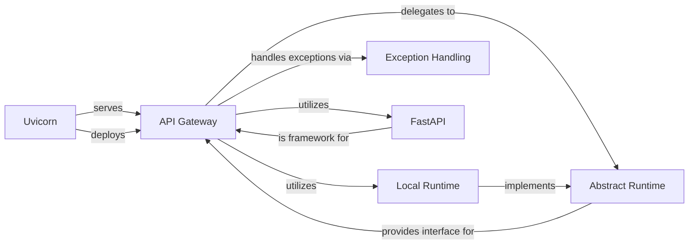

## Details

These components are fundamental because they collectively enable the core functionality of the API Gateway: receiving external requests, processing them, executing them in a sandboxed environment, and returning structured responses or errors. The clear separation between the API layer, the abstract runtime interface, and concrete runtime implementations ensures modularity, testability, and extensibility, which are key architectural biases of SWE-ReX.

### API Gateway [[Expand]](./API_Gateway.md)
The API Gateway is the primary external interface of SWE-ReX, implemented within src/swerex/server.py. It exposes RESTful API endpoints (e.g., /create_session, /execute, /read_file, /upload) to receive commands from clients. Its core responsibilities include parsing incoming requests, authenticating them via an API key, handling file uploads (including unzipping), and delegating the actual execution of commands to the appropriate Runtime Core. It also centralizes exception handling by serializing runtime errors into a client-readable format.

**Related Classes/Methods**: _None_

### Abstract Runtime
Defines the interface (Abstract Base Class) for all runtime implementations. The API Gateway interacts with this abstract interface, ensuring flexibility and extensibility for different execution backends (e.g., local, remote).

**Related Classes/Methods**: _None_

### Local Runtime
A concrete implementation of Abstract Runtime that the API Gateway currently utilizes by default. It manages local execution environments, handling the creation, management, and interaction with local shell sessions (e.g., using pexpect).

**Related Classes/Methods**: _None_

### Exception Handling
This module defines custom exceptions specific to the SWE-ReX framework. The API Gateway leverages this component to catch and serialize exceptions originating from the runtime or other parts of the system, providing consistent and informative error messages back to the client.

**Related Classes/Methods**: _None_

### FastAPI
A modern, fast (high-performance) web framework for building APIs with Python 3.7+ based on standard Python type hints. The API Gateway is built entirely using FastAPI, which provides the decorators for defining endpoints, request parsing, and response generation.

**Related Classes/Methods**: _None_

### Uvicorn
An ASGI web server for Python. Uvicorn is used by the main function within src/swerex/server.py to run the FastAPI application, making the API Gateway accessible over HTTP.

**Related Classes/Methods**: _None_

### [FAQ](https://github.com/CodeBoarding/GeneratedOnBoardings/tree/main?tab=readme-ov-file#faq)