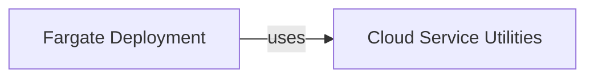

## Details

The Cloud Service Utilities component is fundamental to the SWE-ReX project as it provides a crucial abstraction layer for interacting with AWS services. It encapsulates the complexities of AWS API calls, enabling the Fargate Deployment component to provision and manage cloud-based sandboxed environments efficiently and with a clear separation of concerns. This centralization of AWS interactions achieves modularity, maintainability, extensibility, and reduced complexity, making the Fargate Deployment cleaner and more focused, aligning with the project's architectural bias towards modularity and a clean, manageable codebase.

### Cloud Service Utilities [[Expand]](./Cloud_Service_Utilities.md)
This component provides a set of helper functions and wrappers for programmatic interaction with Amazon Web Services (AWS) using the Boto3 library. Its primary purpose is to facilitate the creation, configuration, and management of AWS resources necessary for deploying and running sandboxed environments, especially within the AWS Fargate ecosystem. It abstracts away the low-level details of AWS API calls, offering a simplified interface for higher-level deployment logic.

**Related Classes/Methods**:

- <a href="https://github.com/synth-laboratories/SWE-ReX/src/swerex/utils/aws.py#L20-L97" target="_blank" rel="noopener noreferrer">`src.swerex.utils.aws:get_execution_role_arn` (20:97)</a>
- <a href="https://github.com/synth-laboratories/SWE-ReX/src/swerex/utils/aws.py#L100-L159" target="_blank" rel="noopener noreferrer">`src.swerex.utils.aws:get_task_definition` (100:159)</a>
- <a href="https://github.com/synth-laboratories/SWE-ReX/src/swerex/utils/aws.py#L162-L168" target="_blank" rel="noopener noreferrer">`src.swerex.utils.aws:get_cluster_arn` (162:168)</a>
- <a href="https://github.com/synth-laboratories/SWE-ReX/src/swerex/utils/aws.py#L171-L181" target="_blank" rel="noopener noreferrer">`src.swerex.utils.aws:get_default_vpc_and_subnet` (171:181)</a>
- <a href="https://github.com/synth-laboratories/SWE-ReX/src/swerex/utils/aws.py#L184-L220" target="_blank" rel="noopener noreferrer">`src.swerex.utils.aws:get_security_group` (184:220)</a>

### Fargate Deployment
This component is responsible for orchestrating the deployment of sandboxed environments using AWS Fargate, relying on the Cloud Service Utilities for AWS API interactions.

**Related Classes/Methods**: _None_

### [FAQ](https://github.com/CodeBoarding/GeneratedOnBoardings/tree/main?tab=readme-ov-file#faq)