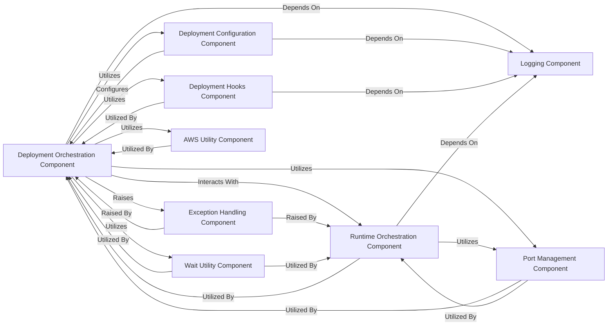

## Details

This analysis focuses on the `Deployment Orchestration` subsystem within `SWE-ReX`, which is critical for managing the lifecycle of the SWE-ReX environment across diverse platforms. It encompasses the core logic for initiating, controlling, and configuring deployments, as well as integrating with various utilities and runtime environments.

### Deployment Orchestration Component
This is the central component responsible for managing the entire lifecycle of the SWE-ReX environment deployment. It provides a unified interface for starting, stopping, and checking the status of deployments across different platforms (Docker, Fargate, Modal, Local, Remote, Dummy). Its fundamental role is to abstract the complexities of platform-specific deployment mechanisms.

**Related Classes/Methods**:

- <a href="https://github.com/synth-laboratories/SWE-ReX/src/swerex/deployment/abstract.py#L1-L1" target="_blank" rel="noopener noreferrer">`swerex/deployment/abstract.py` (1:1)</a>
- <a href="https://github.com/synth-laboratories/SWE-ReX/src/swerex/deployment/local.py#L1-L1" target="_blank" rel="noopener noreferrer">`swerex/deployment/local.py` (1:1)</a>
- <a href="https://github.com/synth-laboratories/SWE-ReX/src/swerex/deployment/docker.py#L1-L1" target="_blank" rel="noopener noreferrer">`swerex/deployment/docker.py` (1:1)</a>
- <a href="https://github.com/synth-laboratories/SWE-ReX/src/swerex/deployment/fargate.py#L1-L1" target="_blank" rel="noopener noreferrer">`swerex/deployment/fargate.py` (1:1)</a>
- <a href="https://github.com/synth-laboratories/SWE-ReX/src/swerex/deployment/modal.py#L1-L1" target="_blank" rel="noopener noreferrer">`swerex/deployment/modal.py` (1:1)</a>
- <a href="https://github.com/synth-laboratories/SWE-ReX/src/swerex/deployment/remote.py#L1-L1" target="_blank" rel="noopener noreferrer">`swerex/deployment/remote.py` (1:1)</a>
- <a href="https://github.com/synth-laboratories/SWE-ReX/src/swerex/deployment/dummy.py#L1-L1" target="_blank" rel="noopener noreferrer">`swerex/deployment/dummy.py` (1:1)</a>

### Deployment Configuration Component
Manages the specific configuration settings required for each deployment type. These configurations define parameters such as image names, resource allocations, and environment variables, ensuring that each deployment strategy has its necessary parameters defined and passed to the respective deployment classes.

**Related Classes/Methods**:

- <a href="https://github.com/synth-laboratories/SWE-ReX/src/swerex/deployment/config.py#L1-L1" target="_blank" rel="noopener noreferrer">`swerex/deployment/config.py` (1:1)</a>

### Deployment Hooks Component
Provides an extensible mechanism for custom logic (hooks) to be executed at various stages of the deployment lifecycle (e.g., before starting, after stopping). This allows for flexible integration of additional functionalities, such as status updates or pre/post-deployment validations.

**Related Classes/Methods**:

- <a href="https://github.com/synth-laboratories/SWE-ReX/src/swerex/deployment/hooks/abstract.py#L1-L1" target="_blank" rel="noopener noreferrer">`swerex/deployment/hooks/abstract.py` (1:1)</a>
- <a href="https://github.com/synth-laboratories/SWE-ReX/src/swerex/deployment/hooks/status.py#L1-L1" target="_blank" rel="noopener noreferrer">`swerex/deployment/hooks/status.py` (1:1)</a>

### Runtime Orchestration Component
Establishes the common interface and base functionality for different execution environments where deployed tasks will run. Concrete runtimes (e.g., `LocalRuntime`, `RemoteRuntime`) inherit from this, providing the actual execution capabilities for the deployed SWE-ReX environment.

**Related Classes/Methods**:

- <a href="https://github.com/synth-laboratories/SWE-ReX/src/swerex/runtime/abstract.py#L1-L1" target="_blank" rel="noopener noreferrer">`swerex/runtime/abstract.py` (1:1)</a>
- <a href="https://github.com/synth-laboratories/SWE-ReX/src/swerex/runtime/local.py#L1-L1" target="_blank" rel="noopener noreferrer">`swerex/runtime/local.py` (1:1)</a>
- <a href="https://github.com/synth-laboratories/SWE-ReX/src/swerex/runtime/remote.py#L1-L1" target="_blank" rel="noopener noreferrer">`swerex/runtime/remote.py` (1:1)</a>
- <a href="https://github.com/synth-laboratories/SWE-ReX/src/swerex/runtime/dummy.py#L1-L1" target="_blank" rel="noopener noreferrer">`swerex/runtime/dummy.py` (1:1)</a>

### Exception Handling Component
Defines a hierarchy of custom exceptions used throughout the `SWE-ReX` system to signal specific error conditions. This improves error handling, debugging, and allows for more granular error recovery within the deployment and runtime processes.

**Related Classes/Methods**:

- <a href="https://github.com/synth-laboratories/SWE-ReX/src/swerex/exceptions.py#L1-L1" target="_blank" rel="noopener noreferrer">`swerex/exceptions.py` (1:1)</a>

### AWS Utility Component
Encapsulates functions for interacting with Amazon Web Services (AWS), specifically for managing execution roles and task definitions required for cloud deployments (e.g., Fargate).

**Related Classes/Methods**:

- <a href="https://github.com/synth-laboratories/SWE-ReX/src/swerex/utils/aws.py#L1-L1" target="_blank" rel="noopener noreferrer">`swerex/utils/aws.py` (1:1)</a>

### Port Management Component
Provides utilities for finding available network ports, which is essential for local deployments or services that require specific port bindings to avoid conflicts.

**Related Classes/Methods**:

- <a href="https://github.com/synth-laboratories/SWE-ReX/src/swerex/utils/free_port.py#L1-L1" target="_blank" rel="noopener noreferrer">`swerex/utils/free_port.py` (1:1)</a>

### Logging Component
Offers a centralized logging mechanism for the `SWE-ReX` system, used across various components to record events, debug information, and errors.

**Related Classes/Methods**:

- <a href="https://github.com/synth-laboratories/SWE-ReX/src/swerex/utils/log.py#L1-L1" target="_blank" rel="noopener noreferrer">`swerex/utils/log.py` (1:1)</a>

### Wait Utility Component
Provides utility functions for pausing execution or waiting on certain conditions to be met. This is crucial for asynchronous operations common in deployment and runtime processes, ensuring resources are ready or operations complete before proceeding.

**Related Classes/Methods**:

- <a href="https://github.com/synth-laboratories/SWE-ReX/src/swerex/utils/wait.py#L1-L1" target="_blank" rel="noopener noreferrer">`swerex/utils/wait.py` (1:1)</a>

### [FAQ](https://github.com/CodeBoarding/GeneratedOnBoardings/tree/main?tab=readme-ov-file#faq)