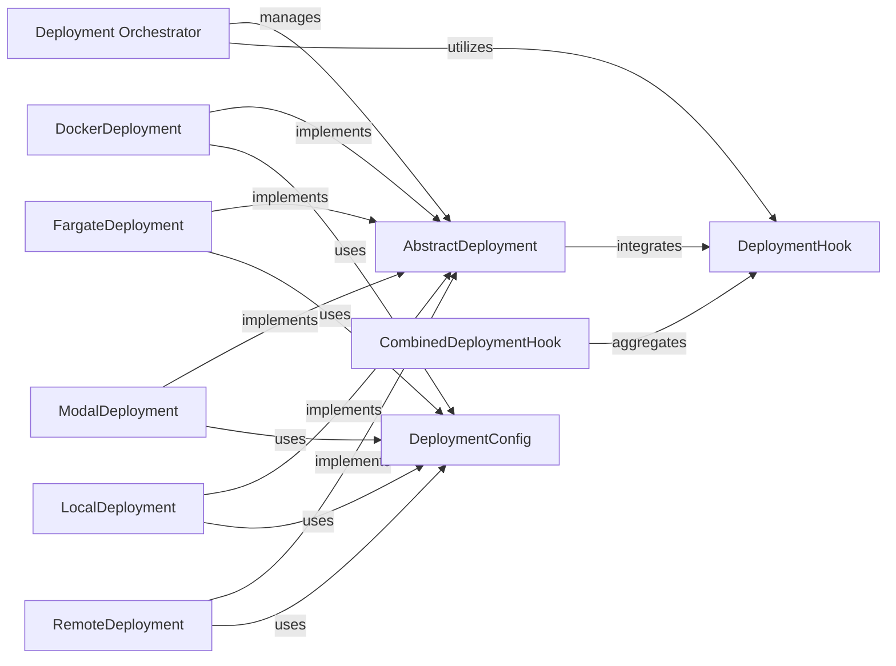

## Details

The `Deployment Orchestrator` subsystem is a critical part of the `swerex` project, embodying the Strategy/Plugin and Facade patterns to manage the lifecycle of sandboxed execution environments across diverse platforms.

### Deployment Orchestrator [[Expand]](./Deployment_Orchestrator.md)
This conceptual component represents the central coordination logic responsible for provisioning, starting, and stopping sandboxed execution environments. It acts as a facade, abstracting the complexities of different deployment platforms by utilizing various concrete `AbstractDeployment` implementations based on the desired environment configuration.

**Related Classes/Methods**:

- `swerex.deployment` (1:1)

### AbstractDeployment
This is the core abstract interface that defines the contract for all concrete deployment strategies. It specifies fundamental methods (e.g., `start`, `stop`) that all deployment implementations must adhere to, ensuring a consistent API for environment lifecycle management regardless of the underlying platform.

**Related Classes/Methods**:

- <a href="https://github.com/synth-laboratories/SWE-ReX/src/swerex/deployment/abstract.py#L10-L55" target="_blank" rel="noopener noreferrer">`swerex.deployment.abstract.AbstractDeployment` (10:55)</a>

### DeploymentConfig
This component provides structured and type-safe configuration models for various deployment types (e.g., Docker, Fargate, Modal, Local, Remote). It centralizes the parameters required for each specific deployment strategy, enabling flexible and organized environment setup.

**Related Classes/Methods**:

- <a href="https://github.com/synth-laboratories/SWE-ReX/src/swerex/deployment/config.py#L1-L1" target="_blank" rel="noopener noreferrer">`swerex.deployment.config.DeploymentConfig` (1:1)</a>

### DockerDeployment
A concrete implementation of the `AbstractDeployment` interface, specifically designed for managing sandboxed execution environments using Docker containers. It encapsulates the platform-specific logic for provisioning, starting, and stopping Docker-based environments.

**Related Classes/Methods**:

- <a href="https://github.com/synth-laboratories/SWE-ReX/src/swerex/deployment/docker.py#L40-L217" target="_blank" rel="noopener noreferrer">`swerex.deployment.docker.DockerDeployment` (40:217)</a>

### FargateDeployment
A concrete implementation of the `AbstractDeployment` interface tailored for AWS Fargate. It handles the specific logic for deploying and managing sandboxed environments within the AWS Fargate serverless compute engine.

**Related Classes/Methods**:

- <a href="https://github.com/synth-laboratories/SWE-ReX/src/swerex/deployment/fargate.py#L30-L184" target="_blank" rel="noopener noreferrer">`swerex.deployment.fargate.FargateDeployment` (30:184)</a>

### ModalDeployment
A concrete implementation of the `AbstractDeployment` interface for the Modal platform. It manages the lifecycle of sandboxed environments by interacting with Modal's infrastructure for serverless function and container deployment.

**Related Classes/Methods**:

- <a href="https://github.com/synth-laboratories/SWE-ReX/src/swerex/deployment/modal.py#L110-L282" target="_blank" rel="noopener noreferrer">`swerex.deployment.modal.ModalDeployment` (110:282)</a>

### LocalDeployment
A concrete implementation of the `AbstractDeployment` interface for local execution environments. It manages sandboxed environments directly on the host machine, often used for development or testing purposes.

**Related Classes/Methods**:

- <a href="https://github.com/synth-laboratories/SWE-ReX/src/swerex/deployment/local.py#L16-L72" target="_blank" rel="noopener noreferrer">`swerex.deployment.local.LocalDeployment` (16:72)</a>

### RemoteDeployment
A concrete implementation of the `AbstractDeployment` interface for pre-existing remote execution environments. It abstracts the details of connecting to and managing sandboxes that are already provisioned on a remote server or service.

**Related Classes/Methods**:

- <a href="https://github.com/synth-laboratories/SWE-ReX/src/swerex/deployment/remote.py#L14-L72" target="_blank" rel="noopener noreferrer">`swerex.deployment.remote.RemoteDeployment` (14:72)</a>

### DeploymentHook
An abstract interface that defines a contract for custom logic to be injected at various stages of the deployment lifecycle (e.g., before environment start, after environment stop). This promotes extensibility and allows for custom actions without modifying core deployment logic.

**Related Classes/Methods**:

- <a href="https://github.com/synth-laboratories/SWE-ReX/src/swerex/deployment/hooks/abstract.py#L1-L1" target="_blank" rel="noopener noreferrer">`swerex.deployment.hooks.abstract.DeploymentHook` (1:1)</a>

### CombinedDeploymentHook
A concrete implementation of `DeploymentHook` that allows for aggregating and executing multiple `DeploymentHook` instances sequentially. This provides a powerful mechanism to chain various custom actions and integrate complex logic into the deployment process.

**Related Classes/Methods**:

- <a href="https://github.com/synth-laboratories/SWE-ReX/src/swerex/deployment/hooks/abstract.py#L1-L1" target="_blank" rel="noopener noreferrer">`swerex.deployment.hooks.abstract.CombinedDeploymentHook` (1:1)</a>

### [FAQ](https://github.com/CodeBoarding/GeneratedOnBoardings/tree/main?tab=readme-ov-file#faq)