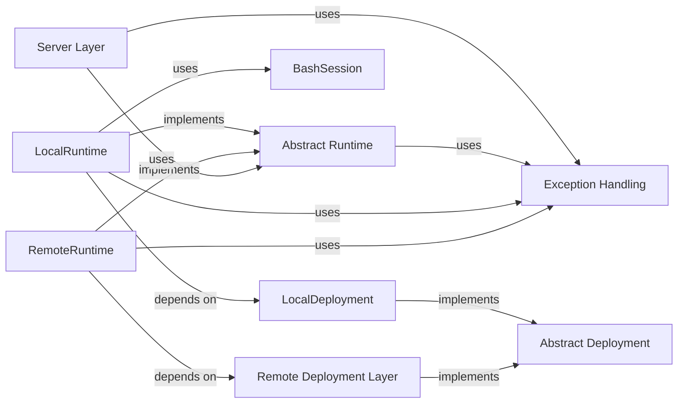

## Details

Provides concrete implementations for executing commands within sandboxed environments. This includes `LocalRuntime` for direct execution on the host system (leveraging `BashSession`) and `RemoteRuntime` for interacting with a remote SWE-ReX instance via HTTP, acting as a client. This component is central to the project's purpose of enabling AI agents to execute code in isolated environments, offering a flexible and extensible way to run code in various environments.

### Abstract Runtime
This is the foundational interface (Abstract Base Class) for all runtime implementations. It defines a consistent contract for interacting with any sandboxed environment, including methods like `create_session`, `run_in_session`, `execute`, `read_file`, `write_file`, `close_session`, `is_alive`, and `upload`. It's fundamental because it enforces a common API for diverse execution backends, promoting extensibility and a pluggable architecture, aligning with the Strategy/Plugin Pattern.

**Related Classes/Methods**:

- <a href="https://github.com/synth-laboratories/SWE-ReX/src/swerex/runtime/abstract.py#L1-L1" target="_blank" rel="noopener noreferrer">`swerex.runtime.abstract` (1:1)</a>

### LocalRuntime
A concrete implementation of `Abstract Runtime` designed for direct execution on the host system. It manages the lifecycle of local shell sessions, typically using `BashSession`, to execute commands and manage files. It's fundamental for enabling local development, testing, and scenarios where direct host access is desired, providing a direct execution path for AI agents.

**Related Classes/Methods**:

- <a href="https://github.com/synth-laboratories/SWE-ReX/src/swerex/runtime/local.py#L1-L1" target="_blank" rel="noopener noreferrer">`swerex.runtime.local` (1:1)</a>

### RemoteRuntime
A concrete implementation of `Abstract Runtime` that acts as a client to interact with remote sandboxed environments. It typically communicates via HTTP requests to a remote `SWE-ReX` server instance or directly with remote container orchestration services (e.g., Docker, Fargate, Modal). It's fundamental for enabling scalable and isolated execution in cloud or distributed environments, crucial for a remote execution framework.

**Related Classes/Methods**:

- <a href="https://github.com/synth-laboratories/SWE-ReX/src/swerex/runtime/remote.py#L1-L1" target="_blank" rel="noopener noreferrer">`swerex.runtime.remote` (1:1)</a>

### BashSession
This component, primarily used by `LocalRuntime`, is responsible for managing individual interactive shell sessions. It handles sending commands, reading output, and maintaining the state of a single shell process using `pexpect`. It's fundamental for providing a robust and interactive command-line interface within the local execution environment, directly supporting the `LocalRuntime`'s functionality.

**Related Classes/Methods**:

- <a href="https://github.com/synth-laboratories/SWE-ReX/src/swerex/runtime/local.py#L126-L358" target="_blank" rel="noopener noreferrer">`swerex.runtime.local:BashSession` (126:358)</a>

### Abstract Deployment
Defines the interface (Abstract Base Class) for various deployment strategies. It specifies methods for starting and stopping the sandboxed environment, ensuring a common contract for different deployment mechanisms (e.g., Docker, Fargate, Local). It's fundamental because runtimes require an underlying environment to operate, and this abstraction allows for flexible environment provisioning, aligning with the Strategy/Plugin Pattern for deployment.

**Related Classes/Methods**:

- <a href="https://github.com/synth-laboratories/SWE-ReX/src/swerex/deployment/abstract.py#L1-L1" target="_blank" rel="noopener noreferrer">`swerex.deployment.abstract` (1:1)</a>

### LocalDeployment
A concrete implementation of `Abstract Deployment` for managing locally deployed environments. It's responsible for setting up and tearing down the local execution environment that `LocalRuntime` operates within. It's fundamental for providing the necessary local infrastructure for `LocalRuntime`, enabling self-contained local execution.

**Related Classes/Methods**:

- <a href="https://github.com/synth-laboratories/SWE-ReX/src/swerex/deployment/local.py#L1-L1" target="_blank" rel="noopener noreferrer">`swerex.deployment.local` (1:1)</a>

### Remote Deployment Layer
This encompasses various concrete implementations of `Abstract Deployment` for different remote targets (e.g., `DockerDeployment`, `FargateDeployment`, `ModalDeployment`, `RemoteDeployment`). These components handle the provisioning, management, and teardown of sandboxed environments on their respective platforms. It's fundamental for enabling `RemoteRuntime` to connect to and manage diverse remote execution environments, supporting the distributed nature of the framework.

**Related Classes/Methods**:

- <a href="https://github.com/synth-laboratories/SWE-ReX/src/swerex/deployment/docker.py#L1-L1" target="_blank" rel="noopener noreferrer">`swerex.deployment.docker` (1:1)</a>
- <a href="https://github.com/synth-laboratories/SWE-ReX/src/swerex/deployment/fargate.py#L1-L1" target="_blank" rel="noopener noreferrer">`swerex.deployment.fargate` (1:1)</a>
- <a href="https://github.com/synth-laboratories/SWE-ReX/src/swerex/deployment/modal.py#L1-L1" target="_blank" rel="noopener noreferrer">`swerex.deployment.modal` (1:1)</a>
- <a href="https://github.com/synth-laboratories/SWE-ReX/src/swerex/deployment/remote.py#L1-L1" target="_blank" rel="noopener noreferrer">`swerex.deployment.remote` (1:1)</a>

### Server Layer
The primary entry point for external interactions, exposing a FastAPI application that handles API requests for managing and executing code within sandboxed environments. It acts as a facade, abstracting the underlying runtime and deployment complexities. It's fundamental as the public interface through which AI agents or other clients interact with the `SWE-ReX` system, embodying the Client-Server Architecture.

**Related Classes/Methods**:

- <a href="https://github.com/synth-laboratories/SWE-ReX/src/swerex/server.py#L1-L1" target="_blank" rel="noopener noreferrer">`swerex.server` (1:1)</a>

### Exception Handling
A dedicated module for defining custom exceptions specific to the `SWE-ReX` framework (e.g., `SwerexException`, `CommandTimeoutError`, `SessionDoesNotExistError`). It provides a structured way to manage and report errors across the system. It's fundamental for robust error management, allowing callers to gracefully handle specific failure conditions and improving the overall reliability of the execution engines.

**Related Classes/Methods**:

- <a href="https://github.com/synth-laboratories/SWE-ReX/src/swerex/exceptions.py#L1-L1" target="_blank" rel="noopener noreferrer">`swerex.exceptions` (1:1)</a>

### [FAQ](https://github.com/CodeBoarding/GeneratedOnBoardings/tree/main?tab=readme-ov-file#faq)