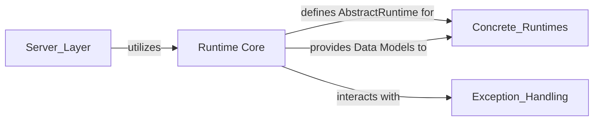

## Details

The `Runtime Core` is fundamental because it acts as the contract layer for all runtime operations. By defining `AbstractRuntime`, it allows for a clear separation between the *what* (the interface) and the *how* (the concrete implementations). This enables new runtime types to be added without altering existing code, adhering to the Strategy/Plugin pattern. The Pydantic data models within `Runtime Core` establish a universal language for commands, observations, and session management. This standardization is critical for interoperability between different parts of the system (e.g., `Server Layer` communicating with `Concrete Runtimes`) and ensures data integrity. The configuration schemas provide a structured and validated way to set up and customize various runtime environments, making the system adaptable to diverse deployment scenarios. In essence, `Runtime Core` provides the essential blueprint and communication protocols that underpin all execution within the sandboxed environments, making it a cornerstone of the entire remote execution framework.

### Runtime Core [[Expand]](./Runtime_Core.md)
This component establishes the foundational contract for all runtime environments within SWE-ReX. It defines the `AbstractRuntime` interface, which specifies the core functionalities for command execution, observation handling, and session management within sandboxed environments. Additionally, it provides essential Pydantic data models (e.g., `Command`, `Observation`, `CreateBashSessionRequest`) and configuration schemas (e.g., `LocalRuntimeConfig`, `RemoteRuntimeConfig`) that ensure consistent data exchange and configuration across all concrete runtime implementations. This component is crucial for maintaining a clear separation of concerns and enabling the Strategy pattern for different runtime behaviors.

**Related Classes/Methods**:

- <a href="https://github.com/synth-laboratories/SWE-ReX/src/swerex/runtime/abstract.py#L220-L274" target="_blank" rel="noopener noreferrer">`swerex.runtime.abstract.AbstractRuntime` (220:274)</a>
- <a href="https://github.com/synth-laboratories/SWE-ReX/src/swerex/runtime/abstract.py#L142-L171" target="_blank" rel="noopener noreferrer">`swerex.runtime.abstract.Command` (142:171)</a>
- <a href="https://github.com/synth-laboratories/SWE-ReX/src/swerex/runtime/abstract.py#L1-L1" target="_blank" rel="noopener noreferrer">`swerex.runtime.abstract.Observation` (1:1)</a>
- <a href="https://github.com/synth-laboratories/SWE-ReX/src/swerex/runtime/abstract.py#L22-L31" target="_blank" rel="noopener noreferrer">`swerex.runtime.abstract.CreateBashSessionRequest` (22:31)</a>
- <a href="https://github.com/synth-laboratories/SWE-ReX/src/swerex/runtime/abstract.py#L1-L1" target="_blank" rel="noopener noreferrer">`swerex.runtime.abstract.RuntimeError` (1:1)</a>
- <a href="https://github.com/synth-laboratories/SWE-ReX/src/swerex/runtime/abstract.py#L1-L1" target="_blank" rel="noopener noreferrer">`swerex.runtime.abstract.RuntimeOutput` (1:1)</a>
- <a href="https://github.com/synth-laboratories/SWE-ReX/src/swerex/runtime/config.py#L7-L18" target="_blank" rel="noopener noreferrer">`swerex.runtime.config.LocalRuntimeConfig` (7:18)</a>
- <a href="https://github.com/synth-laboratories/SWE-ReX/src/swerex/runtime/config.py#L21-L39" target="_blank" rel="noopener noreferrer">`swerex.runtime.config.RemoteRuntimeConfig` (21:39)</a>
- <a href="https://github.com/synth-laboratories/SWE-ReX/src/swerex/runtime/config.py#L42-L53" target="_blank" rel="noopener noreferrer">`swerex.runtime.config.DummyRuntimeConfig` (42:53)</a>

### [FAQ](https://github.com/CodeBoarding/GeneratedOnBoardings/tree/main?tab=readme-ov-file#faq)