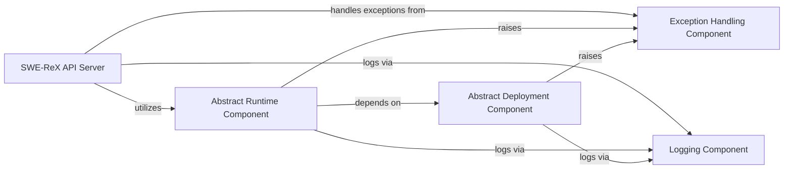

## Details

Here's the final component overview for the `SWE-ReX API Server` subsystem, including its structure, flow, and purpose, along with the identified central components and their interactions.

### SWE-ReX API Server [[Expand]](./SWE_ReX_API_Server.md)
The primary external interface for SWE-ReX, responsible for handling all client requests related to session management, command execution, and file operations. It acts as the central orchestrator, routing requests to the appropriate backend components.

**Related Classes/Methods**:

- <a href="https://github.com/synth-laboratories/SWE-ReX/src/swerex/server.py#L72-L73" target="_blank" rel="noopener noreferrer">`src.swerex.server.is_alive` (72:73)</a>
- <a href="https://github.com/synth-laboratories/SWE-ReX/src/swerex/server.py#L77-L78" target="_blank" rel="noopener noreferrer">`src.swerex.server.create_session` (77:78)</a>
- <a href="https://github.com/synth-laboratories/SWE-ReX/src/swerex/server.py#L82-L83" target="_blank" rel="noopener noreferrer">`src.swerex.server.run` (82:83)</a>
- <a href="https://github.com/synth-laboratories/SWE-ReX/src/swerex/server.py#L87-L88" target="_blank" rel="noopener noreferrer">`src.swerex.server.close_session` (87:88)</a>
- <a href="https://github.com/synth-laboratories/SWE-ReX/src/swerex/server.py#L92-L93" target="_blank" rel="noopener noreferrer">`src.swerex.server.execute` (92:93)</a>
- <a href="https://github.com/synth-laboratories/SWE-ReX/src/swerex/server.py#L97-L98" target="_blank" rel="noopener noreferrer">`src.swerex.server.read_file` (97:98)</a>
- <a href="https://github.com/synth-laboratories/SWE-ReX/src/swerex/server.py#L102-L103" target="_blank" rel="noopener noreferrer">`src.swerex.server.write_file` (102:103)</a>
- <a href="https://github.com/synth-laboratories/SWE-ReX/src/swerex/server.py#L107-L128" target="_blank" rel="noopener noreferrer">`src.swerex.server.upload` (107:128)</a>
- <a href="https://github.com/synth-laboratories/SWE-ReX/src/swerex/server.py#L132-L134" target="_blank" rel="noopener noreferrer">`src.swerex.server.close` (132:134)</a>

### Abstract Runtime Component
Defines the core contract for executing commands and managing the state of user sessions. It provides an abstraction layer for different execution environments, allowing the API server to interact with various runtime implementations (e.g., local, remote, dummy) uniformly.

**Related Classes/Methods**:

- <a href="https://github.com/synth-laboratories/SWE-ReX/src/swerex/runtime/abstract.py#L0-L0" target="_blank" rel="noopener noreferrer">`src.swerex.runtime.abstract` (0:0)</a>
- <a href="https://github.com/synth-laboratories/SWE-ReX/src/swerex/runtime/local.py#L0-L0" target="_blank" rel="noopener noreferrer">`src.swerex.runtime.local` (0:0)</a>
- <a href="https://github.com/synth-laboratories/SWE-ReX/src/swerex/runtime/remote.py#L0-L0" target="_blank" rel="noopener noreferrer">`src.swerex.runtime.remote` (0:0)</a>
- <a href="https://github.com/synth-laboratories/SWE-ReX/src/swerex/runtime/dummy.py#L0-L0" target="_blank" rel="noopener noreferrer">`src.swerex.runtime.dummy` (0:0)</a>

### Abstract Deployment Component
Manages the lifecycle of the underlying execution environments (e.g., Docker containers, Fargate tasks). It provides an abstract interface for deploying, starting, and stopping these environments, decoupling the runtime logic from infrastructure concerns.

**Related Classes/Methods**:

- <a href="https://github.com/synth-laboratories/SWE-ReX/src/swerex/deployment/abstract.py#L0-L0" target="_blank" rel="noopener noreferrer">`src.swerex.deployment.abstract` (0:0)</a>
- <a href="https://github.com/synth-laboratories/SWE-ReX/src/swerex/deployment/local.py#L0-L0" target="_blank" rel="noopener noreferrer">`src.swerex.deployment.local` (0:0)</a>
- <a href="https://github.com/synth-laboratories/SWE-ReX/src/swerex/deployment/docker.py#L0-L0" target="_blank" rel="noopener noreferrer">`src.swerex.deployment.docker` (0:0)</a>
- <a href="https://github.com/synth-laboratories/SWE-ReX/src/swerex/deployment/fargate.py#L0-L0" target="_blank" rel="noopener noreferrer">`src.swerex.deployment.fargate` (0:0)</a>
- <a href="https://github.com/synth-laboratories/SWE-ReX/src/swerex/deployment/modal.py#L0-L0" target="_blank" rel="noopener noreferrer">`src.swerex.deployment.modal` (0:0)</a>
- <a href="https://github.com/synth-laboratories/SWE-ReX/src/swerex/deployment/remote.py#L0-L0" target="_blank" rel="noopener noreferrer">`src.swerex.deployment.remote` (0:0)</a>
- <a href="https://github.com/synth-laboratories/SWE-ReX/src/swerex/deployment/dummy.py#L0-L0" target="_blank" rel="noopener noreferrer">`src.swerex.deployment.dummy` (0:0)</a>

### Exception Handling Component
Provides a centralized and structured approach to defining and managing custom exceptions within the SWE-ReX system. It ensures that errors are caught, processed, and communicated back to the client in a consistent and meaningful manner, preventing system crashes and improving user experience.

**Related Classes/Methods**:

- <a href="https://github.com/synth-laboratories/SWE-ReX/src/swerex/exceptions.py#L0-L0" target="_blank" rel="noopener noreferrer">`src.swerex.exceptions` (0:0)</a>

### Logging Component
Offers standardized logging functionalities across the entire SWE-ReX system. It enables developers and operators to monitor the API server's health, track user activity, debug issues, and gather operational insights.

**Related Classes/Methods**:

- <a href="https://github.com/synth-laboratories/SWE-ReX/src/swerex/utils/log.py#L0-L0" target="_blank" rel="noopener noreferrer">`src.swerex.utils.log` (0:0)</a>

### [FAQ](https://github.com/CodeBoarding/GeneratedOnBoardings/tree/main?tab=readme-ov-file#faq)