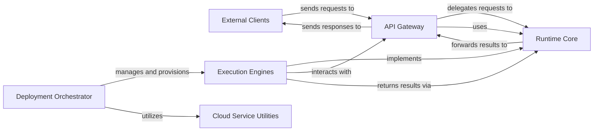

## Details

Remote Execution Framework / Sandboxed Environment Orchestration for AI Agents

### External Clients
Represents AI agents or other external systems that initiate requests for sandboxed code execution and interact with the SWE-ReX system.

**Related Classes/Methods**: _None_

### API Gateway [[Expand]](./API_Gateway.md)
The primary external interface of SWE-ReX. It exposes RESTful API endpoints (e.g., /create_session, /execute, /read_file) to receive commands, handles request parsing, and delegates execution to the appropriate Runtime Core.

**Related Classes/Methods**:

- <a href="https://github.com/synth-laboratories/SWE-ReX/src/swerex/server.py#L1-L1" target="_blank" rel="noopener noreferrer">`src.swerex.server` (1:1)</a>

### Runtime Core [[Expand]](./Runtime_Core.md)
Defines the fundamental abstract interface (AbstractRuntime) and common data models (Pydantic models) for command execution, observations, and session management within sandboxed environments. It serves as the contract that all concrete execution engines must adhere to.

**Related Classes/Methods**:

- <a href="https://github.com/synth-laboratories/SWE-ReX/src/swerex/runtime/abstract.py#L1-L1" target="_blank" rel="noopener noreferrer">`src.swerex.runtime.abstract` (1:1)</a>
- <a href="https://github.com/synth-laboratories/SWE-ReX/src/swerex/runtime/config.py#L1-L1" target="_blank" rel="noopener noreferrer">`src.swerex.runtime.config` (1:1)</a>

### Execution Engines [[Expand]](./Execution_Engines.md)
Provides concrete implementations for executing commands within sandboxed environments. This includes LocalRuntime for direct execution on the host system (leveraging BashSession) and RemoteRuntime for interacting with a remote SWE-ReX instance via HTTP, acting as a client.

**Related Classes/Methods**:

- <a href="https://github.com/synth-laboratories/SWE-ReX/src/swerex/runtime/local.py#L1-L1" target="_blank" rel="noopener noreferrer">`src.swerex.runtime.local` (1:1)</a>
- <a href="https://github.com/synth-laboratories/SWE-ReX/src/swerex/runtime/remote.py#L1-L1" target="_blank" rel="noopener noreferrer">`src.swerex.runtime.remote` (1:1)</a>

### Deployment Orchestrator [[Expand]](./Deployment_Orchestrator.md)
Manages the lifecycle (provisioning, starting, and stopping) of sandboxed execution environments across various platforms (e.g., Docker, AWS Fargate, Modal, Local). It defines the abstract deployment interface (AbstractDeployment) and incorporates deployment hooks for custom logic.

**Related Classes/Methods**:

- <a href="https://github.com/synth-laboratories/SWE-ReX/src/swerex/deployment/abstract.py#L1-L1" target="_blank" rel="noopener noreferrer">`src.swerex.deployment.abstract` (1:1)</a>
- <a href="https://github.com/synth-laboratories/SWE-ReX/src/swerex/deployment/config.py#L1-L1" target="_blank" rel="noopener noreferrer">`src.swerex.deployment.config` (1:1)</a>
- <a href="https://github.com/synth-laboratories/SWE-ReX/src/swerex/deployment/docker.py#L1-L1" target="_blank" rel="noopener noreferrer">`src.swerex.deployment.docker` (1:1)</a>
- <a href="https://github.com/synth-laboratories/SWE-ReX/src/swerex/deployment/fargate.py#L1-L1" target="_blank" rel="noopener noreferrer">`src.swerex.deployment.fargate` (1:1)</a>
- <a href="https://github.com/synth-laboratories/SWE-ReX/src/swerex/deployment/modal.py#L1-L1" target="_blank" rel="noopener noreferrer">`src.swerex.deployment.modal` (1:1)</a>
- <a href="https://github.com/synth-laboratories/SWE-ReX/src/swerex/deployment/local.py#L1-L1" target="_blank" rel="noopener noreferrer">`src.swerex.deployment.local` (1:1)</a>
- <a href="https://github.com/synth-laboratories/SWE-ReX/src/swerex/deployment/remote.py#L1-L1" target="_blank" rel="noopener noreferrer">`src.swerex.deployment.remote` (1:1)</a>
- <a href="https://github.com/synth-laboratories/SWE-ReX/src/swerex/deployment/hooks/abstract.py#L1-L1" target="_blank" rel="noopener noreferrer">`src.swerex.deployment.hooks.abstract` (1:1)</a>
- <a href="https://github.com/synth-laboratories/SWE-ReX/src/swerex/deployment/hooks/status.py#L1-L1" target="_blank" rel="noopener noreferrer">`src.swerex.deployment.hooks.status` (1:1)</a>

### Cloud Service Utilities [[Expand]](./Cloud_Service_Utilities.md)
A collection of helper functions and wrappers for interacting with specific cloud services (e.g., AWS Boto3). These utilities are crucial for supporting the provisioning and management of cloud-based sandboxed environments by the Deployment Orchestrator.

**Related Classes/Methods**:

- <a href="https://github.com/synth-laboratories/SWE-ReX/src/swerex/utils/aws.py#L1-L1" target="_blank" rel="noopener noreferrer">`src.swerex.utils.aws` (1:1)</a>

### [FAQ](https://github.com/CodeBoarding/GeneratedOnBoardings/tree/main?tab=readme-ov-file#faq)