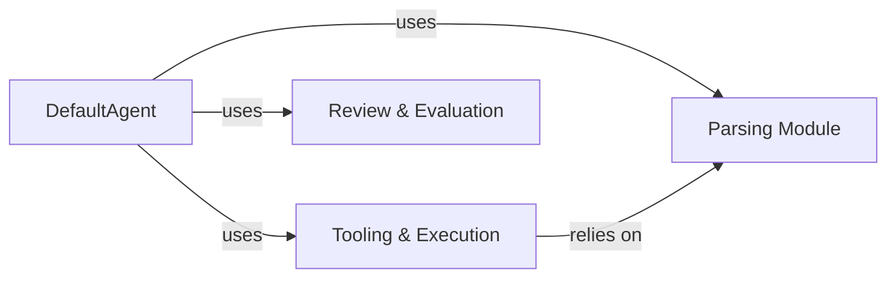

## Component Details

The `Agent Core & Capabilities` subsystem represents the "brain" of the SWE-agent, encompassing its core intelligence, decision-making logic, and the mechanisms for interacting with its environment. It defines the agent's operational loop, including planning, executing actions, processing observations, handling retry mechanisms, reviewing submissions, and sampling alternative actions. This subsystem is fundamental because it contains the core logic for decision-making, planning, and interacting with its environment through defined tools.

### DefaultAgent
This is the central AI agent, embodying the core intelligence and decision-making logic. It orchestrates the problem-solving process by maintaining the agent's state, processing observations, generating thoughts and actions, and interacting with the environment through tools. Its `run` method contains the main operational loop, which repeatedly calls `step` to execute actions, process observations, and manage the agent's state.

**Related Classes/Methods**:

- `DefaultAgent` (0:0)
- `DefaultAgent:run` (0:0)
- `DefaultAgent:step` (0:0)

### Tooling & Execution
This component provides the interface for the agent to interact with its external environment through various defined tools (e.g., shell commands, file operations). It is responsible for defining, initializing, installing, and executing tools, as well as managing their state and ensuring safe execution. The `ToolHandler` class is central to this, managing command patterns, blocking actions, and handling multi-line inputs.

**Related Classes/Methods**:

- `ToolHandler` (0:0)

### Parsing Module
This component is crucial for interpreting the raw text output from the language model (the agent's "thoughts" and "actions") into structured, executable commands or internal representations. It includes various parsers, such as `ActionParser`, designed to handle different output formats from the LLM and ensure that the agent's generated actions are correctly understood and processed. It also handles the complexities of multi-line commands.

**Related Classes/Methods**:

- `ActionParser` (0:0)
- `ToolHandler:parse_actions` (0:0)
- `ToolHandler:guard_multiline_input` (0:0)

### Review & Evaluation
This component provides critical mechanisms for evaluating agent trajectories, selecting the best actions or solutions, and implementing retry logic based on predefined criteria or scores. The `Reviewer` class, with its `review` method, is responsible for assessing the submission's quality, assigning scores, and providing feedback to guide the agent's subsequent steps or determine task completion.

**Related Classes/Methods**:

- <a href="https://github.com/SWE-agent/SWE-agent/blob/master/sweagent/agent/reviewer.py#L0-L0" target="_blank" rel="noopener noreferrer">`Reviewer` (0:0)</a>
- <a href="https://github.com/SWE-agent/SWE-agent/blob/master/sweagent/agent/reviewer.py#L0-L0" target="_blank" rel="noopener noreferrer">`Reviewer:review` (0:0)</a>

### [FAQ](https://github.com/CodeBoarding/GeneratedOnBoardings/tree/main?tab=readme-ov-file#faq)